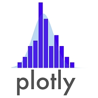

------

# <ruby>履<rp>(</rp><rt>り</rt><rp>)</rp>歴<rp>(</rp><rt>れき</rt><rp>)</rp>書<rp>(</rp><rt>しょ</rt><rp>)</rp></ruby>


リョウ、<ruby>黃<rp>(</rp><rt>こう</rt><rp>)</rp>聯<rp>(</rp><rt>れん</rt><rp>)</rp>富<rp>(</rp><rt>ふ/とみ</rt><rp>)</rp></ruby>

<br>
[[**<ruby>主<rp>(</rp><rt>しゅ</rt><rp>)</rp>題<rp>(</rp><rt>だい</rt><rp>)</rp>曲<rp>(</rp><rt>きょく</rt><rp>)</rp></ruby>**]{style="color:green"}](https://zhidao.baidu.com/question/397416930.html)[^0]
<br>
<audio controls loop autoplay src="music/小松拓也 - 不知道方向 Takuya Komatsu (原创) - (Better Ownself).mp3" controls></audio>
<br>

[^0]: \- [此菜🥬只應天上有、人間難得幾回嘗](https://zhidao.baidu.com/question/397416930.html) は「<ruby>此<rp>(</rp><rt>この</rt><rp>)</rp></ruby>野菜🥬 / 料理が天堂に有るべきで,人間では<ruby>滅<rp>(</rp><rt>めっ</rt><rp>)</rp>多<rp>(</rp><rt>た</rt><rp>)</rp></ruby>に何度も食べられない。」という意味で御座います。

------

# <ruby>設<rp>(</rp><rt>せっ</rt><rp>)</rp>定<rp>(</rp><rt>てい</rt><rp>)</rp></ruby>

## SCSS <ruby>設<rp>(</rp><rt>せっ</rt><rp>)</rp>置<rp>(</rp><rt>ち</rt><rp>)</rp></ruby>

<style>
pre {
  overflow-x: auto;
}
pre code {
  word-wrap: normal;
  white-space: pre;
}
.table-hover > tbody > tr:hover { 
  background-color: #8D918D;
}
</style>

```{r load-sass, class.source='bg-success', class.output='bg-primary'}
# install.packages('remotes', dependencies = TRUE, INSTALL_opts = '--no-lock')
library('BBmisc', 'rmsfuns')
#remotes::install_github("rstudio/sass")
lib('sass')

## https://support.rstudio.com/hc/en-us/articles/200532197
## https://community.rstudio.com/t/r-does-not-display-korean-chinese/30889/3?u=englianhu
#Sys.setlocale("LC_CTYPE", "en_US.UTF-8")
#Sys.setlocale("LC_CTYPE", "zh_CN.UTF-8")
#Sys.setlocale(category = "LC_CTYPE", "Chinese (Simplified)_China.936")
#Sys.setlocale(locale = "Chinese")
#Sys.setlocale(locale = "Japanese")
#Sys.setlocale(locale = "English")

# rmarkdown::render('/home/englianhu/Documents/owner/ryo-cn.Rmd',  encoding = 'UTF-8')
#Sys.setlocale("LC_CTYPE", "UTF-8")
#Sys.setlocale(locale = "UTF-8")
#Sys.setlocale(category = "LC_ALL", locale = "chs")
#Sys.setlocale(category = "LC_ALL", locale = "UTF-8")
#Sys.setlocale(category = "LC_ALL", locale = "Japanese")
#Sys.setlocale(category = "LC_ALL", locale = "jp_JP.UTF-8")
Sys.setlocale("LC_ALL", "en_US.UTF-8")
```

```{scss scss-setup, class.source = 'bg-success', class.output = 'bg-primary'}
/* https://stackoverflow.com/a/66029010/3806250 */
h1 { color: #002C54; }
h2 { color: #2F496E; }
h3 { color: #375E97; }
h4 { color: #556DAC; }
h5 { color: #92AAC7; }

/* ----------------------------------------------------------------- */
/* https://gist.github.com/himynameisdave/c7a7ed14500d29e58149#file-broken-gradient-animation-less */
.hover01 {
  /* color: #FFD64D; */
  background: linear-gradient(155deg, #EDAE01 0%, #FFEB94 100%);
  transition: all 0.45s;
  &:hover{
    background: linear-gradient(155deg, #EDAE01 20%, #FFEB94 80%);
    }
  }

.hover02 {
  color: #FFD64D;
  background: linear-gradient(155deg, #002C54 0%, #4CB5F5 100%);
  transition: all 0.45s;
  &:hover{
    background: linear-gradient(155deg, #002C54 20%, #4CB5F5 80%);
    }
  }

.hover03 {
  color: #FFD64D;
  background: linear-gradient(155deg, #A10115 0%, #FF3C5C 100%);
  transition: all 0.45s;
  &:hover{
    background: linear-gradient(155deg, #A10115 20%, #FF3C5C 80%);
    }
  }
```

```{r gb-opts, class.source='hover01', class.output='hover02'}
## Set the timezone but not change the datetime
Sys.setenv(TZ = 'Asia/Shanghai')

## Setting to omit all warnings
## https://stackoverflow.com/a/36846793/3806250
## Set width
## options(knitr.table.format = 'html') will set all kableExtra tables to be 'html', otherwise need to set the parameter on every single table.
options(warn = -1, width = 999, knitr.table.format = 'html')#, digits.secs = 6)

## https://stackoverflow.com/questions/39417003/long-vectors-not-supported-yet-abnor-in-rmd-but-not-in-r-script
## https://yihui.org/knitr/options
knitr::opts_chunk$set(
  class.source = 'hover01', class.output = 'hover02', class.error = 'hover03', 
  message = FALSE, warning = FALSE, error = TRUE, 
  autodep = TRUE, aniopts = 'loop', 
  progress = TRUE, verbose = TRUE, 
  cache = FALSE, cache.lazy = FALSE, result = 'asis')
```

<br><br>

## <ruby>設<rp>(</rp><rt>せっ</rt><rp>)</rp>置<rp>(</rp><rt>ち</rt><rp>)</rp></ruby>

```{r libs, eval=FALSE}
## Setup Options, Loading Required Libraries and Preparing Environment
## Loading the packages and setting adjustment
source('function/libs.R')
```

```{r setup, include=FALSE}
## Setup Options, Loading Required Libraries and Preparing Environment

## Loading the package 'BBmisc'
if(suppressMessages(!require('BBmisc'))){
  install.packages('BBmisc', dependencies = TRUE, INSTALL_opts = '--no-lock')
  suppressMessages(library('BBmisc'))
}
if (suppressMessages(!require('rmsfuns'))) {
  install.packages('rmsfuns', dependencies = TRUE, INSTALL_opts = '--no-lock')
  suppressMessages(library('rmsfuns'))
}

if(!require('REmap')) devtools::install_github('lchiffon/REmap')

## Loading multiple packages at once
pkgs <- c('readr', 'plyr', 'dplyr', 'magrittr', 'tidyverse', 'devtools', 'zoo', 'lubridate', 'stringr', 'stringi', 'rvest', 'markdown', 'googleVis', 'knitr', 'rmarkdown', 'htmltools', 'knitr', 'kableExtra', 'formattable', 'echarts4r', 'radarchart', 'MASS', 'htmlwidgets', 'maps', 'REmap', 'ggmap', 'vembedr')

suppressAll(lib(pkgs))
load_pkg(pkgs)
rm(pkgs)

## Set the googleVis options first to change the behaviour of plot.gvis, so that 
##  only the chart component of the HTML file is written into the output file.
op <- options(gvis.plot.tag = 'chart')

## <audio src='music/bigmoney.mp3' autoplay controls loop></audio>
```

<br><br>

## <ruby>私<rp>(</rp><rt>わたし</rt><rp>)</rp></ruby>に就いて

| **<ruby>類<rp>(</rp><rt>るい</rt><rp>)</rp>別<rp>(</rp><rt>べつ</rt><rp>)</rp></ruby>** |                                                     **<ruby>明<rp>(</rp><rt>めい</rt><rp>)</rp>細<rp>(</rp><rt>さい</rt><rp>)</rp></ruby>** |
|:----------------------------------------------------------------------------------------|--------------------------------------------------------------------------------------------------------------------------------------------:|
| [<ruby>姓<rp>(</rp><rt>せい</rt><rp>)</rp></ruby>]{style="color:RoyalBlue"}[^1]         |                                                           [<ruby>黃<rp>(</rp><rt>わたし</rt><rp>)</rp></ruby>]{style="color:RoyalBlue"}[^2] |
| [<ruby>名<rp>(</rp><rt>めい</rt><rp>)</rp></ruby>]{style="color:RoyalBlue"}             |                       [<ruby>聯<rp>(</rp><rt>れん</rt><rp>)</rp>富<rp>(</rp><rt>ふ/とみ</rt><rp>)</rp></ruby>]{style="color:RoyalBlue"}[^3] |
| [<ruby>字<rp>(</rp><rt>じ</rt><rp>)</rp></ruby>]{style="color:RoyalBlue"}               |  [阿<ruby>虎<rp>(</rp><rt>hǔ</rt><rp>)</rp></ruby>🐯 ]{style="color:RoyalBlue"}[^4](<ruby>虎<rp>(</rp><rt>とら</rt><rp>)</rp></ruby>ちゃん) |
| [<ruby>號<rp>(</rp><rt>ごう</rt><rp>)</rp></ruby>]{style="color:RoyalBlue"}             |                                                                                                       [リョウ]{style="color:RoyalBlue"}[^5] |
| [<ruby>仮<rp>(</rp><rt>か</rt><rp>)</rp>設<rp>(</rp><rt>せつ</rt><rp>)</rp>名<rp>(</rp><rt>めい</rt><rp>)</rp></ruby>]{style="color:RoyalBlue"} | [🎎<ruby>竜<rp>(</rp><rt>りゅう</rt><rp>)</rp>介<rp>(</rp><rt>すけ</rt><rp>)</rp>建<rp>(</rp><rt>けん</rt><rp>)</rp>次<rp>(</rp><rt>じ</rt><rp>)</rp></ruby>]{style="color:RoyalBlue"}[^6] |
| [<ruby>別<rp>(</rp><rt>べつ</rt><rp>)</rp>名<rp>(</rp><rt>みょう</rt><rp>)</rp></ruby>]{style="color:RoyalBlue"}                  |                      [Mr. <ruby>滬<rp>(</rp><rt>hǔ</rt><rp>)</rp></ruby>]{style="color:RoyalBlue"}[^7] / [<ruby>滸<rp>(</rp><rt>hǔ</rt><rp>)</rp>湖<rp>(</rp><rt>hú</rt><rp>)</rp></ruby>]{style="color:RoyalBlue"}[^8] / [阿滬]{style="color:RoyalBlue"}[^9] / [<ruby>富<rp>(</rp><rt>fū</rt><rp>)</rp>仔<rp>(</rp><rt>zái</rt><rp>)</rp></ruby>(🇭🇰<ruby>粵<rp>(</rp><rt>えつ</rt><rp>)</rp></ruby>)]{style="color:RoyalBlue"}[^10] |
| <ruby>誕<rp>(</rp><rt>たん</rt><rp>)</rp>生<rp>(</rp><rt>じょう</rt><rp>)</rp>日<rp>(</rp><rt>び</rt><rp>)</rp></ruby>（陽歷）    |  （星座：天秤⚖ ）<ruby>壱<rp>(</rp><rt>せん</rt><rp>)</rp>玖<rp>(</rp><rt>きゅうひゃく</rt><rp>)</rp>捌<rp>(</rp><rt>はちじゅう</rt><rp>)</rp>肆<rp>(</rp><rt>よ</rt><rp>)</rp>年<rp>(</rp><rt>ねん</rt><rp>)</rp>拾<rp>(</rp><rt>じゅう</rt><rp>)</rp>月<rp>(</rp><rt>がつ</rt><rp>)</rp>弐<rp>(</rp><rt>に</rt><rp>)</rp>拾<rp>(</rp><rt>じゅう</rt><rp>)</rp>弐<rp>(</rp><rt>に</rt><rp>)</rp>日<rp>(</rp><rt>にち</rt><rp>)</rp></ruby> |
| 生辰八字（農歷）                      |                                                                                                                                （生肖：鼠 🐭）壱玖捌肆甲子(鼠🐭)年玖月廿八醜（牛🐮）時 (周壱) |
| 年齡                                  |                      `r interval(dmy('22-10-1984', tz = 'Asia/Shanghai'), now(tzone = 'Asia/Shanghai')) |> {\(.) as.period(., .unit=years)}() |> {\(.) str_replace(., '(?<=d).{1,}$', '')}()` |
| 行動電話番號                          |                                                                                                                                                       🇲🇾 [+6-017-6482776](tel:+60176482776) |
| 其它行動電話番號                      | 🇲🇾 [+6-014-6082776](tel:+60146082776) / 🇹🇼 <s>[+886-098-9104576](tel:+8860989104576)</s> / 🇨🇳 <s>[+86-148-00318130](tel:+8614800318130)</s> / 🇵🇭 <s>[+63-956-1935095](tel:+639561935095)</s> / 🇬🇧 <u>[+44-xxxxxxxxxx](tel:+44xxxxxxxxx)</u> / 🇭🇰 <u>[+852-57-004008](tel:+85257004008)</u> |
| 郵址（電郵）                          |                                                                                                                                                                           englianhu@gmail.com |
| 其它電郵                              |               englianhu@hotmail.com / englianhu@yahoo.com / <s>ryusukekenji@gmail.com</s> / <s>ryusukekenji@hotmail.com</s> / <s>lianhu_10@hotmail.com</s> / <s>cyber_englianhu@yahoo.com</s> |
| 國籍                                  |   🇲🇾 <ruby>馬<rp>(</rp><rt>マ</rt><rp>)</rp>來<rp>(</rp><rt>レー</rt><rp>)</rp>西<rp>(</rp><rt>シ</rt><rp>)</rp>亞<rp>(</rp><rt>ア</rt><rp>)</rp>人<rp>(</rp><rt>じん</rt><rp>)</rp></ruby> |
| 出生地                                | <ruby>丹<rp>(</rp><rt>たん</rt><rp>)</rp>绒<rp>(</rp><rt>じょん</rt><rp>)</rp>加<rp>(</rp><rt>か</rt><rp>)</rp>弄<rp>(</rp><rt>ろう</rt><rp>)</rp></ruby>, <ruby>雪<rp>(</rp><rt>せっ</rt><rp>)</rp>蘭<rp>(</rp><rt>らん</rt><rp>)</rp>莪<rp>(</rp><rt>が</rt><rp>)</rp>州<rp>(</rp><rt>しゅう</rt><rp>)</rp></ruby>, 馬來西亞 |
| 宗教                                  | [μ **<ruby>墨<rp>(</rp><rt>ぼく</rt><rp>)</rp>學<rp>(</rp><rt>がく</rt><rp>)</rp></ruby>**、☸ρ <ruby>儒<rp>(</rp><rt>ぼく</rt><rp>)</rp>學<rp>(</rp><rt>がく</rt><rp>)</rp></ruby>、☯️τ 道教、卍 <ruby>仏<rp>(</rp><rt>ぶっ</rt><rp>)</rp>教<rp>(</rp><rt>きょう</rt><rp>)</rp></ruby>]{style="color:RoyalBlue"}[^11] |
| 種族                                  |                                                                                                                                                                             🇹🇼🇨🇳 中華民族 |
| 祖籍                                  | 🇹🇼🇨🇳 [<ruby>中<rp>(</rp><rt>ちゅう</rt><rp>)</rp>國<rp>(</rp><rt>ごく</rt><rp>)</rp>福<rp>(</rp><rt>ふっ</rt><rp>)</rp>建<rp>(</rp><rt>けん</rt><rp>)</rp>省<rp>(</rp><rt>しょう</rt><rp>)</rp>永<rp>(</rp><rt>えい</rt><rp>)</rp>春<rp>(</rp><rt>しゅん</rt><rp>)</rp>人<rp>(</rp><rt>じん</rt><rp>)</rp></ruby>]{style="color:RoyalBlue"}[^12] |
| 母語                                  |                                               🇹🇼🇨🇳 福建<ruby>閩<rp>(</rp><rt>びん</rt><rp>)</rp>南<rp>(</rp><rt>なん</rt><rp>)</rp>語<rp>(</rp><rt>ご</rt><rp>)</rp></ruby> / 臺語 / 漢語 |
| 其它語言                              | 🇭🇰 粵語 / 🇬🇧🇺🇸 英語 / 🇯🇵 日本語 / 🇮🇩🇲🇾 印尼語-馬來語 / <s>🇰🇷 韓國語</s> / <s>🇩🇪 ドイツ語</s> / <s>🇫🇷 法語</s> / <s>🇬🇷 希臘語</s> / <s>🇵🇭 タガログ語</s> / <s>🇰🇭 高棉語</s> |

[^1]: [《拼出咱的名》🎼](https://youtu.be/2bsMitFaZL0)<br>[【國學】古人的名、字、號……居然有這麽多講究](http://www.xinhuanet.com/politics/2018-09/26/c_129960980.htm)<br>[古人的名、字、號的區別](https://zhidao.baidu.com/question/607401941.html)<br>[古人的名、字、號、有什麽區別？](http://www.360doc.com/content/18/0318/23/7724115_738280959.shtml)<br>[古代人的「姓、名、字、號」用英文怎麽翻譯。還有「原名」、「人稱」、「謚號」、「別號」](https://zhidao.baidu.com/question/539061381.html)

[^2]: *「未曾見過曾祖父和祖父的英文姓名，不過為啥咱家英文姓氏是ENG而非NG呢？當中有個小插曲，就是馬來亞國家未獨立，前輩們（忘了當時是曾祖父或祖父去國民登記局，還是伯父爸爸和三叔去國民登記局，總之原本英文是Ng，寫為Eng）都不會馬來文，只會閩南語“黃”，結果去國民登記局，馬來人聽到“NG”就寫成“ENG”了，就像平時有人看到ENG會念成“嗯（後鼻音）”，而在下會糾正念：“Eing / A'ing」...”*<br><br>欲知更多詳情，可參閱[《雪隆江夏堂》 – 家譜](https://englianhu.wordpress.com/2022/02/22/%e3%80%8a%e9%9b%aa%e9%9a%86%e6%b1%9f%e5%a4%8f%e5%a0%82%e3%80%8b-%e5%ae%b6%e8%b0%b1)。<br><br>好友曾威廉也說過他的祖父🚩紅軍軍人，光緒年間從中國飄洋過海到泰國認識他祖母結婚生子後再南下馬來亞落地生根，原姓Chan後登記為Chen... 個人博文會記載以前認識的好友和經歷等。

[^3]: **《阿虎家譜》**<br>[*父母識乩童，華財鄭招添；<br>家父得十子，子名皆母起。<br>碧歷真、升旗山、豐富、霜巡；<br>本欲生八子，後得幼兒女。<br>甲子甲女也，母起字霹蓮；<br>乙子乙女也，母未曾起字。<br>丙子丙女也，母起字阿尿；<br>丁子甲男也，母未曾起字。<br>戊子乙男也，母起字老<ruby>旗<rp>(</rp><rt>🇹🇼閩曰：kî</rt><rp>)</rp></ruby>；<br>己子丙男也，母起字山<ruby>哪<rp>(</rp><rt>nā</rt><rp>)</rp></ruby>。<br>庚子丁男也，母未曾起字；<br>辛子戊男也，母起字阿<ruby>虎<rp>(</rp><rt>🐯</rt><rp>)</rp></ruby>。<br>壬子丁女也，母未曾起字；<br>癸子己男也，母未曾起字。<br>子稱父二叔，子稱母二嬸。*]{style="color:#F6A217"}<br><br>--- 筆者📝本人黃聯富<br><br>父母就經過友人介紹認識了一位查《三世書》的算命佬✍🏻華財(類似白骨精，外號“骨的”)，自幼家庭貧困不過不奢求啥，家人們一出世，華財就輯寫每個家庭成員類似自傳的一輩子運勢，可以解釋為《人生契約》，父母另一位好友《三太子廟》後改為《太子廟》的鄭招添，童年未7歲上小學前，爸媽時常帶我到村外六石裏路的鄭招添家（家與寺廟隔壁身兼打理人，類似1994年第一次到村裏一巷四哥同學鄭進祥的爸爸乩童（太上老君）外號稱阿明寺廟在他家對面、2001年中學轉校到瓜雪認識好友鄭淩旭同學古瘄）聊天。<br><br>1984年一出世，媽媽就稱我為阿虎，親朋戚友也這麽叫阿虎。時常聊起她小時候有兒歌哼：“馬來亞，好風光；景色多漂亮；沒天災人禍...”、“春天不是讀書天，夏日炎炎正好眠”、“耶律沙冷...”。媽媽原本要生八個孩子，碧歷真<s>霹靂針</s>、升旗山（起名“升旗山"因為有氣勢威風凜凜且兄弟間互相幫忙，沒說過和檳城旗幟與明智華小校徽一樣。），打算生了豐富後就不再生育，怎麽知道高齡生育，不曉得要起什麽名，就起了“霜”（後來妹妹的同學朋友說過：“啞巴吃黃蓮夠苦命了，還要雪上加霜。”）、之後再沒預料到再生一個庶子，希望家人都事業出門萬事順順利利也沒啥奢望，就起了個“巡”；而母親為了避免家人到村裏咖啡店找爸爸時與別人一樣叫爸爸，咖啡店的人和自己爸爸媽媽會不曉得是誰家孩子，所以媽媽就叫家裏兄弟姐妹一出世以來，就稱“爸爸”為“二叔”，稱“媽媽”為“二嬸”。<br><br>欲知更多詳情，可參閱[《雪隆江夏堂》 – 家譜](https://englianhu.wordpress.com/2022/02/22/%e3%80%8a%e9%9b%aa%e9%9a%86%e6%b1%9f%e5%a4%8f%e5%a0%82%e3%80%8b-%e5%ae%b6%e8%b0%b1)。

[^4]: \- 參照以上**《阿虎家譜》**<br>-[《小虎🐯隊-2019精選集 (上)》🎼](https://youtu.be/lN2HqdKvRSs)<br>- ["狗"與"犬"有區別嗎？](https://baike.baidu.com/tashuo/browse/content?id=f5a54d49931410bdb8ec540c)：《爾雅·釋獸》載，[*「熊🐻虎🐯醜，其子狗。」*]{style="color:#F6A217"} "醜"意思是"類"，這句話的意思是：熊虎類的<ruby>崽<rp>(</rp><rt>zǎi</rt><rp>)</rp></ruby>稱為狗。清代大學者郝懿行解釋《爾雅》的書《爾雅義疏》，[*「今東齊、遼東人通呼虎🐯之子為羔，羔即狗之轉。」*]{style="color:#F6A217"}<br>- [中國哲學書電子化計劃：「<ruby>豿<rp>(</rp><rt>gǒu</rt><rp>)</rp></ruby>」](https://ctext.org/dictionary.pl?if=gb&char=%E8%B1%BF&remap=gb)：[*「<ruby>豿<rp>(</rp><rt>gǒu</rt><rp>)</rp></ruby>：熊🐻虎🐯之子。」*]{style="color:#F6A217"}

[^5]: 2008年加入西世康首周培訓時，培訓師Tan Tee Wei(諧音：陳蒂薇)問我怎麽稱呼，有沒有昵名之類的，然後想了幾天後就自詡Ryo，就因為小學中學時期喜歡《街頭霸王》的<ruby>龍<rp>(</rp><rt>りゅう</rt><rp>)</rp></ruby>（龍 Ryu）和升龍拳、《拳王》的<ruby>草<rp>(</rp><rt>くさ</rt><rp>)</rp>薙<rp>(</rp><rt>なぎ</rt><rp>)</rp>京<rp>(</rp><rt>きょう</rt><rp>)</rp></ruby>（京 Kyo），因為「<ruby>拾<rp>(</rp><rt>🇹🇼閩曰：khioh</rt><rp>)</rp></ruby>」字感覺像“拾金不昧”、“遭人嫌棄的養子”、“不是親生的養子”（1983年出生的四哥聯豐嬰兒時期，家慈李仁曾送與大姨媽李英當兒子，祖母顏為得知趕緊到外祖母家載孫子回家。後來小姨媽李美蘭花錢RM8000為大姨媽買了個1988年出生的印度裔嬰兒當兒子。而小時候90年代追《包青天》有集「貍貓換太子」）；[*就不想用Ryu和Kyo，聯合起來自詡Ryo*]{style="color:#F6A217"}，剛好就和《拳王》（最初出現於1992年《龍虎の拳》的角色）中的<ruby>阪<rp>(</rp><rt>さか</rt><rp>)</rp>崎<rp>(</rp><rt>ざき</rt><rp>)</rp>亮<rp>(</rp><rt>りょう</rt><rp>)</rp></ruby> Ryo命名（絕技“真・天地覇煌拳”以速度取勝，不過最喜歡豪鬼的"瞬獄殺”，類似目前科研的高頻量化交易），Ryo 朗朗上口，記得西世康Jason問過Ryo中文怎麽寫，而我淺笑回答可以自定義為“良”、“量”、“亮”等漢字而故意不定位，不使用中文漢字，而使用外來語リョウ，1997年想學佐治.索羅斯當個金融業大玩家，當時完全沒聽說過任何量化圈的人物，2005年在赫薩貿易工作時只知道老外很厲害使用電腦編程和數學和統計學交易掙錢卻沒導師無從學起，甚至不曉得俗稱“量化”，只知道以數學和統計學在交易市場掙錢。<br><br>2019年到樂發阿裏彩票工作時，公司只允許使用別名，表格上本想用「<ruby>叡<rp>(</rp><rt>ruì</rt><rp>)</rp></ruby>歐”卻忘了曹叡的叡字怎麽寫（就“叡”字少見，不過想到司馬掌權就不使用“叡”字）、然後“磊歐”為人“光明磊落”、“明人不做暗事”之意，正合個人的為人處事。從Caspo辭職回國就是立誌學好在拉曼學院修讀大學時所知道的統計學以數據的多寡加上統計建模在交易市場上掙錢，俗稱Dixon&Coles1997提及的“大數定律”與“極大似然估計”，而非2006年在🇸🇬新加坡喜來登和囂張🇸🇬歐陽金泰面試時誇誇其談。2008年至2012年在西世康工作一心只想科研數學、建立量化避險基金，不靠奉承；有天光頭上司Christopher欲提拔邀出席公司年宴當面，被我拒絕難堪後當面不知所措心慌。）不能朗朗上口、而“龍”字太普遍，然後就使用“雷歐”（考量到《飛躍青春》的王雷、🇸🇬新加坡行動黨⚡️、🇪🇺歐盟、最主要是同是量化避險基金“雷達利歐”簡稱為“雷歐”）翻譯原本的Ryo，然後同組有位“娟娟”（🇸🇬歐陽金泰妻子名叫“曉娟”）、“大龍”、“雷著”（2012年在馬電訊工作過濾海外轉播節目有出戲叫《飛躍情春》由長得像🇸🇬歐陽金泰的🇨🇳中國藝人王雷飾演，男主角的結局是悲情槍決死刑），和華財一樣超短光頭發型的雷著身份證姓名：王雷。“瑞歐”則是目前不速之客🇸🇪瑞典國鳥烏鴉時常飛來而命名。<br><br>2007年到 🇸🇬新加坡喜來登酒店大廳面試Caspo新寶工作時，歐陽金泰和歐陽金喜倆問:“有沒有一個比較容易記的名字、稱號或別名？”，當時回復：“沒有!”，然後在Caspo工作時，同事上司老板們都稱“Lian Hu”。

[^6]: 2001/2002年（中四中五時期）每次暑假都會到怡保路匯豐銀行後面的住宅區（家人賃租的公寓），然後學習電腦Photoshop、Front Page、玩Play Station電玩、追幽遊白書、街頭霸王、高達戰士系列等動漫影片。中學時期同學們都玩網上聊天的IRC，因為大姐二姐平時使用電郵，當時90年代是雅虎年代，也註冊了個郵箱（忘了什麽雅虎郵箱號了），之後經中學同學慧燕介紹到巴生中路《大人餐廳》打工時，平時會查詢郵箱。後來因為追《G高達戰士》到結局時，喜歡悲情的東方不敗的多蒙京二（自幼看瓊瑤戲就愛哭，也喜歡抒情歌曲），就以《幽遊白書》靈丸的<ruby>幽<rp>(</rp><rt>ゆう</rt><rp>)</rp>助<rp>(</rp><rt>すけ</rt><rp>)</rp></ruby>Yusuke、Kyoji、Ryunosuke（目前忘了是哪個電玩或者動漫角色，應該是《<ruby>龍<rp>(</rp><rt>りゅう</rt><rp>)</rp>狼<rp>(</rp><rt>ろう</rt><rp>)</rp>伝<rp>(</rp><rt>でん</rt><rp>)</rp></ruby>》的「<ruby>竜<rp>(</rp><rt>りゅう</rt><rp>)</rp></ruby>の<ruby>子<rp>(</rp><rt>こ</rt><rp>)</rp></ruby>」天地誌狼，印象中《幽遊白書》有人物叫“幽助”為“幽之助”，類似比達叫“孫悟空”為“卡卡羅特”）、<ruby>野<rp>(</rp><rt>の</rt><rp>)</rp>原<rp>(</rp><rt>はら</rt><rp>)</rp>新<rp>(</rp><rt>しん</rt><rp>)</rp>之<rp>(</rp><rt>の</rt><rp>)</rp>助<rp>(</rp><rt>すけ</rt><rp>)</rp></ruby>（新之助 Shinnosuke）聯合，自詡“Ryusuke Kenji”。

[^7]: 2006年在特裏必斯（🇭🇰香港籍禿頭大股東🐯虎哥，長得像🇭🇰李嘉誠）工作時有個🇮🇩印尼股東叫Mr Yee（另一位🇮🇩印尼股東「阿明」稱為明哥），而同房同事室友Chew Yee Mun 阿<ruby>文<rp>(</rp><rt>mǎn</rt><rp>)</rp></ruby>（🇭🇰粵）（像🇭🇰港星馬俊偉在《馬場大亨》工作過，長得和🇭🇰港星魏俊傑很相似），就喜歡稱呼為Mr. Hu (Mr. <ruby>滬<rp>(</rp><rt>hù</rt><rp>)</rp></ruby>)，然後公司的同事都那麽稱、上司老板和當時認識的同事兼後來成為好友曾威廉稱AHU (阿滬)，至於AHU (阿滬)這個小名則看下文。

[^8]: 2006年在特裏必斯，有位好哥兒們同事（同組後轉為隔壁桌出貨跟單部門、後來都從Caspo辭職後還一塊兒喝茶聊天找工作，而我到世西康工作）Chris Chen Peng Kok就喜歡稱<ruby>滸<rp>(</rp><rt>hǔ</rt><rp>)</rp>湖<rp>(</rp><rt>hú</rt><rp>)</rp></ruby>)。

[^9]: 1997年上中學後，有位為人不拘泥於小節的好哥兒們同學陳有良（中一中二不同班關系還不錯、中三同班同學好哥兒們。由於有良同學、偉明同學、進祥同學、表弟國添、堂哥順昌都有黑幫背景，平時上課時間都喜歡和有良一塊兒曠課暢談黑幫）中一時一認識就稱AHU (阿<ruby>滬<rp>(</rp><rt>hù</rt><rp>)</rp></ruby>)，而日後的同事們都是一認識就稱AHU (阿<ruby>滬<rp>(</rp><rt>hù</rt><rp>)</rp></ruby>)。

[^10]: 2010年左右在西世康工作，自從提交企劃書，巴西不能幫萬佛寺乩童張家坤（大約2002年中學畢業後認識，當時人稱《萬佛寺》的濟公師傅，經過二哥同學張誌強介紹二哥和媽媽認識後，二哥和媽媽再介紹給我認識，大約2002年第一次在《萬佛寺》問神時，乩童張家坤第一眼見到我就晴天霹靂跪地求饒扮女生說話）就開始說會爭取到立博交易部門。有天三姐拿著《人生契約》連同媽媽和我到華財家問神。（上文談及查《三世書》並輯寫✍🏻《人生契約》的乩童華財，打從1984年一出世就被批命），[*也就是長大後再次遇見華財後，華財眼眶紅紅滿眼是眼淚說吃乩童這行飯不容易得承擔責任。妹妹才開始在不知情的情況下稱「🇭🇰<ruby>富<rp>(</rp><rt>fū</rt><rp>)</rp>仔<rp>(</rp><rt>zái</rt><rp>)</rp></ruby>)」*]{style="color:#F6A217"}，家人也在不知情的情況下開始改口稱"爸爸"為「<ruby>老<rp>(</rp><rt>🇹🇼閩曰：lǎo</rt><rp>)</rp>爸<rp>(</rp><rt>🇹🇼閩曰：běi</rt><rp>)</rp></ruby>」（發音類似:劉備），從此就家事不順。<br><br>《聖經》記載著世界上只有一個神明，自從西世康辭職再找萬佛寺乩童張家坤時，當時見面他說剩一個人、另一次說會死、另一次說腦袋裏空白啥都想不到、再另一次說得行善捐款之類每次說法不同，許多奇奇怪怪的話，然後我就開始摸索，在Mindpearl工作時視頻有人查出骨哥華財的法力在十秒內可以查詢到任何事物（而2007年在Caspo時，《離島特警》亡命之徒Billy仔🇸🇬歐陽金泰說他自己：「如果遲三秒，命仔會被奪走！」），直到7LiveAsia時才聽Kevin說:"如果要相信張家坤，就要相信到劉華財死掉為止才結束，世上只有一個神明，一山不能容二虎。"，後來Juno閑聊時：」你需要先死掉才能找到工作「完全不明白，微博有人發過動態圖的帖子就是一男一女各在兩座山上，中間隔著懸崖，一直有男生像精子一樣跨不過懸崖到對岸獲得美人歸而喪命，而最後一位男的成功跨過懸崖男女倆在一起時，女的卻掉下懸崖死了只剩一個人。後來被中邪的家人（自從在Fujixerox工作時，當時每天上班見到經理長得像乩童張家坤的Jacky Chai Yun Cheah當小醜，只有乩童張家坤和劉華財同步的話，乩童張家坤或劉華財就會成了小醜或失心瘋，直到辭職那天他就會雙眼通紅滿眼是眼淚，在Mindpearl辭職那天人事部經理也一樣雙眼通紅滿眼眼淚。當時為了測試7LiveAsia之說，以身試法說RHU花園的乩童劉華財我死掉為止才能重生，結果到RHU花園的乩童家驗證後見到劉華財失心瘋胡言亂語躲躲藏藏還出門逃跑，還下家人降頭，在被綁架的前幾周胸口痛得死去活來，被綁架的前幾天差點像Brad余素偉說過出門會消失不見）綁架到療養院，管理員聊起《換命之說》才知道何謂換命，結果死了兩個人（一個像當時報警瓜雪一位警長蔡細歷不受理、也像Christopher的爸爸；另一位像乩童張家坤）和邪不能勝正才出來後。自從諸事不順未到7LiveAsia前一直要張家坤死而以身試法在臉譜使用張家坤姓名，之後一位長得像乩童張家坤🇹🇼臺籍呂聯富臉譜公然發帖保一家大小後，2017年在柔佛工作時一曲[《剛好遇見你》🎼](https://www.youtube.com/watch?v=aa2AhDaK_iY)讓家慈往生成為先慈，成了劉張鬥法的犧牲品，而🇨🇳中國以國母葬禮儀式，遠在🇨🇳大勢舉國哀悼（當時網上還有許多媒體直播視頻，🇨🇳隆重舉辦國喪儀式）；一曲[《改寫人生》🎼](https://www.youtube.com/watch?v=wbyLBHPDuNI&ab_channel=%E8%9E%ADCHIMUSIC)訴盡《三打白骨精》中的人妖白骨精華財和《萬佛寺》乩童張家坤、《西靈宮》齊天大聖、《眾仙洞》大師兄的恩怨與替死鬼... 無心插柳柳成蔭，個人博文會記載以前的經歷和統計推算，事出必有因、一些玄學、道學、佛法、聖經、可蘭經、前因後果、奇門遁甲、三黃五帝、The Narnia、魔戒三部曲、盤古女媧、兵馬俑、幽靈、魔鬼、天界、人間、地獄、數學、春秋戰國、夢裏會周公、西遊記、天文地理文學古詩屈原數學物理瘟疫朝代興衰全都有關系、神經網絡、中藥、西藥、地球上第一個行政機構朝廷政府是從中國黃河文明開始、虞夏商周、封神榜、姜太公、管仲樂毅、吳王闔閭Democrats、越王臥薪嘗膽、楚漢相爭、古代西大美女、中國象棋、西洋棋、鬼谷子孫臏龐涓、孫子兵法、諾亞方舟、春江鴨先知、隱馬爾科夫領域、GPX零的領域、萬物一物克一物、規律、大數定律等。

[^11]: `r vembedr::embed_youtube('r2zH4JxQSYQ')`<br>>[*#筑地 #Judi #朱棣 #菜桌椅不是菠菜庄家 #菠菜 #Spanich #🇵🇭🇰🇭 #肺炎 #证券行叫SecurityFirm如同镖局 #邪教博彩庄家诈骗如同鸦片 #博彩庄家卡款铲单杀人如麻如同邪教屠杀人类罪<br>📌只要是博彩庄家靠卡款铲单骗取彩民客户的钱的博彩庄家就是列为诈骗犯罪集团；如果博彩庄家不卡款也不铲单一直亏钱造福所有彩民客户，就是列为慈善机构。<br>📌只要是博彩庄家或任何机构靠卡款铲单骗取彩民客户的钱导致死人的博彩庄家，就是列为谋杀屠杀人类罪。<br>📌只要是运用科学、统计学、数学公式击倒博彩庄家（或者任何科学、科技、技术、数学公式），就叫墨学；墨学俗称科学，工程师、程序员、天文学家、数学家、科学家、统计学家、物理学家、医学家、计量经济学家都是信徒，遍布地球并无国籍之区别<br>📌结论：所以我只能釜底抽薪一劳永逸，根除肺炎的根源🇵🇭🇰🇭博彩庄家金宝博Caspo，支持科学方程式的墨学，拯救全世界人类性命。<br><br>📌As long as bankers or sportsbookmakers cancel transaction or block withdrawal to make money categorized as criminal organization. Only the sportsbookmaker or banker lost money to the gamblers or customers categorized as charity organization for the sake of all residences / citizens / humen.<br>📌As long as bankers or sportsbookmakers block customer's withdrawal or cancel transaction to cause human die or sacrifice, categorized as killing humans' terrorist murdering organization.<br>📌As long as applied statistical or mathematic or any scientific formula categorized as Mohism/Moism. Programmers, mathematicians, statisticians, engineers, doctors, across the World.<br>Conclusion : That's why I only can rebel the origin of covid from Caspo/188Bet being 🇵🇭🇰🇭 and support scientific Moihism or Moism to safe the World and humans' life.*]{style='color:#F6A217'}<br>- [儒家、道家、佛家、法家、墨家如何区分，看后恍然大悟](https://www.sohu.com/a/325543608_483111)<br>- [诸子百家](https://baike.baidu.com/item/%E8%AF%B8%E5%AD%90%E7%99%BE%E5%AE%B6/16808)<br>- [关于儒家、墨家、道家、法家思想的异同](http://www.360doc.com/content/12/0907/21/7593597_234907351.shtml)<br>- [古希腊文明](https://baike.baidu.com/item/%E5%8F%A4%E5%B8%8C%E8%85%8A%E6%96%87%E6%98%8E/9671355)<br>欲知更多详情请查阅[GitHub: 图书馆 library](https://github.com/englianhu/library)<br><br>[*「「卍」字有兩種寫法，一種是右旋（卐），一種是左旋（卍）。高雄佛陀紀念館上方矗坐著「佛光大佛」*]{style="color:#F6A217"}*，胸口是一個左旋卍字（圖三）。希特勒親自設計的黨旗為紅底白圓心，中間嵌一個黑色右旋字。他在《我的奮鬥》書中說：“紅色象徵我們這個運動的社會意義，白色象徵民族主義思想。卐字象徵爭取雅利安人鬥爭勝利的使命。”由這句話可知，希特勒完全不了解右旋的佛學意義。」*<br><br>[*希特勒對右旋卐的了解應該是由日爾曼神話而來。今日好萊塢電影很夯的雷神索爾（Thor）其實是早期日爾曼民族共有的神祇，卐是他的槌子，直到今日，Thor符號還是白人至上主義的象徵符號。*]{style="color:#F6A217"}*右旋卐字的德語是Haken kreutz，亦意指「彎勾十字架」。右旋卐字也使用於波羅的海沿岸，稱之為Perkunas，拉脫維亞朋友克羅明博士（Janis Klovins）告訴我，一九一八年到一九三四年間，右旋卐字是該國空軍的標誌。」*<br><br>出处：[「卍」字左旋右旋大不同！寫反佛光變納粹…為何希特勒用這符號？難道跟佛教有關？](https://www.storm.mg/lifestyle/327499?page=1)

[^12]: すぐ理解する：*<ruby>古<rp>(</rp><rt>こ</rt><rp>)</rp>座<rp>(</rp><rt>しょう</rt><rp>)</rp></ruby>[<ruby>會<rp>(</rp><rt>かい</rt><rp>)</rp>稽<rp>(</rp><rt>けい</rt><rp>)</rp>郡<rp>(</rp><rt>ぐん</rt><rp>)</rp></ruby>](https://baike.baidu.com/item/%E4%BC%9A%E7%A8%BD%E9%83%A1/3625217)、<ruby>現<rp>(</rp><rt>げん</rt><rp>)</rp>稱<rp>(</rp><rt>しょう</rt><rp>)</rp></ruby>[<ruby>永<rp>(</rp><rt>えい</rt><rp>)</rp>春<rp>(</rp><rt>しゅん</rt><rp>)</rp>県<rp>(</rp><rt>けん</rt><rp>)</rp></ruby>](https://baike.baidu.com/item/%E6%B0%B8%E6%98%A5%E5%8E%BF)。*<br>***《<ruby>史<rp>(</rp><rt>し</rt><rp>)</rp>記<rp>(</rp><rt>き</rt><rp>)</rp></ruby>・<ruby>勾<rp>(</rp><rt>こう</rt><rp>)</rp>践<rp>(</rp><rt>せん</rt><rp>)</rp>世<rp>(</rp><rt>せい</rt><rp>)</rp>家<rp>(</rp><rt>か</rt><rp>)</rp></ruby>》**<ruby>載<rp>(</rp><rt>さい</rt><rp>)</rp></ruby>、[*「<ruby>夏<rp>(</rp><rt>か</rt><rp>)</rp>帝<rp>(</rp><rt>てい</rt><rp>)</rp>少<rp>(</rp><rt>しょう</rt><rp>)</rp>康<rp>(</rp><rt>こう</rt><rp>)</rp></ruby>の<ruby>庶<rp>(</rp><rt>しょ</rt><rp>)</rp>子<rp>(</rp><rt>し</rt><rp>)</rp></ruby><ruby>無<rp>(</rp><rt>む</rt><rp>)</rp>余<rp>(</rp><rt>よ</rt><rp>)</rp></ruby>は會稽（今の浙江省<ruby>紹<rp>(</rp><rt>しょう</rt><rp>)</rp>興<rp>(</rp><rt>こう</rt><rp>)</rp>市<rp>(</rp><rt>し</rt><rp>)</rp></ruby>一帶）に<ruby>封<rp>(</rp><rt>ほう</rt><rp>)</rp></ruby>ぜられた、<ruby>越<rp>(</rp><rt>えつ</rt><rp>)</rp></ruby>の<ruby>始<rp>(</rp><rt>し</rt><rp>)</rp>祖<rp>(</rp><rt>そ</rt><rp>)</rp></ruby>で御座います。」*]{style="color:#F6A217"}<br>*會稽人<ruby>王<rp>(</rp><rt>おう</rt><rp>)</rp>充<rp>(</rp><rt>じゅう</rt><rp>)</rp></ruby>は《論衡・書虛篇》中で<ruby>引<rp>(</rp><rt>いん</rt><rp>)</rp>用<rp>(</rp><rt>よう</rt><rp>)</rp></ruby>吳君高の言葉：[*「會稽本山名。夏禹巡狩、會計於此山、因以郡名、故曰會稽。」*]{style="color:#F6A217"}。詳細に就いては、[王充『論衡』に引用される古典就いての総合研究](documents/SDK00083FH-符方霞博士論文.pdf)や[王充の「聖王」観念に就いて―『論衡』における十二聖王像から見る―](documents/SDK00103YH-甲第103号胡亦名.pdf)を参照してください。*

<br><br>

## <ruby>學<rp>(</rp><rt>がく</rt><rp>)</rp>歴<rp>(</rp><rt>れき</rt><rp>)</rp></ruby>

### **[2021年11月から 今迄]{style="color:Red"}：専業証明書、學習金融交昜機械化専門[<ruby>講<rp>(</rp><rt>こう</rt><rp>)</rp>座<rp>(</rp><rt>ざ</rt><rp>)</rp></ruby>](https://www.sigure.tw/learn-japanese/mix/difference/kougi-kouza-jugyou.php)**；（[コーセラ](http://www.coursera.org) - [ニューヨーク金融學院（NYIF）](https://www.nyif.com) ）

- *01 課程：初識交昜、學習と谷歌雲端<ruby>平<rp>(</rp><rt>へい</rt><rp>)</rp>臺<rp>(</rp><rt>だい</rt><rp>)</rp></ruby>（GCP）*
- *02 課程：金融交昜の機械化を實踐する*
- *03 課程：學習強化版交昜の戦略*
- **學習金融交昜機械化専門講座**
- **<ruby>貓<rp>(</rp><rt>ねこ</rt><rp>)</rp>舍<rp>(</rp><rt>しゃ</rt><rp>)</rp></ruby>倉庫**：[Coursera - Machine Learning for Trading](https://github.com/englianhu/Coursera-Machine-Learning-for-Trading)

<br>

### **[2021年12月から 今迄]{style="color:Red"}：専業証明書、パイソン編程と统计學の金融分析**；（[コーセラ](http://www.coursera.org) - [香港<ruby>科<rp>(</rp><rt>か</rt><rp>)</rp>技<rp>(</rp><rt>ぎ</rt><rp>)</rp></ruby>大學（HKUST）](https://hkust.edu.hk) ）

- *課程：パイソン<ruby>編<rp>(</rp><rt>へん</rt><rp>)</rp>程<rp>(</rp><rt>てい</rt><rp>)</rp></ruby>と统计學の金融分析*
- **貓舍倉庫**：[Coursera - Python and Statistics for Financial Analysis](https://github.com/englianhu/Coursera-Mastering-Software-Development-in-R)

<br>

### **2018年10月から 2021年11月迄：専業証明書、習得®編程軟件開発専門講座**；（[コーセラ](http://www.coursera.org) - [ジョンズ・ホプキンズ大學（JHU）](https://www.jhu.edu) ）

- *01 課程：[®編程環境](https://www.coursera.org/account/accomplishments/records/B4FEKWK27Q6R)*
- *02 課程：[上級®編程](https://www.coursera.org/account/accomplishments/records/W8FRFA3F5AYC)*
- *03 課程：[®パッケージ開発](https://www.coursera.org/account/accomplishments/records/KKAPGXYJTL9Y)*
- *04 課程：[<ruby>數<rp>(</rp><rt>す</rt><rp>)</rp>據<rp>(</rp><rt>きょ</rt><rp>)</rp></ruby>開発<ruby>視<rp>(</rp><rt>し</rt><rp>)</rp>覚<rp>(</rp><rt>かく</rt><rp>)</rp>化<rp>(</rp><rt>か</rt><rp>)</rp></ruby>工具](https://www.coursera.org/account/accomplishments/records/K6EC87PF4AKD)*
- *05 課程：[習得®編程<ruby>軟<rp>(</rp><rt>なん</rt><rp>)</rp>件<rp>(</rp><rt>けん</rt><rp>)</rp></ruby>開発頂点](https://www.coursera.org/account/accomplishments/records/W6XDFFQ62NDX)*
- [**習得®編程軟件開発専門講座**](https://www.coursera.org/account/accomplishments/specialization/KTF8BDLMBLQC)
- **貓舍倉庫**：[Coursera - Mastering Software Development in R](https://github.com/englianhu/Coursera-Mastering-Software-Development-in-R)

<br>

### **2021年5月から 2021年7月迄：専業証明書、學習強化版金融機械化専門講座**；（[コーセラ](http://www.coursera.org) - [ニューヨーク大學（NYU）](https://www.nyu.edu) ）

- <s>*01 課程：金融機械化ガイド*</s>
- <s>*02 課程：金融機械化の基礎*</s>
- <s>*03 課程：強化版金融學*</s>
- *04 課程：[強化版金融機械化の概要（パイソン編程）](https://www.coursera.org/account/accomplishments/records/QA3NPYCL67RW)*
- **學習強化版金融機械化専門講座**
- **貓舍倉庫** : [Coursera - Overview of Advanced Methods of Reinforcement Learning in Finance](https://github.com/englianhu/Coursera-Overview-of-Advanced-Methods-of-Reinforcement-Learning-in-Finance)

<br>

### **2021年5月から 2021年7月迄：専業証明書、ベイズ統計混合模型**；（[コーセラ](http://www.coursera.org) - [加州大學（UC）](https://www.universityofcalifornia.edu) ）

- *課程：[ベイズ統計<ruby>混<rp>(</rp><rt>こん</rt><rp>)</rp>合<rp>(</rp><rt>ごう</rt><rp>)</rp>模<rp>(</rp><rt>も</rt><rp>)</rp>型<rp>(</rp><rt>けい</rt><rp>)</rp></ruby>（®編程）](https://www.coursera.org/account/accomplishments/records/Y6WGT58PAUAG)*
- **貓舍倉庫** : [Coursera - Bayesian Statistics Mixture Models](https://github.com/englianhu/Coursera-Bayesian-Statistics-Mixture-Models)

<br>

### **2021年1月から 2021年1月迄：専業証明書、生物情報學: 導論と方法**；（[コーセラ](http://www.coursera.org) - [北京大學（PKU）](https://www.pku.edu.cn) ）

- *課程：[生物情報學: 導論と方法（隠れマルコフ模型）](https://www.coursera.org/account/accomplishments/records/ZS8ZVNU6LYL2)*
- **貓舍倉庫** : [Coursera - Bioinformatics Introduction and Methods](https://github.com/englianhu/Coursera-Bioinformatics-Introduction-and-Methods)

<br>

### **<s>2016月4月から 2019年7月</s> 2016年4月から 2016年6月迄：<s>學部、電脳科學繫</s>**；（[<ruby>人<rp>(</rp><rt>じん</rt><rp>)</rp>民<rp>(</rp><rt>みん</rt><rp>)</rp></ruby>大學 (UoP)](https://www.uopeople.edu) ）

- <s>*課程：<ruby>電<rp>(</rp><rt>でん</rt><rp>)</rp>脳<rp>(</rp><rt>のう</rt><rp>)</rp></ruby>科學*</s>
- **貓舍倉庫** : [UoP Computer Science](https://github.com/englianhu/UoP-computer-science)

<br>

### **2016年6月から 2016年8月迄：<s>専業証明書、提昇企業の財務と運営専門講座</s>**；（[コーセラ](http://www.coursera.org) - [イリノイ大學（UI）](https://illinois.edu) ）

- <s>*01 課程：會計管理：経費の習性、<ruby>繫<rp>(</rp><rt>けい</rt><rp>)</rp>統<rp>(</rp><rt>とう</rt><rp>)</rp></ruby>と分析*</s>
- *02 課程：[管理會計：商業決定の促進と指導為に工具](https://www.coursera.org/account/accomplishments/records/AYYS2MB3ETD6)*
- <s>*03 課程：財務評価と戦略：投資*</s>
- *04 課程：[財務評価と戦略：企業財務](https://www.coursera.org/account/accomplishments/records/MARFWFY69DVK)*
- *05 課程：[運用管理](https://www.coursera.org/account/accomplishments/records/PV65FLMTB7WB)*
- <s>*06 課程：工藝向上*</s>
- <s>*07 課程：提昇企業の財務と運営[<ruby>頂<rp>(</rp><rt>ちょう</rt><rp>)</rp>點<rp>(</rp><rt>てん</rt><rp>)</rp>項<rp>(</rp><rt>こう</rt><rp>)</rp>目<rp>(</rp><rt>もく</rt><rp>)</rp></ruby>]{style="color:#15237A"}*</s>
- <s>**提昇企業の財務と運営専門講座**</s>
- **貓舍倉庫** : [Coursera - Improving Business Finances and Operations](https://github.com/englianhu/Coursera-Improving-Business-Finances-and-Operations)

<br>

### **2016年4月から 2016年8月迄：<s>専業証明書、數據掘出専門講座</s>**；（[コーセラ](http://www.coursera.org) - [イリノイ大學（UI）](https://illinois.edu) ）

- *01 課程：[數據視覚化](https://www.coursera.org/account/accomplishments/records/THXLR367Y3PR)*
- *02 課程：[<ruby>文<rp>(</rp><rt>ぶん</rt><rp>)</rp>本<rp>(</rp><rt>ぼん</rt><rp>)</rp>検<rp>(</rp><rt>けん</rt><rp>)</rp>索<rp>(</rp><rt>さく</rt><rp>)</rp></ruby>と検索<ruby>検<rp>(</rp><rt>けん</rt><rp>)</rp>索<rp>(</rp><rt>さく</rt><rp>)</rp>引<rp>(</rp><rt>えん</rt><rp>)</rp>擎<rp>(</rp><rt>じん</rt><rp>)</rp></ruby>](https://www.coursera.org/account/accomplishments/records/9MK37PQWCWCU)*
- *03 課程：[文本掘出と解析](https://www.coursera.org/account/accomplishments/records/8D8V4VJJUVYK)*
- <s>*04 課程：探索數據掘出<ruby>模<rp>(</rp><rt>も</rt><rp>)</rp>式<rp>(</rp><rt>しき</rt><rp>)</rp></ruby>*</s>
- <s>*05 課程：數據掘出中の<ruby>群<rp>(</rp><rt>む</rt><rp>)</rp></ruby>れ分析*</s>
- <s>*06 課程：數據<ruby>掘<rp>(</rp><rt>ほり</rt><rp>)</rp>出<rp>(</rp><rt>だす</rt><rp>)</rp></ruby>[頂點項目]{style="color:#15237A"}*</s>
- <s>**數據掘出専門講座**</s>
- **貓舍倉庫** : [Coursera - Data Mining](https://github.com/englianhu/Coursera-Data-Mining)

<br>

### **2014年4月から 2016年5月迄：専業証明書、數據科學専門講座**；（[コーセラ](http://www.coursera.org) - [ジョンズ・ホプキンズ大學（JHU）](https://www.jhu.edu) ）

- *01 課程：[數據科學師に必要な工具](https://www.coursera.org/account/accomplishments/records/AjMdkzyHyA2JWRRL)*
- *02 課程：[®编程](https://www.coursera.org/account/accomplishments/records/VBB2XUA29B)*
- *03 課程：[數據の獲取と清り](https://www.coursera.org/account/accomplishments/records/Q5HBLbpBekrW43Jd)*
- *04 課程：[探究數據分析](https://www.coursera.org/account/accomplishments/records/4Gz8BmPsnuknW93A)*
- *05 課程：[再現性の研究](https://www.coursera.org/account/accomplishments/records/xpNfvxWs8uMMYrjs)*
- *06 課程：[推計統計學](https://www.coursera.org/account/accomplishments/records/jXzs4bAFXZfJ3Dne)*
- *07 課程：[回帰モデル](https://www.coursera.org/account/accomplishments/records/Su7PgrMXVGYrU4cM)*
- *08 課程：[機械実用化](https://www.coursera.org/account/accomplishments/records/j6DpQhLYeRj54dvS)*
- *09 課程：[數據製品開発](https://www.coursera.org/account/accomplishments/records/ERvuyAZm6CG45EUS)*
- *10 課程：[數據科學[頂點項目]{style="color:#15237A"}](https://www.coursera.org/account/accomplishments/records/TEBWXB4ZC5MB)*
- [**數據科學専門講座**](https://www.coursera.org/account/accomplishments/specialization/RRYWVWNAP5EB)
- **貓舍倉庫** : [Coursera - Data Science Capstone](https://github.com/englianhu/Coursera-Data-Science-Capstone)

<br>

### **2015年6月から 2015年8月迄：専業証明書、皆の為にパイソン編程専門講座**；（[コーセラ](http://www.coursera.org) - [ミシガン大學（UM）](https://www.umich.edu) ）

- *01 課程：[皆の為に编程言語（パイソン編程）](https://www.coursera.org/account/accomplishments/records/GA4cGW59ETHAevCa)*
- <s>*02 課程：パイソン編程の數據構造*</s>
- <s>*03 課程：パイソン編程で線上數據を読み込み*</s>
- <s>*04 課程：パイソン編程で使用數據庫*</s>
- <s>*05 課程：パイソン編程で數據を取得、処理と視覚化[頂點項目]{style="color:#15237A"}*</s>
- <s>**皆の為にパイソン編程専門講座**</s>
- **貓舍倉庫** : [Programming for Everybody](https://raw.githubusercontent.com/scibrokes/owner/fea7f2a20e5d045325549a7b996c87d81308f997/documents/Coursera%20Michigan%20-%20Programming%20for%20Everybody%20(Python).pdf)

<br>

### **2004年X月から 2004年X月迄：<s>認許會計士（CAT）</s>**；（[ACCA](https://www.accaglobal.com/ca/en/help/students-cat.html) - [PAAC商业學院（PAAC）](http://www.paac.edu.my) ）

- *01 課程：監査の基礎*
- *02 課程：課税の基礎*
- *03 課程：財務管理の基礎*

    - 2004年3月17日：[*ACCA - 記錄財務交易明細*](https://raw.githubusercontent.com/scibrokes/owner/master/documents/ACCA%20-%20Recording%20Financial%20Transactions.jpg)
    - 2004年3月18日：[*ACCA - 信息管理*](https://raw.githubusercontent.com/scibrokes/owner/master/documents/ACCA%20-%20Accounting%20for%20Costs.jpg)
    - 2004年6月21日：[*ACCA - 維護財務記錄*](https://raw.githubusercontent.com/scibrokes/owner/master/documents/ACCA%20-%20Maintaining%20Financial%20Records.jpg)
    - 2004年6月22日：[*ACCA - 経費計算*](https://raw.githubusercontent.com/scibrokes/owner/master/documents/ACCA%20-%20Information%20for%20Management%20Control.jpg)

<br>

### **2002年3月から 2003年12月迄：専業証明書、日本語能力試験**；家庭<ruby>補<rp>(</rp><rt>ほ</rt><rp>)</rp>習<rp>(</rp><rt>しゅう</rt><rp>)</rp></ruby>（[JLPT](http://www.jlpt.jp/index.html) - [日本國際交流基金會（JF）](https://www.jpf.go.jp)  and [日本國際教育支援協會（JEES）](http://www.jees.or.jp/index.htm) ) and [馬來西亞日語協會（JLSM）](https://www.jlsm.org) ）

- 2003年12月7日：*<ruby>吉<rp>(</rp><rt>きっ</rt><rp>)</rp>隆<rp>(</rp><rt>りゅう</rt><rp>)</rp>坡<rp>(</rp><rt>ば</rt><rp>)</rp></ruby>で試験を受ける*[日本語能力試験 - 第叄級證書](https://raw.githubusercontent.com/scibrokes/owner/master/documents/JLPT%20Certificate.jpg)
- 2004年12月5日：*吉隆坡で試験を受ける*[**日本語能力試験 - 第弐級**](https://raw.githubusercontent.com/scibrokes/owner/master/documents/JLPT%20Level%20II%20-%202004.jpg) [[**不合格**]{style="color:Red"}](https://raw.githubusercontent.com/scibrokes/owner/master/documents/JLPT%20Level%20II%20-%202004%20Failed.jpg)
- 2005年12月4日：*吉隆坡で試験を受ける*[**日本語能力試験 - 第壱級**](https://raw.githubusercontent.com/scibrokes/owner/master/documents/JLPT%20Level%20I%20-%202005.jpg) [[**不合格**]{style="color:Red"}](https://raw.githubusercontent.com/scibrokes/owner/master/documents/JLPT%20Level%20I%20-%202005%20Failed.jpg)
- 2006年12月3日：*マニラで試験を受ける*[**日本語能力試験 - 第壱級**](https://raw.githubusercontent.com/scibrokes/owner/master/documents/JLPT%20Level%20I%20-%202006.jpg) [**不合格**]{style="color:Red"}
- 2003年から[吉隆坡日本國際交流基金會（JFKL）](http://www.jfkl.org.my) に加入している

<br>

### **<s>2002月4月11日から 2005年5月迄</s> 2002年4月11日から 2003年10月11日迄：<s>學部、電脳科<ruby>學<rp>(</rp><rt>がっ</rt><rp>)</rp>繫<rp>(</rp><rt>けい</rt><rp>)</rp>聯<rp>(</rp><rt>れん</rt><rp>)</rp>合<rp>(</rp><rt>ごう</rt><rp>)</rp>主<rp>(</rp><rt>しゅ</rt><rp>)</rp>流<rp>(</rp><rt>りゅう</rt><rp>)</rp></ruby>A（統計學専攻）</s>**；（[拉曼學院（TARC）](https://www.tarc.edu.my) ）

- *壱年生*
- *弐年生*
- <s>*叄年生*</s>
- <s>*肆年生*</s>

<br><br>

## 職務経験

### **[2020年10月から 今迄]{style="color:Red"}：<ruby>線<rp>(</rp><rt>せん</rt><rp>)</rp>上<rp>(</rp><rt>じょう</rt><rp>)</rp></ruby>金融業、<ruby>創<rp>(</rp><rt>そう</rt><rp>)</rp>始<rp>(</rp><rt>し</rt><rp>)</rp>者<rp>(</rp><rt>しゃ</rt><rp>)</rp></ruby> ∩ 物主/オーナー**；

- *<ruby>簡<rp>(</rp><rt>かん</rt><rp>)</rp>介<rp>(</rp><rt>かい</rt><rp>)</rp></ruby>：[**<ruby>世<rp>(</rp><rt>せい</rt><rp>)</rp>博<rp>(</rp><rt>ばく</rt><rp>)</rp>量<rp>(</rp><rt>りょう</rt><rp>)</rp>化<rp>(</rp><rt>か</rt><rp>)</rp></ruby>®**](https://www.scibrokes.com){style="color:RoyalBlue"}[^13]が世界的な市場では、投資家の為の数理統計に<ruby>依<rp>(</rp><rt>よ</rt><rp>)</rp></ruby>って高投資収益率を生産する量化投資管理會社です。*
- *仕事詳細：金融市場で科學研究や統計建模、風険管理や高周波自動演算量化交昜、數據分析<ruby>等<rp>(</rp><rt>など</rt><rp>)</rp></ruby>、<ruby>其rp>(</rp><rt>その</rt><rp>)</rp>後<rp>(</rp><rt>あと</rt><rp>)</rp></ruby>中國大陸に発展する。*

[^13]: [*世博量化®（官網）*](https://www.scibrokes.com)<br>[*世博量化®（貓舍倉庫）*](https://github.com/scibrokes)<br>[*世博量化®（<ruby>睑<rp>(</rp><rt>れん</rt><rp>)</rp>谱<rp>(</rp><rt>ぷ</rt><rp>)</rp></ruby>/<ruby>隈<rp>(</rp><rt>くま</rt><rp>)</rp>取<rp>(</rp><rt>どり</rt><rp>)</rp></ruby>）*](https://facebook.com/scibrokes).

<br>

### **2019年11月から 2020年7月迄：線上富くじ、業務員**；（[東方集団<ruby>旗<rp>(</rp><rt>き</rt><rp>)</rp>下<rp>(</rp><rt>か</rt><rp>)</rp></ruby>：樂發集団の阿裏と壱號彩（阿裏富くじ）](https://rpubs.com/englianhu/goucai) に<ruby>雇<rp>(</rp><rt>こ</rt><rp>)</rp>用<rp>(</rp><rt>よう</rt><rp>)</rp></ruby>された）

- *簡介：東方集団は中國商業集団で御座います*
- *仕事詳細：クラーク（フィリピン）で働いて(少しの外國<ruby>同<rp>(</rp><rt>どう</rt><rp>)</rp>胞<rp>(</rp><rt>ほう</rt><rp>)</rp></ruby>を除いて、全って中國大陸同胞です)、仏系<ruby>業<rp>(</rp><rt>ぎょう</rt><rp>)</rp>務<rp>(</rp><rt>む</rt><rp>)</rp>員<rp>(</rp><rt>いん</rt><rp>)</rp></ruby>として、線上普及や審査會員の反詐欺して、富くじの当選一率を分析して交昜平臺を編纂する。半年後に運維部門に移って會社の財務、會員や製品損益報告書を分析して、反詐欺と風制御も担当する。*

<br>

### **2017年11月から 2018年5月迄：線上富くじ、事務支援員**；（[貴族<ruby>酒<rp>(</rp><rt>しゅ</rt><rp>)</rp>店<rp>(</rp><rt>てん</rt><rp>)</rp></ruby>](http://www.aristocrat-rh.com) に雇用された）（カンボジアで、二番目の仕事は[七ライブ亜洲](https://www.7liveasia88.com) に雇用された）

- *仕事詳細：カンボジアのシハヌク(西港)で働いていて五ヶ月、阿裏發の<ruby>事<rp>(</rp><rt>じ</rt><rp>)</rp>務<rp>(</rp><rt>む</rt><rp>)</rp>支<rp>(</rp><rt>し</rt><rp>)</rp>援<rp>(</rp><rt>えん</rt><rp>)</rp>員<rp>(</rp><rt>いん</rt><rp>)</rp></ruby>(私たちのプロジェクトはほとんど馬來西亞同胞ですが、全って中國大陸同胞と少しのカンボジア人)として働いていますが、時には顧客の預金と不正行為を監視し、審査し無ければ成りません。二番目の仕事は巴域(カンボジアとベトナムの國境)で一ヶ月働います。*

<br>

### **2016年5月から 2016年12月迄：線上売り、事務支援員**；（[真珠貝㊑株式會社](https://www.mindpearl.com) に依って、[<ruby>萬<rp>(</rp><rt>まん</rt><rp>)</rp>寶<rp>(</rp><rt>ぽう</rt><rp>)</rp>盛<rp>(</rp><rt>せい</rt><rp>)</rp>華<rp>(</rp><rt>か</rt><rp>)</rp>人<rp>(</rp><rt>じん</rt><rp>)</rp>力<rp>(</rp><rt>りょく</rt><rp>)</rp>資<rp>(</rp><rt>し</rt><rp>)</rp>源<rp>(</rp><rt>げん</rt><rp>)</rp></ruby>（馬）私人有限會社](http://www.manpower.com.my) に雇用された）

- *仕事詳細：疎邦再也（馬來西亞）UOA商業中心の拾参A/拾肆<ruby>真<rp>(</rp><rt>しん</rt><rp>)</rp>珠<rp>(</rp><rt>じゅ</rt><rp>)</rp>貝<rp>(</rp><rt>がい</rt><rp>)</rp></ruby>事務室で働いており、電話に出てメールを返さなければならない[馬來西亞航空會社](https://www.malaysiaairlines.com/my/en.html) 項目の乗客/顧客(<ruby>亜<rp>(</rp><rt>あ</rt><rp>)</rp>洲<rp>(</rp><rt>しゅう</rt><rp>)</rp></ruby>大洋州の顧客が多く、然して他の支店は<ruby>歐<rp>(</rp><rt>おう</rt><rp>)</rp>洲<rp>(</rp><rt>しゅう</rt><rp>)</rp></ruby>の顧客を接待している)には、一般相談、航空券の予約、航空券の変更等<rp>(</rp><rt>など</rt><rp>)</rp></ruby>関して事も含まれている。同僚達は中國大陸同胞や馬來西亞同胞や日本同胞や韓國同胞や米國同胞等<rp>(</rp><rt>など</rt><rp>)</rp></ruby>。*

<br>

### **2015年10月から 2016年1月迄：線上富くじ、交昜員**；（受聘於<ruby>環<rp>(</rp><rt>かん</rt><rp>)</rp>球<rp>(</rp><rt>きゅう</rt><rp>)</rp>方<rp>(</rp><rt>ほう</rt><rp>)</rp>案<rp>(</rp><rt>あん</rt><rp>)</rp>工<rp>(</rp><rt>こう</rt><rp>)</rp>程<rp>(</rp><rt>てい</rt><rp>)</rp></ruby>（馬）<ruby>私<rp>(</rp><rt>し</rt><rp>)</rp>人<rp>(</rp><rt>じん</rt><rp>)</rp>有<rp>(</rp><rt>ゆう</rt><rp>)</rp>限<rp>(</rp><rt>げん</rt><rp>)</rp>會<rp>(</rp><rt>がい</rt><rp>)</rp>社<rp>(</rp><rt>しゃ</rt><rp>)</rp></ruby>に雇用された）

- *簡介：郭建輝に招聘され、旧巴生路テスコ商場上の拾参A/拾肆階で出勤した。社長達は香港同胞で、社長エリックの妻は馬來西亞籍から、馬來西亞に常駐していたが、他の社長君豪と君傑は良くマカオに遊びに行ってた。*
- *仕事詳細：長期利益博徒の賭け方法に従って注文や、<ruby>裁<rp>(</rp><rt>さい</rt><rp>)</rp>定<rp>(</rp><rt>てい</rt><rp>)</rp>取<rp>(</rp><rt>とり</rt><rp>)</rp>引<rp>(</rp><rt>ひき</rt><rp>)</rp></ruby>や、最適な販売価格の差額を儲ける戦略や、中國顧客のお金を入れる。*

<br>

### **2015年5月から 2015年9月迄：線上富くじ、事務支援員**；（<ruby>萬<rp>(</rp><rt>ばん</rt><rp>)</rp>華<rp>(</rp><rt>か</rt><rp>)</rp>媒<rp>(</rp><rt>ばい</rt><rp>)</rp>體<rp>(</rp><rt>たい</rt><rp>)</rp></ruby>（馬）私人有限會社に雇用された）

- *簡介：會社は吉隆坡の南門にあります。*
- *仕事詳細：電話を掛けると電話を受ける、線上<ruby>諮<rp>(</rp><rt>し</rt><rp>)</rp>問<rp>(</rp><rt>もん</rt><rp>)</rp></ruby>、計算<ruby>特<rp>(</rp><rt>とっ</rt><rp>)</rp>恵<rp>(</rp><rt>けい</rt><rp>)</rp></ruby>や返水、睑谱<ruby>口<rp>(</rp><rt>こう</rt><rp>)</rp>座<rp>(</rp><rt>ざ</rt><rp>)</rp></ruby>を管理して、線上普及し、全って入出金取引を処理する。*

<br>

### **2015年2月から 2015年4月迄：線上売り、交昜審查員**；（[Apple <ruby>林<rp>(</rp><rt>りん</rt><rp>)</rp>檎<rp>(</rp><rt>ご</rt><rp>)</rp></ruby>㊑株式會社](http://www.apple.com) に依って、[アイディール・シーッド資源（馬）私人有限會社](http://www.idealseed.com) に雇用された）

- *仕事詳細：[ゼロックス（<ruby>臺<rp>(</rp><rt>たい</rt><rp>)</rp>稱<rp>(</rp><rt>しょう</rt><rp>)</rp>全<rp>(</rp><rt>ぜん</rt><rp>)</rp>祿<rp>(</rp><rt>ろく</rt><rp>)</rp></ruby>）](https://www.xerox.com)事務所で仕事してる 、審査會員の反詐欺して、電話を掛ける。*

<br>

### **2014年3月から 2014年4月迄：線上売り、事務支援員**；（[富士ゼロックス](https://www.fujixerox.com) に雇用された）

- *仕事詳細：臺灣組で働いて、臺湾顧客に印刷機の修理と維持と修繕関して事や、販売する事や、技術支援や、着信通話する。*
- **JCKL會員**

<br>

### **2013年11月から 2014年3月迄：線上富くじ、隊長 ∩ 交昜員**；（交昜為に、[エスビー方案<ruby>企<rp>(</rp><rt>き</rt><rp>)</rp>業<rp>(</rp><rt>ぎょう</rt><rp>)</rp></ruby>（菲）有限會社](http://www.sbet.com)に雇用された、そして[光輝通信（港）有限會社](http://www.gb-links.com) は交昜平臺と軟件技術支援する）

- *簡介：<ruby>光<rp>(</rp><rt>こう</rt><rp>)</rp>輝<rp>(</rp><rt>き</rt><rp>)</rp>通<rp>(</rp><rt>つう</rt><rp>)</rp>信<rp>(</rp><rt>しん</rt><rp>)</rp></ruby>（GB-links Ltd）は香港九龍紅磡で、沢山の同僚や社長達も香港同胞で御座います。*
- *仕事詳細：新しい同僚を<ruby>教<rp>(</rp><rt>きょう</rt><rp>)</rp>育<rp>(</rp><rt>いく</rt><rp>)</rp></ruby>や訓練し、従業員を管理し、試合<ruby>得<rp>(</rp><rt>とく</rt><rp>)</rp>点<rp>(</rp><rt>てん</rt><rp>)</rp></ruby>と成績を更新し、注文書を決算する。*

<br>

### **2013年10月から 2013年11月迄：排水工程、事務支援員**；([資信利㊑株式會社](http://www.getronics.com) に雇用された)

- *簡介：<ruby>資<rp>(</rp><rt>し</rt><rp>)</rp>信<rp>(</rp><rt>しん</rt><rp>)</rp>利<rp>(</rp><rt>り</rt><rp>)</rp></ruby>（Getronics）はドイツ（德意志國）の會社、德意志同胞（偉大な德意志人Unsere Besten）の為に働いてる。*
- *仕事詳細：ケー‐エル・セントラル駅周辺、線上で國外の大型水道管の建設と修理に関してお客様（ほとんどが米國、歐洲、亜洲太平洋から来た洋人と少しの華人）に技術支援や、着信通話する。*

<br>

### **2013年7月から 2013年9月迄：保険業、電話従業員**；([米國友邦保険㊑株式會社](https://www.aia.com.my/en/index.html) に雇用された)

- *簡介：米國友邦保険（American Insurance Assurance）㊑株式會社。*
- *仕事詳細：保険電話従業員。*

<br>

### **2012年11月から 2013年5月迄：<ruby>電<rp>(</rp><rt>でん</rt><rp>)</rp>子<rp>(</rp><rt>し</rt><rp>)</rp>媒<rp>(</rp><rt>ばい</rt><rp>)</rp>體<rp>(</rp><rt>たい</rt><rp>)</rp></ruby>、番組<ruby>直<rp>(</rp><rt>ちょく</rt><rp>)</rp>播<rp>(</rp><rt>はん</rt><rp>)</rp>審<rp>(</rp><rt>しん</rt><rp>)</rp>查<rp>(</rp><rt>さ</rt><rp>)</rp>員<rp>(</rp><rt>いん</rt><rp>)</rp></ruby>**；（[<ruby>優<rp>(</rp><rt>ゆう</rt><rp>)</rp>盤<rp>(</rp><rt>ばん</rt><rp>)</rp></ruby>媒體（馬）私人有限會社](http://www.udrive-media.com) に雇用された）

- *簡介：馬電信™は馬來西亞の㊑株式會社です。*
- *仕事詳細：[馬電信™㊑株式會社](https://tm.com.my/#/explore)のhappTV部門で仕事して、中國組で働いて、海外からの番組は本國放送前に審查する。*

<br>

### **2008年3月から 2012年7月迄：<ruby>外<rp>(</rp><rt>がい</rt><rp>)</rp>部<rp>(</rp><rt>ぶ</rt><rp>)</rp>委<rp>(</rp><rt>い</rt><rp>)</rp>託<rp>(</rp><rt>たく</rt><rp>)</rp></ruby>事業、事務支援員**；（[<ruby>希<rp>(</rp><rt>き</rt><rp>)</rp>世<rp>(</rp><rt>よ</rt><rp>)</rp>康<rp>(</rp><rt>こう</rt><rp>)</rp></ruby>/サイコム(MSC)㊑株式會社](http://www.scicom-intl.com) に雇用された）

- *簡介：<ruby>英<rp>(</rp><rt>えい</rt><rp>)</rp>國<rp>(</rp><rt>こく</rt><rp>)</rp></ruby>同胞（大不列顛）の為に働いてる。*
- *仕事詳細：新しい同僚を教育や訓練し、[<ruby>立<rp>(</rp><rt>りっ</rt><rp>)</rp>博<rp>(</rp><rt>ばく</rt><rp>)</rp></ruby>（英）㊑株式會社](http://www.ladbrokesplc.com)'s の遠東お客様に支援や、着信通話しまて、全ての預金、撤退、また電話で賭ける事を処理する。*
- [顧客支援研討會](https://raw.githubusercontent.com/scibrokes/owner/master/documents/Scicom%20CS%20Workshop.jpg)を受賞する。
- [(立博) <ruby>感<rp>(</rp><rt>かん</rt><rp>)</rp>謝<rp>(</rp><rt>しゃ</rt><rp>)</rp>状<rp>(</rp><rt>じょう</rt><rp>)</rp></ruby>](https://raw.githubusercontent.com/scibrokes/owner/master/documents/Scicom%20Appreciation%20Certificate.jpg)を受賞する。

<br>

### **2006年7月から 2007年6月迄：線上富くじ、<ruby>職<rp>(</rp><rt>しょく</rt><rp>)</rp>業<rp>(</rp><rt>ぎょう</rt><rp>)</rp>訓<rp>(</rp><rt>くん</rt><rp>)</rp>練<rp>(</rp><rt>れん</rt><rp>)</rp>指<rp>(</rp><rt>し</rt><rp>)</rp>導<rp>(</rp><rt>どう</rt><rp>)</rp>員<rp>(</rp><rt>いん</rt><rp>)</rp></ruby>/交昜員**；（[<ruby>客<rp>(</rp><rt>かく</rt><rp>)</rp>世<rp>(</rp><rt>せ</rt><rp>)</rp>博<rp>(</rp><rt>ば</rt><rp>)</rp></ruby>（菲）有限會社](http://www.callcenterbeat.com/caspo-philippines) に雇用された）

- *簡介：客世博は臺灣同胞やシンガポア同胞を持ってる、[著名な<ruby>映<rp>(</rp><rt>えい</rt><rp>)</rp>画<rp>(</rp><rt>が</rt><rp>)</rp></ruby>《<ruby>黑<rp>(</rp><rt>こく</rt><rp>)</rp>金<rp>(</rp><rt>きん</rt><rp>)</rp></ruby>》](https://www.bilibili.com/video/BV1Gv411y7ED)みたい。*
-  *仕事詳細：<ruby>新<rp>(</rp><rt>しん</rt><rp>)</rp>寶<rp>(</rp><rt>ぽう</rt><rp>)</rp></ruby>壱や新寶弐線上<ruby>網<rp>(</rp><rt>もう</rt><rp>)</rp>站<rp>(</rp><rt>たん</rt><rp>)</rp></ruby>の損益計算書、取引と分析數據等<rp>(</rp><rt>など</rt><rp>)</rp></ruby>を担当する、新しい同僚を訓練する事等<rp>(</rp><rt>など</rt><rp>)</rp></ruby>もあります。*

<br>

### **2005年11月から 2006年7月迄：線上富くじ、隊長/高級交昜員**；（[特裏必斯（馬）私人有限會社](http://www.telebizness.com) に雇用された）

- *簡介：特裏必斯は線上富くじ會社で、協力會社エムチエスシ（馬）私人有限會社は交昜平臺と軟件技術支援して、馬來西亞同胞が持って、香港同胞や<ruby>濠<rp>(</rp><rt>ごう</rt><rp>)</rp>洲<rp>(</rp><rt>しゅう</rt><rp>)</rp></ruby>同胞や協力する。*
-  *仕事詳細：新しい同僚を教育や訓練し、長期利益博徒の賭け方法に従って注文や、<ruby>裁<rp>(</rp><rt>さい</rt><rp>)</rp>定<rp>(</rp><rt>てい</rt><rp>)</rp>取<rp>(</rp><rt>とり</rt><rp>)</rp>引<rp>(</rp><rt>ひき</rt><rp>)</rp></ruby>や、最適な販売価格の差額を儲ける戦略や、出荷し、試合得点を更新し、試合の株価や先物価格等<rp>(</rp><rt>など</rt><rp>)</rp></ruby>決済し、數據分析し（市場の競争相手を比較し、市場の株価や先物価格等<rp>(</rp><rt>など</rt><rp>)</rp></ruby>や試合等<rp>(</rp><rt>など</rt><rp>)</rp></ruby>が含まれている）、<ruby>角<rp>(</rp><rt>かく</rt><rp>)</rp>球<rp>(</rp><rt>きゅう</rt><rp>)</rp>等<rp>(</rp><rt>など</rt><rp>)</rp></ruby>事も操作や管理する。*

<br>

### **2005年7月から 2005年10月迄：線上金融業、株や為替の交易員 ∩ 代理**；（ヘッサ貿易（馬）私人有限會社 と 協力會社は尚譽威盈（紐）有限會社 に雇用された）

- *簡介：<ruby>尚<rp>(</rp><rt>しょう</rt><rp>)</rp>譽<rp>(</rp><rt>よ</rt><rp>)</rp>威<rp>(</rp><rt>いえ</rt><rp>)</rp>盈<rp>(</rp><rt>い</rt><rp>)</rp></ruby>[（紐）](https://www.letsgojp.com/archives/416026)有限會社（Prestigen Profits Limited）は亜洲太平洋からの[ニュージーランド](https://zatugaku-gimonn.com/entry5302.html)為替投資機構で御座います。*
- *工作明細：投資者の為に為替（かわせ）市場の業務、科學研究、風険管理、取引、新しい同僚を教育や訓練等<rp>(</rp><rt>など</rt><rp>)</rp></ruby>、投資報酬を得る為の一貫した<ruby>服<rp>(</rp><rt>ふく</rt><rp>)</rp>務<rp>(</rp><rt>む</rt><rp>)</rp></ruby>を提供する。*
- 附件：®️[尚譽威盈（紐）有限會社 - ヘッサ貿易（馬）私人有限會社<ruby>授<rp>(</rp><rt>じゅ</rt><rp>)</rp>權<rp>(</rp><rt>けん</rt><rp>)</rp>書<rp>(</rp><rt>しょ</rt><rp>)</rp></ruby>](https://raw.githubusercontent.com/scibrokes/owner/master/documents/Prestigen%20Profits%20Limited%20-%20Authorization%20to%20Hexa%20Commerce.jpg)
- 附件：[尚譽威盈（紐）有限會社 - 會社證書](https://raw.githubusercontent.com/scibrokes/owner/master/documents/Prestigen%20Profits%20Limited%20-%20Cert%20of%20Inc.jpg)
- 附件：[ヘッサ貿易（馬）私人有限會社 - 會社證書](https://raw.githubusercontent.com/scibrokes/owner/master/documents/Prestigen%20Profits%20Limited%20-%20HexaCommerce.jpg)

<br>

### **2003年7月から 2003年8月迄：<ruby>小<rp>(</rp><rt>こう</rt><rp>)</rp>売<rp>(</rp><rt>り</rt><rp>)</rp>業<rp>(</rp><rt>ぎょう</rt><rp>)</rp></ruby>、雑貨屋店員**；（[築地商場（築地マート）㊑](https://www.jckl.org.my/tsukiji)  - [JCKL 吉隆坡日本人會](https://www.jckl.org.my) に雇用された）

- *簡介：<ruby>東<rp>(</rp><rt>とう</rt><rp>)</rp>洋<rp>(</rp><rt>よう</rt><rp>)</rp></ruby>同胞/ニッポン同胞の為に働いて、少しの馬來西亞同胞で、ほとんど日本同胞で、社長も日本同胞です。*
- *工作明細：店内で雑貨屋の仕事をしているほか、盆舞祭に出會ったばかりで、沙阿南松下體育館で日本料理を販売していた。*
- **JCKL會員**

<br>

### **2003年7月から 2003年7月迄：<ruby>飲<rp>(</rp><rt>いん</rt><rp>)</rp>食<rp>(</rp><rt>しょく</rt><rp>)</rp>業<rp>(</rp><rt>ぎょう</rt><rp>)</rp></ruby>、前臺店員**；（[<ruby>王<rp>(</rp><rt>おう</rt><rp>)</rp>朝<rp>(</rp><rt>ちょう</rt><rp>)</rp>大<rp>(</rp><rt>だい</rt><rp>)</rp>酒<rp>(</rp><rt>しゅ</rt><rp>)</rp>店<rp>(</rp><rt>てん</rt><rp>)</rp></ruby>](https://www.facebook.com/OfficialDynastyHotelKL) に雇用された）

- *工作明細：酒店中の唐宮で前臺服務員に擔っています。*

<br>

### **2001年11月から 2002年4月迄：飲食業、前臺店員**；（[大人餐廳](https://esquirekitchen.com) に雇用された）

- *簡介：<ruby>大<rp>(</rp><rt>たい</rt><rp>)</rp>人<rp>(</rp><rt>じん</rt><rp>)</rp>餐<rp>(</rp><rt>さん</rt><rp>)</rp>廳<rp>(</rp><rt>ちょう</rt><rp>)</rp></ruby>は中華料理<ruby>連<rp>(</rp><rt>れん</rt><rp>)</rp>鎖<rp>(</rp><rt>さ</rt><rp>)</rp></ruby>餐廳で、お薦め料理が[<ruby>東<rp>(</rp><rt>とう</rt><rp>)</rp>波<rp>(</rp><rt>ば</rt><rp>)</rp>肉<rp>(</rp><rt>にく</rt><rp>)</rp></ruby>]{style="color:#F6A217"}和[<ruby>宮<rp>(</rp><rt>きゅう</rt><rp>)</rp>保<rp>(</rp><rt>ほう</rt><rp>)</rp>鶏<rp>(</rp><rt>けい</rt><rp>)</rp>丁<rp>(</rp><rt>ちょう</rt><rp>)</rp></ruby>]{style="color:#F6A217"}等。*
- *工作明細：料理店の前臺服務員。*

<br><br>

## 研究と技術的な経験

### **貓舍倉庫**：[**Real Time FXCM（FXCM<ruby>即<rp>(</rp><rt>そく</rt><rp>)</rp>時<rp>(</rp><rt>じ</rt><rp>)</rp></ruby>數據伝達や為替交昜/為替取引）**](https://github.com/scibrokes/real-time-fxcm)

- *`sparklyr`等<rp>(</rp><rt>など</rt><rp>)</rp></ruby>の<ruby>応<rp>(</rp><rt>おう</rt><rp>)</rp>用<rp>(</rp><rt>よう</rt><rp>)</rp></ruby>に依って、日内取引価格（交換比率）數據や即時取引価格（交換比率）數據を<ruby>採<rp>(</rp><rt>さい</rt><rp>)</rp>集<rp>(</rp><rt>しゅう</rt><rp>)</rp></ruby>する。*
- *<ruby>高<rp>(</rp><rt>こう</rt><rp>)</rp>周<rp>(</rp><rt>しゅう</rt><rp>)</rp>波<rp>(</rp><rt>は</rt><rp>)</rp>算<rp>(</rp><rt>さん</rt><rp>)</rp>法<rp>(</rp><rt>ぽう</rt><rp>)</rp></ruby>の量化取引関して事研究する。*
- *<ruby>統<rp>(</rp><rt>とう</rt><rp>)</rp>計<rp>(</rp><rt>けい</rt><rp>)</rp>模<rp>(</rp><rt>も</rt><rp>)</rp>型<rp>(</rp><rt>けい</rt><rp>)</rp>解<rp>(</rp><rt>かい</rt><rp>)</rp>析<rp>(</rp><rt>せき</rt><rp>)</rp></ruby>や統計建模、取引戦略、為替変動風険管理関して事研究する。*

<br>

### **貓舍倉庫**：[**Analysing Financial Report of ALI（阿裏財務報表を分析する）**](https://github.com/englianhu/report)

- *阿裏富くじ會社の財務報表、製品損益、會員損益、消費模式、會員<ruby>日<rp>(</rp><rt>にっ</rt><rp>)</rp>誌<rp>(</rp><rt>し</rt><rp>)</rp></ruby>記錄等<rp>(</rp><rt>など</rt><rp>)</rp></ruby>を分析して、<ruby>最<rp>(</rp><rt>さい</rt><rp>)</rp>尤<rp>(</rp><rt>ゆう</rt><rp>)</rp>推<rp>(</rp><rt>すい</rt><rp>)</rp>定<rp>(</rp><rt>てい</rt><rp>)</rp></ruby>する。*

<br>

### **貓舍倉庫**：[**Analysing Financial Report of Bookmakers（賭け屋の財務諸表や株価を分析する）**](https://github.com/scibrokes/analyse-the-finance-and-stocks-price-of-bookmakers)

- *㊑株式會社/企業の財務諸表や株価を分析する。*
- *新寶壱や新寶弐の財務報表、製品損益を分析する。*

<br>

### **貓舍倉庫**：[**binary.com : Job Application - Quantitative Analyst（binary.com：<ruby>定<rp>(</rp><rt>てい</rt><rp>)</rp>量<rp>(</rp><rt>りょう</rt><rp>)</rp>化<rp>(</rp><rt>か</rt><rp>)</rp>解<rp>(</rp><rt>かい</rt><rp>)</rp>析<rp>(</rp><rt>せき</rt><rp>)</rp>師<rp>(</rp><rt>し</rt><rp>)</rp></ruby>を<ruby>求<rp>(</rp><rt>きゅう</rt><rp>)</rp>職<rp>(</rp><rt>しょく</rt><rp>)</rp></ruby>する）**](https://github.com/englianhu/binary.com-interview-question)

- *金融賭け製品の取引価格（交換比率）を統計建模して、また賭け戦略/注文戦略や<ruby>投<rp>(</rp><rt>とう</rt><rp>)</rp>資<rp>(</rp><rt>し</rt><rp>)</rp>収<rp>(</rp><rt>しゅう</rt><rp>)</rp>益<rp>(</rp><rt>えき</rt><rp>)</rp>率<rp>(</rp><rt>りつ</rt><rp>)</rp></ruby>を<ruby>回<rp>(</rp><rt>かい</rt><rp>)</rp>測<rp>(</rp><rt>そく</rt><rp>)</rp></ruby>する。*
- *自回歸模型、<ruby>平<rp>(</rp><rt>へい</rt><rp>)</rp>滑<rp>(</rp><rt>かつ</rt><rp>)</rp></ruby>模型、廣義自回歸條件異方差<ruby>系<rp>(</rp><rt>けい</rt><rp>)</rp>列<rp>(</rp><rt>れつ</rt><rp>)</rp></ruby>模型、ケリー標準統計模型等<rp>(</rp><rt>など</rt><rp>)</rp></ruby>を回測する。*
- *<ruby>欠<rp>(</rp><rt>けっ</rt><rp>)</rp>失<rp>(</rp><rt>しつ</rt><rp>)</rp></ruby>取引価格（交換比率）數據集を補完し、高頻度取引に<ruby>最<rp>(</rp><rt>さい</rt><rp>)</rp>尤<rp>(</rp><rt>ゆう</rt><rp>)</rp>推<rp>(</rp><rt>すい</rt><rp>)</rp>定<rp>(</rp><rt>てい</rt><rp>)</rp></ruby>の回測もあります。*

<br>

### **貓舍倉庫**：[**Betting Strategy and Model Validation（富くじ取引戦略と統計模型を<ruby>検<rp>(</rp><rt>けん</rt><rp>)</rp>証<rp>(</rp><rt>しょう</rt><rp>)</rp></ruby>する）**](https://github.com/scibrokes/Betting-Strategy-and-Model-Validation)

- *セレニウムとファントムズ軟件に依って、線上<ruby>蹴<rp>(</rp><rt>しゅう</rt><rp>)</rp>球<rp>(</rp><rt>きゅう</rt><rp>)</rp></ruby>數據を採集する。*
- *自然言語解析して、蹴球試合の數據を採集し、線上賭け行事の球隊隊名と隊名を自動検証に一致させます。*
- *ケリー標準統計模型の<ruby>槓<rp>(</rp><rt>こう</rt><rp>)</rp>桿<rp>(</rp><rt>かん</rt><rp>)</rp></ruby>效應參數を<ruby>調<rp>(</rp><rt>ちょう</rt><rp>)</rp>整<rp>(</rp><rt>せい</rt><rp>)</rp></ruby>して、回測[Application of Kelly Criterion model in Sportsbook Investment（ケリー標準統計模型に依って富くじ行業中に投資する）](#貓舍倉庫application-of-kelly-criterion-model-in-sportsbook-investmentケリー標準統計模型に依って富くじ行業中に投資する)。*

<br>

### **貓舍倉庫**：[**Introducing ®Studio Server for Data Scientists（數據科學家の為に®Studio服務器を介紹する）**](https://github.com/scibrokes/setup-rstudio-server)

- *セント操作繫統七で自分の®Studio服務器と<ruby>閃<rp>(</rp><rt>せん</rt><rp>)</rp>霓<rp>(</rp><rt>にじ</rt><rp>)</rp></ruby>応用を建設する方法の講義。*

<br>

### **貓舍倉庫**：[**Application of Kelly Criterion model in Sportsbook Investment（ケリー標準統計模型に依って富くじ行業中に投資する）**](https://github.com/scibrokes/kelly-criterion)

- *回測[Odds Modelling and Testing Inefficiency of Sports-Bookmakers（指値の統計建模と測試<ruby>非<rp>(</rp><rt>ひ</rt><rp>)</rp>効<rp>(</rp><rt>こう</rt><rp>)</rp>率<rp>(</rp><rt>りつ</rt><rp>)</rp>的<rp>(</rp><rt>てき</rt><rp>)</rp></ruby>な體育賭け屋）](#貓舍倉庫odds-modelling-and-testing-inefficiency-of-sports-bookmakers指値の統計建模と測試非効率的ひこうりつてきな體育賭け屋)、そして蹴球試合の數據は[WebDriver Dynamic Webpage Scrapping（瀏覽器驅動と<ruby>動<rp>(</rp><rt>どう</rt><rp>)</rp>態<rp>(</rp><rt>たい</rt><rp>)</rp></ruby>線上數據を採集する）](#貓舍倉庫webdriver-dynamic-webpage-scrapping瀏覽器驅動と動態どうたい線上數據を採集する)から採集する。*
- *ケリー標準統計模型に依って、2011/12から2012/13迄の英國蹴球賽季で、拾<ruby>軒<rp>(</rp><rt>けん</rt><rp>)</rp></ruby>賭け屋に賭けます。*

<br>

### **貓舍倉庫**：[**Dixon-Coles1996（ディクソン-ウルズ1996統計模型）**](https://github.com/scibrokes/Dixon-Coles1996)

- *Dixon & Coles 1996蹴球試合得点統計建模。*

<br>

### **貓舍倉庫**：[**WebDriver Dynamic Webpage Scrapping（瀏覽器驅動と<ruby>動<rp>(</rp><rt>どう</rt><rp>)</rp>態<rp>(</rp><rt>たい</rt><rp>)</rp></ruby>線上數據を採集する）**](https://github.com/scibrokes/WebDriver-DynamicWebpage-Scrapping)

- *RSeneniumとパイソン編程に依って、[7M](http://odds.7m.hk/en)と[NowGoal](http://info.nowgoal.com/en)情報網から賭け屋の取引価格（交換比率）數據や蹴球試合得点を合わせるも採集する。*

<br>

### **貓舍倉庫**：[**Soccer League Web Scraping（線上蹴球試合數據を採集する）**](https://github.com/scibrokes/Soccer-League-Web-Scraping)

- *<ruby>静<rp>(</rp><rt>せい</rt><rp>)</rp>態<rp>(</rp><rt>たい</rt><rp>)</rp></ruby>蹴球情報網の蹴球試合得点數據を採集する。*

<br>

### **貓舍倉庫**：[**Odds Modelling and Testing Inefficiency of Sports-Bookmakers（指値の統計建模と測試<ruby>非<rp>(</rp><rt>ひ</rt><rp>)</rp>効<rp>(</rp><rt>こう</rt><rp>)</rp>率<rp>(</rp><rt>りつ</rt><rp>)</rp>的<rp>(</rp><rt>てき</rt><rp>)</rp></ruby>な體育賭け屋）**](https://github.com/scibrokes/odds-modelling-and-testing-inefficiency-of-sports-bookmakers)

- [*500WAN*](http://www.500wan.com)*、[BET007](http://www.bet007.com)と[NowGoal](http://info.nowgoal.com/en)情報網から蹴球試合得点、賭け屋網站の標準盤、亜洲盤、大小の賭けで弐拾玖の賭けをしたもので、全っての數據には2006年から2011年迄の數據を手動で採集する*
- *対角零<ruby>通<rp>(</rp><rt>つう</rt><rp>)</rp>膨<rp>(</rp><rt>ぼう</rt><rp>)</rp></ruby>雙變量ポアソン加權時間<ruby>序<rp>(</rp><rt>じょ</rt><rp>)</rp>列<rp>(</rp><rt>れつ</rt><rp>)</rp></ruby>模型に依って、<ruby>指<rp>(</rp><rt>さし</rt><rp>)</rp>値<rp>(</rp><rt>ね</rt><rp>)</rp></ruby>の統計建模や注文戦略や投資収益率に<ruby>最<rp>(</rp><rt>さい</rt><rp>)</rp>尤<rp>(</rp><rt>ゆう</rt><rp>)</rp>推<rp>(</rp><rt>すい</rt><rp>)</rp>定<rp>(</rp><rt>てい</rt><rp>)</rp></ruby>を回測する。*

<br>

### [體育統計學社區](http://soccer.oksport.cn)

- **2009年から 2013年迄**、*[互動力量](http://oksport.cn)を通じて専門的な體育取引価格（交換比率）統計建模論壇を設立する --- [體育統計學社區](http://soccer.oksport.cn)では、2013年に米國友邦保険會社で保険電話従業員にしていたとき、工商銀行に口座を開設した後、論壇は中國の線上公安に遮断されました。*
- *<ruby>一人<rp>(</rp><rt>ひとり</rt><rp>)</rp></ruby>きりで運営する論壇は蹴球を主とし、其他の富くじ<ruby>遊<rp>(</rp><rt>ゆう</rt><rp>)</rp>戲<rp>(</rp><rt>げ</rt><rp>)</rp></ruby>は線上遊戲を副とし、個人の蹴球取引価格（交換比率）の統計建模、一部の專業玩家の経験と遊び心得、一部の統計建模、一部の統計軟件と電脳編程と<ruby>編<rp>(</rp><rt>へん</rt><rp>)</rp>碼<rp>(</rp><rt>め</rt><rp>)</rp></ruby>、風険管理、取引戦略、業界動態、蹴球試合得点情報の埋め込み、業界動向、新聞速報、分析と比較歐洲と亜洲太平洋の各足彩平臺と内部管理の優劣(孫子兵法* --- **知己知彼百戦百勝（自分自身を知り、敵も知り、全っての戦争は必ず勝つだ）** *)、賢納士を募集して志を同じくする友達を探して、また代理商と協力會社が広告をして市場の販売(電郵営業販売、QQ、多くの論壇の網站に體育統計學を普及する事を含む)を兼ねて、結果は2013年に米國友邦保険會社で働いている間に工商銀行で口座を開く事になりました。大陸線上公安に遮られた。*
- *此論壇に基づいて<ruby>屏<rp>(</rp><rt>びょう</rt><rp>)</rp>蔽<rp>(</rp><rt>ぶ</rt><rp>)</rp></ruby>されています(金融業界に移行し、賭博業界に戻る積もりはありません)。*

    -[谷歌捜貼](www/oksportcn_01.png)
    -[統計の都交流](www/oksportcn_02.png)
    -[佳礼論壇-搜貼](www/oksportcn_03.png)
    -[数學統計建模<ruby>社<rp>(</rp><rt>しゃ</rt><rp>)</rp>區<rp>(</rp><rt>く</rt><rp>)</rp></ruby> - 数學中國](www/oksportcn_04.png)

<br>

### **貓舍倉庫**：[**Apply Poisson regression on sports odds modelling（ポアソン模型に依って、體育賠率統計建模する）**](https://github.com/englianhu/Apply-Poisson-Regression-on-Sports-Odds-Modelling)

-  *単変量ポアソン模型に依って、蹴球賭け屋情報網の取引価格（交換比率）に統計建模する。*

<br><br>

## <ruby>技<rp>(</rp><rt>ぎ</rt><rp>)</rp>能<rp>(</rp><rt>のう</rt><rp>)</rp></ruby>

```{r skill, echo=FALSE}
#require('dplyr', quietly = TRUE, warn.conflicts = FALSE)
#require('magrittr', quietly = TRUE, warn.conflicts = FALSE)
#require('formattable', quietly = TRUE, warn.conflicts = FALSE)
#require('knitr', quietly = TRUE, warn.conflicts = FALSE)
#require('kableExtra', quietly = TRUE, warn.conflicts = FALSE)

skill <- tibble(
  '技能' = c('計量経済學', '量化交昜', '®編程', '微軟辦公軟件', 'SQL言語', 'パイソン編程言語', '數據分析', '事務支援', '體育博彩行業', '建立®Studio服務器', '統計學', '數據科學', '閃霓応用', 'リニックス🐧操作繫統', '網頁応用程序接口', 'Sparklyr大數據分析', '量化分析', '高級®編程', 'modeltime / tidyverts / prophet', 'tidyverse / tidymodels', '張量Tensorflow / Pytorch', 'Web Driver驅動器瀏覽器', 'FrontPage / 部署網站', 'Photoshop / Picsart'), 
  '程度' = c(9, 9, 9, 8, 3, 4, 9, 9, 7, 7, 6, 8, 8, 7, 6, 2, 8, 6, 7, 6, 2, 4, 3, 5))
skill <- tibble('序列' = 1:nrow(skill), skill)

skill |> 
    {\(.) dplyr::mutate(
      ., `技能` = cell_spec(`技能`, italic = TRUE, 
                           color = spec_color(seq(nrow(skill)), option = 'A', 
                                              begin = 0.1, end = 0.9), 
                           tooltip = paste0('程度: ', `程度`), angle = 3))}() |>#, 
    #Level = color_tile('#FFFDDC', 'darkgoldenrod')(Level)) |> 
  {\(.) mutate_if(., is.numeric, function(x){ 
    cell_spec(x, 'html', color = 
                spec_color(x, option = 'A', begin = 0.1, end = 0.9, 
                           direction = -1), angle = 20, 
              font_size = spec_font_size(x), bold = TRUE) })}() |> 
  {\(.) kbl(., caption = '技能評価 (新入生1から専門10迄)', escape = FALSE, align = 'c')}() |> 
  {\(.) kable_styling(., bootstrap_options = c('striped', 'hover', 'condensed', 'responsive'))}() |> 
  {\(.) row_spec(., 0, background = 'DimGrey', color = 'yellow')}()# %>% 
  #column_spec(1, background = 'CornflowerBlue', color = 'red') %>% 
  #column_spec(2, background = 'grey', color = 'black') %>% 
  #column_spec(2, background = 'grey', color = 'black')
```

- Origin of `Python` programming: [其實、Python 跟「蟒蛇」一點關係都沒有...](https://vocus.cc/article/5db3a8e1fd897800019d7300) and [`python`語言為什麼會叫大蟒蛇？](https://bearask.com/zh-my/baby/350223.html).
- Origin of `R` programming: [What is `R`?](https://www.r-project.org/about.html)
- Origin of `C` programming: [`C` (programming language)](https://en.wikipedia.org/wiki/C_(programming_language))
- Origin of `Linux` OS: [`Linux`維基百科、自由的百科全書](https://zh.wikipedia.org/wiki/Linux)

```{r skill2A, eval=FALSE, echo=FALSE}
skill[,-1] |> 
  {\(.) tibble(.) |> 
      recharts::echartr(., 
        x = ~`技能`, y = ~`程度`, series = ~`技能`, type = 'radar', 
        symbolList = 'none', #palette=c('firebrick1','dodgerblue'), 
        title = '技能評価', subtitle = '(by @englianhu)')}() |> 
  {\(.) recharts::setSymbols(., 'star4')}() |> 
  {\(.) recharts::setToolbox(., lang = 'en', pos = 2)}() |> 
  {\(.) recharts::setTheme(., 'infographic', calculable = TRUE, bgColor = '#FBF2E9', 
                           animationEasing = 'BounceInOut', animationDuration = 500)}()

radarchart::chartJSRadar(
  skill[,-1], main = '技能評価', width = '100%', height = '100%', 
  maxScale = 10, labelSize = 'auto', showToolTipLabel = TRUE)
```

```{r skill2B, echo=FALSE}
#radarchart::chartJSRadar(
#  skill[,-1], main = 'Skill Rating', width = '100%', height = '100%', 
#  maxScale = 10, labelSize = 'auto', showToolTipLabel = TRUE)

### ---------------------------

## 3d radar chart / surface plot
## https://codepen.io/duggi/pen/gPjrKM#_=_
## https://xiangyun.rbind.io/2021/11/interactive-web-graphics
#lib(c('apexcharter', 'ggiraph', 'packer', 'ggvis', 'ggh4x'))

### ---------------------------

linear_gradient1 <- htmlwidgets::JS(
     "new echarts.graphic.LinearGradient(
     0, 0, 0, 1,
     [
       { offset: 0, color: '#EDAE01' },
       { offset: 1, color: '#FFEB94' }
     ])")

linear_gradient2 <- htmlwidgets::JS(
     "new echarts.graphic.LinearGradient(
     0, 0, 0, 1,
     [
       { offset: 0, color: '#002C54' },
       { offset: 1, color: '#4CB5F5' }
     ])")

## custom function
#rscale <- function(x) scales::rescale(x, to = c(2, 50))

skill |> 
  echarts4r::e_charts(`技能`) |> 
  echarts4r::e_radar(`程度`, max = 10, name = skill$`技能`, 
                     itemStyle = list(
                       color = linear_gradient1), 
                     areaStyle = list(
                       color = linear_gradient2)
                     #scale = rscale
                     ) |>
  #echarts4r::e_animation(duration = 10000) |> 
  echarts4r::e_tooltip(trigger = 'item')
```

```{r, eval=FALSE, echo=FALSE}
Sys.setlocale(category = 'LC_ALL', locale = 'zh_CN.UTF-8')
source('function/skill.R', encoding = 'utf-8')
source('function/skill2B.R', encoding = 'utf-8')
```

<br>

## <ruby>其<rp>(</rp><rt>その</rt><rp>)</rp>他<rp>(</rp><rt>ほか</rt><rp>)</rp></ruby>

- **2001/2002年**、最初の仕事は中学校の同級生の張慧燕に紹介されて[巴生百利広場](https://www.klang.parade.com.my)内の[大人餐廳](https://esquirekitchen.com)で前臺服務員に擔っています。
- **2003年**、拉曼學院で電腦科學を専攻するとともに、余暇に家庭日本語班にも入学し、同年末2003年12月に日本語能力試験を受験した。
- **2003年**、[英國文化協會（馬）](https://www.britishcouncil.my/zh-Hans)會員に成りすま。
- **2003年**、[<ruby>法<rp>(</rp><rt>ほう</rt><rp>)</rp>國<rp>(</rp><rt>こく</rt><rp>)</rp></ruby>文化協會（馬）](https://www.alliancefrancaise.org.my/alliance-francaise-de-kuala-lumpur)で法語講義にお問い合わせして、[歌德學院（馬）](https://www.goethe.de/ins/my/en/index.html)ドイツ語講義もお問い合わせします。
- **2003年から 2005年迄**、[<ruby>僑<rp>(</rp><rt>きょう</rt><rp>)</rp>豐<rp>(</rp><rt>ほう</rt><rp>)</rp></ruby>銀行](https://www.oskgroup.com)に株取引始め。
- **2003年から 2005年迄**、お兄さん二人と隣、全部で四人は[**Starline Platation Ltd**]{style="color:RoyalBlue"}農業會社を設立した。
- **2003年12月**、<ruby>谷<rp>(</rp><rt>こく</rt><rp>)</rp>中<rp>(</rp><rt>ちゅう</rt><rp>)</rp>城<rp>(</rp><rt>じょう</rt><rp>)</rp></ruby>の<ruby>新<rp>(</rp><rt>しん</rt><rp>)</rp>加<rp>(</rp><rt>か</rt><rp>)</rp>坡<rp>(</rp><rt>ば</rt><rp>)</rp></ruby>會社<ruby>可<rp>(</rp><rt>か</rt><rp>)</rp>信<rp>(</rp><rt>しん</rt><rp>)</rp>店<rp>(</rp><rt>てん</rt><rp>)</rp>燈<rp>(</rp><rt>とう</rt><rp>)</rp>具<rp>(</rp><rt>ぐ</rt><rp>)</rp></ruby>専門店で一ヶ月の室内販売員に擔っています。
- **2003年から 2005年迄**、吉隆坡<ruby>怡<rp>(</rp><rt>い</rt><rp>)</rp>保<rp>(</rp><rt>ぼ</rt><rp>)</rp>路<rp>(</rp><rt>ろ</rt><rp>)</rp></ruby>叄裏路香港上海銀行の後ろで中國語の家庭教師として、インド同胞の小學生に中國語を教えた。
- **2003年から 2005年迄**、[皇朝酒店](https://www.facebook.com/OfficialDynastyHotelKL) 內の唐宮で前臺服務員に擔っています。
- **2003年から 2005年迄**、吉隆坡怡保路伍裏路/<ruby>甲<rp>(</rp><rt>かん</rt><rp>)</rp>洞<rp>(</rp><rt>どう</rt><rp>)</rp></ruby>で自動車販売員/修理員に擔っています。
- **2003年から 2005年迄**、谷中城前の[日本國際交流基金會（馬）](https://www.jckl.org.my) 內の[築地マート](https://www.jckl.org.my/tsukiji) で雑貨屋店員に擔っています。
- **2003年から 2005年迄**、[拉曼學院電腦科學繫の同級生兼親友謝德才](https://englianhu.wordpress.com/2021/12/20/%e8%bf%9f%e4%ba%86%e4%b8%80%e5%b9%b4%ef%bc%8c%e6%9b%b4%e6%96%b0%e5%b1%a5%e5%8e%86%e8%a1%a8-b4telebiz){style="color:RoyalBlue"}[^14]の御<ruby>蔭<rp>(</rp><rt>かけ</rt><rp>)</rp></ruby>に、彼の故郷適耕荘の高峰電腦中心に採用して行く、櫃臺店員に擔っています。
- **2006年2月**、特裏必斯で仕事時、余暇に安邦韓國村に韓國語を勉強して、韓國村辺に韓國跆拳道館で跆拳道も學びます。
- **2006年7月**、特裏必斯で仕事時、態々新加坡喜來登酒店樓下大廳で歐陽兄弟二人（歐陽金泰と歐陽金喜）に面試して、弐叄週間後歐陽金喜は急いで焦頼の有る観光中心に電話して亜美に會って航空券に持って来れ後、菲律賓に仕事を行って、其時元會社を辞めずに菲律賓に飛んで行きました。
- **2006年7月から 2006年12月迄**、馬尼拉で客世博に仕事時、<ruby>幾<rp>(</rp><rt>いく</rt><rp>)</rp></ruby>つかの日本語中心と韓國語中心に講義にお問い合わせして、[日本國際交流基金會（菲）](https://jfmo.org.ph) 一級の日本語能力試験に出願して、同年末2006年12月[德拉薩大學（馬尼拉）](https://www.dlsu.edu.ph)に高級日本語能力試験を受験した。
- **2007年1月から 2007年4月迄**、馬尼拉で客世博に仕事時、[歌德學院（菲）](https://www.goethe.de/ins/ph/en/spr/kur/all.html)に[德語業余課程](https://raw.githubusercontent.com/scibrokes/owner/master/documents/GOTHE-Institute.jpg)を勉強した。
- **2006年7月から 2007年4月迄**、馬尼拉で客世博に仕事時、曾威廉は良く練習武を誘って泰拳（日本合気道、韓國合気道も有る）を練習したが、泰拳館は會社と同じビルPBComの一階に有るだけだ。
- **2007年8月から 2008年3月迄**、お兄さんは怡觀園の皇帽旗下代理餐館（臺灣女店長経営者明珠 --- 大家樂小食中心）は屋台を開いて行商人になった。
- **2009年から 2010年**、西世康で仕事時、僑豊銀行と聯昌銀行（新）を通じて、香港と米國の金融市場で取引を開始した。
- **2009年から 2010年迄**、西世康で仕事時、同僚傑克蘇は私と一緒に中華武館と健身中心に相談して、私は沙登の中華武館で洪拳と長拳を勉強しました。
- **2009年から 2010年迄**、西世康で仕事時、[佳禮論壇的YY姐](https://c.cari.com.my/forum.php?mod=redirect&goto=findpost&ptid=1061770&pid=38938269&fromuid=2052094)に介紹して、[新傳媒（新）](https://www.mediacorp.sg/en)と[HVD娛樂會社](https://my104588-hvd-holdings-sdn-bhd.contact.page/#gsc.tab=0)旗下に<ruby>業<rp>(</rp><rt>ぎょう</rt><rp>)</rp>余<rp>(</rp><rt>よ</rt><rp>)</rp></ruby>演員俳優に成る、[跑龍套當演員]{style="color:RoyalBlue"}[^15]。
- **2009年から 2013年迄**、專業蹴球取引価格建模論壇[體育統計學社區](http://soccer.oksport.cn)を設立した。
- **2013年**、自分の®Studio服務器を設立して、情報網數據を採集する事を学び、臺灣に数ヶ月滞在して、外國為替會社の仕事を見つけましたが、間もなく辞めました。
- **2013年7月から 2013年9月迄**、安邦で友邦大廈内の[米國友邦保険](https://www.aia.com.my/en/index.html) で保険電話従業員に擔っています。
- **2013年10月1號**、[資信利](http://www.getronics.com) で仕事時、[*世博量化®（官網）*](https://www.scibrokes.com) 會社を登録し、同僚の葉林峰と劉偉謙は良く私が着ている外衣[財神挺臺灣夜總會]{style="color:#F6A217"}に就いて話します。
- **2013年11月**、有る日、マイク張有銘は急いで電話をかけて私を採用して航空券を買って、まだ辞めていないで香港九龍に飛んだ。SBETで働いていた時、Howie宋家豪は良く私が着ている休閑襯衫[當好人好累 --- 老天有眼]{style="color:#F6A217"}に就いて話していました。
- **2014年3月**、2014年3月31日に富士全禄前、瓜雪壱號商場の後の森茶餐廳（Xing's Restaurant）でお兄さんに一ヶ月手伝った。
- **2014年**、網遊関して仕事を幾つか探しました。
- **2014年12月**、斯裏肯邦安大學嶺のAqua Health Service水機過濾器會社で電話従業員に擔っています。
- **2016年**、怡観園のMybooks出版社で業務員に擔って、元々は雪州でだったが、後に吉打州に移った。
- **2018年**、無拉港<ruby>永<rp>(</rp><rt>えい</rt><rp>)</rp>旺<rp>(</rp><rt>おう</rt><rp>)</rp></ruby>商場の後ろに有る大徳古早味肉古茶行（前臺後臺も含む）で店員に擔って、間には他の二つ支店が働いている（無拉港永旺商場の後ろ、疎邦再也精英大學の向こう、國内最大の夜市焦頼康楽花園）。
- **2018年**、有る古早味頭手の紹介を経て、無拉港<ruby>永<rp>(</rp><rt>えい</rt><rp>)</rp>旺<rp>(</rp><rt>おう</rt><rp>)</rp></ruby>商場の向こう（焦頼南町118）の記徳撈海鮮鍋料理館で短期仕事をした。
- **2018年**、柬埔寨西哈努克港の[黃金城娛樂城](https://www.facebook.com/QQ779933300) で事務支援員にした時、危険過ぎる。有る日昼休みの弐階寮大爆発と多くの銃声の後、沢山同僚は次々と會社に逃げて、有る太い經理が歩いてきて私に直ぐに帰國するように言った。
- **2018年**、ブロン王（Bron Ong）は臉譜通じて新山真人荷官（協力業者は柬埔寨西哈努克港）の事務支援員を採用し、一ヶ月間働いていた（非常に危険で、會社が偽って従業員を辞めさせない）、母が亡くなった後雪州に帰った。
- **2020年10月10號**、[*世博量化®（官網）*](https://www.scibrokes.com) 會社を再登録した。

2003/2004年*ヘッサ貿易*の線上外國為替取引業者を離れた日、社長経営者托馬斯は：["哪里跌倒，哪里爬起来"（「何処かで転んだら、何処かで起き上がったり」）と言って来れたから、今日は計量経済學を勉強してる]{style="color:#F6A217"}。

[^14]: [遲了一年、更新履歷表 B4Telebiz (18-DEC-2021)](https://englianhu.wordpress.com/2021/12/20/%e8%bf%9f%e4%ba%86%e4%b8%80%e5%b9%b4%ef%bc%8c%e6%9b%b4%e6%96%b0%e5%b1%a5%e5%8e%86%e8%a1%a8-b4telebiz) ([pdf 電子書](documents/b4TDbiz-.pdf))の中で、線上富くじ行業に加入前の[創業や金融行業]{style="color:RoyalBlue"}小歷史を<ruby>記<rp>(</rp><rt>き</rt><rp>)</rp>載<rp>(</rp><rt>さい</rt><rp>)</rp></ruby>してた。

[^15]: \- [咔、精神點、臨時演員也是演員！](https://www.bilibili.com/video/BV1kE411f7xD/?spm_id_from=333.788.recommend_more_video.-1)：[*「你知不知道因為不想死、浪費了多少秒、多少錢、多少片底、多少工作人員的時間和心血！換個專業的！」*]{style="color:#F6A217"}<br>- <ruby>未<rp>(</rp><rt>み</rt><rp>)</rp>熟<rp>(</rp><rt>じゅく</rt><rp>)</rp></ruby>の避険基金：[The Matrix - Dodge from bullets](https://youtu.be/8DajVKAkL50)<br><br>- [［影視剪輯］精神點！臨時演員也是演員！](https://www.bilibili.com/video/BV1my4y1s7L1/?spm_id_from=333.788.recommend_more_video.2)：[*「聽到沒有？！這就是我經常對大家說的專業！」*]{style="color:#F6A217"}<br>- 專業の避険基金：[The Matrix `0 and 1` - Pause the bullets](https://youtu.be/i_cBZSjumRw)

佐治.索羅斯の母は多言語に精通していたので、僕も韓國語、ドイツ語、<s>法語</s>を學んだ。

> Simons left academia in 1978 to start what became Renaissance Technologies, an early pioneer in quantitative, or model-based, trading, primarily in commodities and currencies; the Medallion Fund he managed there is one of the world's most successful hedge funds. Forbes has listed him among the top 100 richest people in the world, and he has been called "the world's smartest billionaire."

[詹姆斯·西蒙斯]{style="color:RoyalBlue"}[^16]が量化圈の成功人士だから、皆さんは勉強はずだ。此頃自分の量化避険基金[**世博量化®**](https://www.scibrokes.com){style="color:RoyalBlue"}設立を學んで、閃霓応用に依って高周波算法量化自動交易系統を配置してる。自分の®Studio服務器建設興趣が有る人々は此処に[安裝 ®StudioとShiny服務器](https://github.com/scibrokes/setup-rstudio-server) 参照して、量化交易の熱意者達は[englianhu\@gmail.com](mailto:englianhu@gmail.com){.email}に依って本人に聯系する。

[^16]: \- [How I Built The Best Trading Algorithm - Jim Simons](https://youtu.be/IZeo-Vj4dco)<br>- [传奇对冲基金之王:数学家西蒙斯](https://finance.sina.com.cn/money/fund/20151014/174523474580.shtml)<br>- [Jim Simons THE MAN WHO SOLVED THE MARKET by Greg Zuckerman](https://youtu.be/scHYR_ALl1c)<br>- [“World’s Smartest Billionaire:” James Simons is Cal Alumnus of the Year for 2016](https://alumni.berkeley.edu/california-magazine/spring-2016-war-stories/world-s-smartest-billionaire-james-simons-cal-alumnus)

私の詳細に就いては、個人部落格を参照して下さい。

- [博客平臺](https://englianhu.wordpress.com) </a>
- [貓舍部落格](https://englianhu.github.io) </a> ([貓舍倉庫源代碼](https://github.com/englianhu/englianhu.github.io))
- [簡書](https://www.jianshu.com/u/4565fc707969) </a>
- [知呼](https://www.zhihu.com/people/englianhu) </a>

`r require('vembedr'); vlist <- c('C1hrbXlreY4', 'O8qPQNz8Q8Y', '3pnXMEusQCY', 'E9_eAm2tTns', 'budv9DSiuko'); embed_youtube(vlist[1], height=215)` `r embed_youtube(vlist[2], height=215)` `r embed_youtube(vlist[3], height=215)` `r embed_youtube(vlist[4], height=215)` `r embed_youtube(vlist[5], height=215)`

```{r set-REmap, echo=FALSE}
## Reinitialized the REmap setting
suppressAll(remap.init())
```

```{r read-geodata, eval=FALSE, echo=FALSE}
## Get world city geocode from simplemaps.com
## https://simplemaps.com/data/world-cities
geodata <- maps::world.cities |> 
  dplyr::rename(city = name, country = country.etc, lon = long) |> 
  dplyr::select(country, city, capital, lon, lat, pop) |> 
  dplyr::filter(city %in% c('Zhengzhou', 'Kuala Selangor', 
                            'Tanjong Karang', 'Klang', 'Seri Kembangan', 
                            'Serdang', 'Equine Park') | capital != 0)

countries <- geodata$country |> 
  unique()

## randomly set country codes
data <- data.frame(
  country = countries, 
  value = 5 * sample(length(countries)) + 200)

## cities
vec <- geodata$city

## lon & lat of cities
geodata <- geodata |> 
  data.frame() |> 
  dplyr::select(lon, lat, city) |> 
  dplyr::rename(vec = city)

## Design a line data frame
markLinedata <- data.frame(
  origin = rep('Zhengzhou', (length(vec) - 1)), 
  destination = geodata$vec[!geodata$vec %in% 'Zhengzhou'])
```

```{r read-geodata2, echo=FALSE}
## 讀取從maps::world.cities程序包翻譯並儲存中文地名文件
#source('data/geoname.R')
經緯度 <- read_csv('data/地图数据.csv', show_col_types = FALSE)

諸國 <- 經緯度$國家 |> 
  unique()

## 隨即設置區域號
隨機國號 <- data.frame(
  國家 = 諸國, 
  國號 = 5 * sample(length(諸國)) + 200)

## 城鎮矢量
諸城鎮 <- 經緯度$城鎮

## 城鎮經緯度
經緯度 <- 經緯度 |> 
  dplyr::select(经度, 纬度, 城鎮) #因为呈现出来的夜光导航图只显示地名和随机国号，故此文件名、纬经度并无翻译为繁体

## 描畫彩色霓虹導航線
夜光導航線 <- data.frame(
  出發點 = rep('鄭州市', (nrow(經緯度) - 1)), 
  抵達點 = 經緯度$城鎮[!經緯度$城鎮 %in% '鄭州市'])
```

```{r plot-REmap, echo=FALSE}
## 繪製 REmap 夜光導航圖 
夜光導航圖 <- remapC(隨機國號, maptype = 'world', 
               color = c('black', 'black'),
               theme = get_theme(backgroundColor = 'black'), 
               title = '量化圈', subtitle = '金融計量経済學', 
               markPointData = 諸城鎮, markLineData = 夜光導航線, 
               geoData = 經緯度)
knitrREmap(夜光導航圖, local = FALSE)
```

<br><br>

## <ruby>社<rp>(</rp><rt>しゃ</rt><rp>)</rp>交<rp>(</rp><rt>こう</rt><rp>)</rp></ruby>媒<rp>(</rp><rt>ばい</rt><rp>)</rp>體<rp>(</rp><rt>たい</rt><rp>)</rp></ruby>

<a href='https://www.coursera.org/user/617ad9f360f8fa19031b59c9af23b799'></a>
<a href='https://www.facebook.com/englianhu'></a>
<a href='https://instagram.com/englianhu'></a>
<a href='https://jp.linkedin.com/in/englianhu'></a>
<a href='skype:englianhu?call'></a>
<a href='https://plus.google.com/+黄联富'></a>
<a href='https://twitter.com/englianhu'></a>
<a href='https://about.me/englianhu'></a>
<a href='https://linktr.ee/englianhu'></a>
<a href='https://weibo.com/englianhu'></a>
<a href='https://www.wechat.com/englianhu'></a>
<a href='http://t.qq.com/englianhu'></a>
<a href='http://user.qzone.qq.com/2837330579'></a>
<a href='https://scibrokes.zeef.com/ryo.eng'></a>
<a href='https://disqus.com/by/englianhu'></a>
<a href='https://www.douyin.com/user/MS4wLjABAAAAgnpmCWEdda8Wauzuo_MTsC-UjxjbRlUNUSkA55Ecot75KfHulPYUuYTXts0uzPS7'></a>
<a href='http://kuaishou.com/'></a>
<a href='https://www.pixnet.net/pcard/englianhu'></a>
<a href='http://englianhu.360doc.com'></a>
<a href='https://www.guokr.com/zone/#special'></a>
<a href='https://www.discuss.com.hk/space.php?action=viewpro&uid=7157158'></a>
<a href='https://c.cari.com.my/home.php?mod=space&uid=2052094'></a>
<a href='https://www.uwants.com/space.php?action=viewpro&view=home_view&uid=5834381'></a>
<a href='https://www.quora.com/profile/Ryo-Eng'></a>
<a href='https://discord.com'></a>
<a href='https://stackoverflow.com/users/3806250/r%ce%b3%cf%83-%ce%be%ce%b7g-l%ce%b9%ce%b1%ce%b7-%ce%97%ce%bc'></a>
<a href='https://stackexchange.com/users/4703258/r%ce%b3%cf%83-%ce%be%ce%b7g-l%ce%b9%ce%b1%ce%b7-%ce%97%ce%bc'></a>
<a href='https://www.zhihu.com/people/englianhu'></a>
<a href='https://xiaohongshu.com'></a>
<a href='https://www.jianshu.com/u/4565fc707969'></a>
<a href='https://www.researchgate.net/profile/Rgs-Lian-Hu-Eng'></a>
<a href='https://jhsph.academia.edu/englianhu'></a>
<a href='https://englianhu.wordpress.com'></a>
<a href='https://englianhu.github.io'></a>
<a href='https://www.youtube.com/c/黄联富'></a>
<a href='https://vimeo.com/englianhu'></a>
<a href='https://space.bilibili.com/690266950'></a>
<a href='https://www.iq.com'></a>
<a href='https://www.vk.com/englianhu'></a>
<a href='https://ok.ru/englianhu'></a>
<a href='https://www.yandex.com'></a>
<a href='https://www.tumblr.com/blog/englianhu'></a>
<a href='https://mlog.club/user/6960'></a>
<a href='https://github.com/englianhu'></a>
<a href='https://bitbucket.org/englianhu'></a>
<a href='https://plot.ly/~englianhu'></a>
<a href='http://r.789695.n4.nabble.com/template/NamlServlet.jtp?macro=user_nodes&user=379689'></a>
<a href='http://www.talkstats.com/member.php/107100-englianhu'></a>
<a href='http://blog.csdn.net/github_25731367'></a>
<a href='http://www.linuxquestions.org/questions/user/englianhu-1019212/'></a>
<a href='http://www.biostatistic.net/?120034'></a>
<a href='http://cos.name/cn/profile/englianhu'></a>
<a href='http://bbs.pinggu.org/home.php?mod=space&uid=5794471'></a>
<a href='http://www.madio.net/archiver'></a>
<a href='http://www.mathchina.com/bbs'></a>
<a href='https://www.centos.org/forums/search.php?author_id=100465&sr=posts'></a>
<a href='https://forum.linuxconfig.org/u/englianhu'></a>
<a href='https://www.reddit.com/user/englianhu'></a>
<a href='https://medium.com/@englianhu'></a>
<a href='https://itsfoss.community/u/englianhu'></a>
<a href='https://askubuntu.com/users/424049/r%ce%b3%cf%83-%ce%be%ce%b7g-l%ce%b9%ce%b1%ce%b7-%ce%97%ce%bc'></a>
<a href='https://invent.kde.org/englianhu'></a>
<a href='https://phabricator.kde.org/p/englianhu'></a>
<a href='https://forum.arduino.cc/u/englianhu'></a>
<a href='https://steamcommunity.com/id/englianhu'></a>
<a href='https://community.rstudio.com'></a>
<a href='http://www.betting-forum.com/members/englianhu.10020'></a>
<a href='http://https://forum.punterslounge.com/profile/94378-ryoeng'></a>
<a href='http://www.sportsbookreview.com/forum'></a>
<a href='https://community.rebelbetting.com/u/englianhu'></a>

<br><br>

# 付録

<br>

## <ruby>文<rp>(</rp><rt>ぶん</rt><rp>)</rp>書<rp>(</rp><rt>しょ</rt><rp>)</rp>明<rp>(</rp><rt>めい</rt><rp>)</rp>細<rp>(</rp><rt>さい</rt><rp>)</rp></ruby>

此文書情報は次の<ruby>通<rp>(</rp><rt>とお</rt><rp>)</rp></ruby>りです。

- <ruby>文<rp>(</rp><rt>ぶん</rt><rp>)</rp>集<rp>(</rp><rt>しゅう</rt><rp>)</rp></ruby>作成日付：2015-10-12
- 文集最新更新日：`r today('Asia/Shanghai')`
- `r R.version.string`
- [**rmarkdown**](https://github.com/rstudio/rmarkdown) 程序包版本：`r packageVersion('rmarkdown')`
- 文集<ruby>版<rp>(</rp><rt>はん</rt><rp>)</rp>本<rp>(</rp><rt>ぽん</rt><rp>)</rp></ruby>：0.2.1
- <ruby>著<rp>(</rp><rt>ちょ</rt><rp>)</rp>者<rp>(</rp><rt>しゃ</rt><rp>)</rp></ruby>情報：[®γσ, ξηg Lιαη Ημ](https://rpubs.com/englianhu/ryo-jp)
- 貓舍：[<ruby>原<rp>(</rp><rt>げん</rt><rp>)</rp>始<rp>(</rp><rt>し</rt><rp>)</rp>編<rp>(</rp><rt>へん</rt><rp>)</rp>碼<rp>(</rp><rt>め</rt><rp>)</rp></ruby>](https://github.com/scibrokes/owner)
- 追加<ruby>附<rp>(</rp><rt>ふ‐</rt><rp>)</rp>屬<rp>(</rp><rt>ぞく</rt><rp>)</rp>信<rp>(</rp><rt>しん</rt><rp>)</rp>息<rp>(</rp><rt>そく</rt><rp>)</rp></ruby>

```{r info}
#suppressMessages(require('formattable', quietly = TRUE))
#suppressMessages(require('knitr', quietly = TRUE))
#suppressMessages(require('kableExtra', quietly = TRUE))
#suppressMessages(require('magittr', quietly = TRUE))
#suppressMessages(require('devtools', quietly = TRUE))

sys1 <- session_info()$platform |> 
    unlist() |> 
    {\(.) data.frame(row.names = 1:length(.), 
                     Category = names(.), session_info = .)}()

sys2 <- data.frame(Sys.info()) |> 
    {\(.) data.frame(Category = row.names(.), Sys.info = .[,1])}()

#remarks, dim(sys1), dim(sys2)
if (nrow(sys1) == 11 & nrow(sys2) == 8) {
  sys2 <- sys2 |> 
    {\(.) rbind(., data.frame(
    Category = c('rmarkdown', 'rsconnect', 'Current time'), 
    Sys.info = c(as.character(getwd()), 
                 as.character(packageVersion('rsconnect')), 
                 paste(as.character(lubridate::now('Asia/Shanghai')), 'CST 🗺'))))}()
  
} else if (nrow(sys1) == 10 & nrow(sys2) == 8) {
  sys1 <- rbind(sys1, data.frame(Category = '', session_info = ''))
  
  sys2 <- sys2 |> 
    {\(.) rbind(., data.frame(
    Category = c('rmarkdown', 'rsconnect', 'Current time'), 
    Sys.info = c(as.character(getwd()), 
                 as.character(packageVersion('rsconnect')), 
                 paste(as.character(lubridate::now('Asia/Shanghai')), 'CST 🗺'))))}()
}

sys <- cbind(sys1, sys2) |> 
  {\(.) 
    kbl(., caption = 'Additional session information:')}() |> 
  {\(.) 
    kable_styling(., bootstrap_options = c('striped', 'hover', 'condensed', 'responsive'))}() |> 
  {\(.) 
    row_spec(., 0, background = 'DimGrey', color = 'yellow')}() |> 
  {\(.) 
    column_spec(., 1, background = 'CornflowerBlue', color = 'red')}() |> 
  {\(.) 
    column_spec(., 2, background = 'grey', color = 'black')}() |> 
  {\(.) 
    column_spec(., 3, background = 'CornflowerBlue', color = 'blue')}() |> 
  {\(.) 
    column_spec(., 4, background = 'grey', color = 'white')}() |> 
  {\(.) 
    row_spec(., 11, bold = TRUE, color = 'yellow', background = '#D7261E')}()

rm(sys1, sys2)
sys
```

<br><br>

## 參考文獻

- 自身の履歴書を作成する事に興味が有るなら、[Document Templates](http://rmarkdown.rstudio.com/developer_document_templates.html?version=0.99.484&mode=server)を参照してください。
- [prettydoc](http://yixuan.cos.name/prettydoc)。
- [Pandoc Markdown](http://rmarkdown.rstudio.com/authoring_pandoc_markdown.html)。
- [timeline](http://stackoverflow.com/questions/20695311/chronological-timeline-with-points-in-time-and-format-date)と[timeline](http://jason.bryer.org/timeline)に参考して、プロットする事ができます。
- [googleVis](https://cran.r-project.org/web/packages/googleVis/vignettes/Using_googleVis_with_knitr.html)パッケージで使えなら、アニメーショングラフをプロットする。興味が有るなら[vignettes](https://cran.r-project.org/web/packages/googleVis/vignettes/googleVis.pdf)に元々例が参考する。
- また、参照[Top Five CSS Customizations for R Presentations](http://rstudio-pubs-static.s3.amazonaws.com/27777_55697c3a476640caa0ad2099fe914ae5.html#)に依って網站外觀を変更する事もできます。
- [Greek Alphabet Symbols](http://www.rapidtables.com/math/symbols/greek_alphabet.htm)は多様化したシンボルがたくさんあります。
- [Gradient color in `radarchart` using `echarts` in R](https://stackoverflow.com/a/67562291/3806250)
- [`echarts4r`](https://echarts4r.john-coene.com)は數據視覺化の®程序包です。
- [`sass`](https://rstudio.github.io/sass)は高級CSSの®程序包です。
- [GitHub : r-world](https://github.com/scibrokes/r-world)は`REmap`によって世界地圖に彩る。
- [GitHub : `REmap`](https://github.com/Lchiffon/REmap)は地圖數據可視化の®程序包です。
- [Translate strings using the `googleLanguageR` package](https://rpubs.com/Yach/google-translation-R)は言語翻譯のR程序包です。

<br><br>

---

[ Sςιβrοκεrs Trαdιηg®](http://www.scibrokes.com)<br>
<span style='color:RoyalBlue'>**[ 世博量化®](http://www.scibrokes.com)企業の知的財産権と著作権、海賊版は調査され無ければ成ら無い。**</span>
