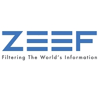

------

# Curriculum Vitae


$®γσ$, $ξηg\ Lιαη\ Ημ$

<br>
[[**Theme Song**]{style='color:green'}](https://zhidao.baidu.com/question/397416930.html)[^0]：《子曰》
<br>
<audio controls loop autoplay src='诸子百家诗经与古诗源/卜学亮 - 子曰.mp3' controls></audio>
<br>

[^0]: [此菜🥬只应天上有，人间难得几回尝](https://zhidao.baidu.com/question/397416930.html) means :"As fantastic / heavenly as this dish🥬, it's one in the million of a chance to have it made so exquisite and one in the million for you to have."

**大秦赋 (Chinese Emperor)**<br>
春秋战国《*礼记•经解*》<br>
孔子曰：「君子慎始，差若毫厘，缪以千里。」

> <span style='color:#FFEBCD; background-color:#991B00;'>**《礼记·经解》孔子曰：**</span><span style='color:#DimGrey; background-color:#D52600;'>*「君子慎始，差若毫厘，谬以千里。」*</span>[^1]

*引用：[「快懂百科」《礼记•经解》](https://www.baike.com/wikiid/2225522569881832051?view_id=2tt3iw3blkq000)和[第一范文网：差之毫厘，谬以千里的故事](https://www.diyifanwen.com/chengyu/liuziyishangchengyugushi/2010051523105152347092749890.htm)和[「百度百科」春秋时期孔子作品《礼记•经解》](https://baike.baidu.com/item/%E7%A4%BC%E8%AE%B0%C2%B7%E7%BB%8F%E8%A7%A3/2523092)和[「當代中國」差之毫釐 謬以千里](https://www.ourchinastory.com/zh/2962/%E5%B7%AE%E4%B9%8B%E6%AF%AB%E9%87%90%20%E8%AC%AC%E4%BB%A5%E5%8D%83%E9%87%8C)*

[^1]: [HTML Color Codes](https://html-color.codes)

> 
> 
> **大秦赋 - 北京大学**
> 
> 🇨🇳国操作系统🚩🇨🇳️🏹红旗礼逆袭是由🚩🇨🇳️🏹中科红旗创办人孙玉芳教授团队研发，孙玉芳教授与愚生都是🇨🇳北京大学校友。
> 
> - [🚩红旗礼逆袭（官网）](https://www.chinaredflag.cn)
> - [🚩红旗应用商店（官网）](http://www.linuxsir.cn)
> - [🚩红旗飘飘 —— 孙玉芳研究员谈国产操作系统](https://xuewen.cnki.net/CJFD-WDNJ199941001.html)
> - [🚩Administration of User Account in Secure OS](http://journal.ucas.ac.cn/CN/abstract/abstract11932.shtml)
> 
> 
> 
> <br>
> 可通过以下网站查阅更多详情：
> 
> - [猫城仓库：scibrokes/r-world/issues/1](https://github.com/scibrokes/r-world/issues/1)
> - [猫城仓库：scibrokes/owner/issues/4](https://github.com/scibrokes/owner/issues/4)
> - [猫城仓库：scibrokes/setup-centOS7-DO](https://github.com/scibrokes/setup-centOS7-DO)
> - [猫城仓库：englianhu/RedFlag-Linux/issues/6](https://github.com/englianhu/RedFlag-Linux/issues/6)
> 
> <iframe src='//player.bilibili.com/player.html?aid=938367824&bvid=BV1pT4y1a7Zt&cid=581199416&page=1' scrolling='no' border='0' frameborder='no' framespacing='0' allowfullscreen='true'> </iframe>
> 
> *视频来源*：[*β站：安装🚩红旗Linux系统*](https://t.bilibili.com/678703037247651863)

有关农历与二十四节气，目前正在自修中科红旗之礼逆袭红旗操作系统，会先将曦与曦佳佳编程语言翻译为咱们中文编程附上拼音（李斯篆书），再提升为文言文及古文编程、日期均以农历与咱们中华五千多年习俗文化道教为主，它日再研发「大秦赋」操作系统，欲知更多详情请查阅[「猫城」雷欧/中科红旗](https://github.com/englianhu/RedFlag-Linux)和[「猫城」雷欧/图书馆](https://github.com/englianhu/library)。

------

# Setting

## SCSS Setup

<style>
pre {
  overflow-x: auto;
}
pre code {
  word-wrap: normal;
  white-space: pre;
}
.table-hover > tbody > tr:hover { 
  background-color: #8D918D;
}
</style>

```{r load-sass, class.source='bg-success', class.output='bg-primary'}
# install.packages('remotes', dependencies = TRUE, INSTALL_opts = '--no-lock')
library('BBmisc', 'rmsfuns')
#remotes::install_github("rstudio/sass")
lib('sass')

## https://support.rstudio.com/hc/en-us/articles/200532197
## https://community.rstudio.com/t/r-does-not-display-korean-chinese/30889/3?u=englianhu
#Sys.setlocale("LC_CTYPE", "en_US.UTF-8")
#Sys.setlocale("LC_CTYPE", "zh_CN.UTF-8")
#Sys.setlocale(category = "LC_CTYPE", "Chinese (Simplified)_China.936")
#Sys.setlocale(locale = "Chinese")
#Sys.setlocale(locale = "Japanese")
#Sys.setlocale(locale = "English")

# rmarkdown::render('/home/englianhu/Documents/owner/ryo-cn.Rmd',  encoding = 'UTF-8')
#Sys.setlocale("LC_CTYPE", "UTF-8")
#Sys.setlocale(locale = "UTF-8")
#Sys.setlocale(category = "LC_ALL", locale = "chs")
#Sys.setlocale(category = "LC_ALL", locale = "UTF-8")
#Sys.setlocale(category = "LC_ALL", locale = "Chinese")
#Sys.setlocale(category = "LC_ALL", locale = "zh_CN.UTF-8")
Sys.setlocale("LC_ALL", "en_US.UTF-8")
```

```{scss scss-setup, class.source='bg-success', class.output='bg-primary'}
/* https://stackoverflow.com/a/66029010/3806250 */
h1 { color: #002C54; }
h2 { color: #2F496E; }
h3 { color: #375E97; }
h4 { color: #556DAC; }
h5 { color: #92AAC7; }

/* ----------------------------------------------------------------- */
/* https://gist.github.com/himynameisdave/c7a7ed14500d29e58149#file-broken-gradient-animation-less */
.hover01 {
  /* color: #FFD64D; */
  background: linear-gradient(155deg, #EDAE01 0%, #FFEB94 100%);
  transition: all 0.45s;
  &:hover{
    background: linear-gradient(155deg, #EDAE01 20%, #FFEB94 80%);
    }
  }

.hover02 {
  color: #FFD64D;
  background: linear-gradient(155deg, #002C54 0%, #4CB5F5 100%);
  transition: all 0.45s;
  &:hover{
    background: linear-gradient(155deg, #002C54 20%, #4CB5F5 80%);
    }
  }

.hover03 {
  color: #FFD64D;
  background: linear-gradient(155deg, #A10115 0%, #FF3C5C 100%);
  transition: all 0.45s;
  &:hover{
    background: linear-gradient(155deg, #A10115 20%, #FF3C5C 80%);
    }
  }
```

```{r gb-opts, class.source='hover01', class.output='hover02'}
## 设置时区但不更换时差
Sys.setenv(TZ = 'Asia/Shanghai')

## 设置忽略所有警讯
## https://stackoverflow.com/a/36846793/3806250
## 设置宽度
## options(knitr.table.format = 'html')一次性将所有kableExtra图表设置为'html'，省得逐个设置。
options(warn = -1, width = 999, knitr.table.format = 'html')#, digits.secs = 6)

## https://stackoverflow.com/questions/39417003/long-vectors-not-supported-yet-abnor-in-rmd-but-not-in-r-script
## https://yihui.org/knitr/options
knitr::opts_chunk$set(
  class.source = 'hover01', class.output = 'hover02', class.error = 'hover03', 
  message = FALSE, warning = FALSE, error = TRUE, 
  autodep = TRUE, aniopts = 'loop', 
  progress = TRUE, verbose = TRUE, 
  cache = FALSE, cache.lazy = FALSE, result = 'asis')
```

<br><br>

## Setup

```{r 读取程序包配套, eval=FALSE}
## 选项设置、查阅图书馆读取R程序包、环境设置
## 读取R程序包与调整设置
source('函数/读取程序包配套.R')
```

```{r setup, include=FALSE}
## 选项设置、查阅图书馆读取R程序包、环境设置
## 读取BBmisc程序包
if (suppressMessages(!require('BBmisc'))){
  install.packages('BBmisc', dependencies = TRUE, INSTALL_opts = '--no-lock')
  suppressMessages(library('BBmisc'))
}
if (suppressMessages(!require('rmsfuns'))) {
  install.packages('rmsfuns', dependencies = TRUE, INSTALL_opts = '--no-lock')
  suppressMessages(library('rmsfuns'))
}

if (!require('REmap')) devtools::install_github('lchiffon/REmap')

conflicted::conflicts_prefer(dplyr::rename, .quiet = TRUE)
conflicted::conflicts_prefer(plyr::count, .quiet = TRUE)
conflicted::conflicts_prefer(dplyr::filter, .quiet = TRUE)
conflicted::conflicts_prefer(dplyr::lag, .quiet = TRUE)
conflicted::conflicts_prefer(data.table::transpose, .quiet = TRUE)
conflicted::conflicts_prefer(git2r::pull, .quiet = TRUE)
conflicted::conflicts_prefer(dplyr::summarise, .quiet = TRUE)
conflicted::conflicts_prefer(dplyr::mutate, .quiet = TRUE)
conflicted::conflicts_prefer(dplyr::arrange, .quiet = TRUE)
conflicted::conflicts_prefer(readr::read_csv, .quiet = TRUE)

## 一次性读取所列R程序包，一劳永逸
程序包 <- c('readr', 'dplyr', 'magrittr', 'tidyverse', 'devtools', 'zoo', 'lubridate', 'stringr', 'stringi', 'rvest', 'markdown', 'googleVis', 'knitr', 'rmarkdown', 'htmltools', 'knitr', 'kableExtra', 'formattable', 'echarts4r', 'radarchart', 'MASS', 'htmlwidgets', 'maps', 'REmap', 'ggmap', 'vembedr', 'rsconnect', 'tidyft', 'Ipaper', 'conflicted')

suppressAll(lib(程序包))
load_pkg(程序包)
rm(程序包)

## 设置googleVis中的plot.gvis选项，将html文件嵌入于成品文件。
op <- options(gvis.plot.tag = 'chart')

## <audio src='诸子百家诗经与古诗源/bigmoney.mp3' autoplay controls loop></audio>
```

<br><br>

## About Me

| **Title**                                    |                                                                                                                                                                       **Details** |
|:---------------------------------------------|----------------------------------------------------------------------------------------------------------------------------------------------------------------------------------:|
| [Family Name]{style='color:RoyalBlue'}[^2]   |                                                                                                                                                [ξηg]{style='color:RoyalBlue'}[^3] |
| [Given Name]{style='color:RoyalBlue'}        |                                                                                                                                            [Lιαη Ημ]{style='color:RoyalBlue'}[^4] |
| [Courtesy Name]{style='color:RoyalBlue'}     |                                                                                         [阿<ruby>虎<rp>(</rp><rt>hǔ</rt><rp>)</rp></ruby>🐯 ]{style='color:RoyalBlue'}[^5](Tiger) |
| [Pseudonym]{style='color:RoyalBlue'}         |                                                                                                                                              [$®γσ$]{style='color:RoyalBlue'}[^6] |
| [Alais Name]{style='color:RoyalBlue'}        |                                                                                                                                    [🎎Ryusuke Kenji]{style='color:RoyalBlue'}[^7] |
| [Nickname]{style='color:RoyalBlue'}          | [Mr. Hu (Mr. <ruby>沪<rp>(</rp><rt>hù</rt><rp>)</rp></ruby>)]{style='color:RoyalBlue'}[^8] / [HuHu (<ruby>浒<rp>(</rp><rt>hǔ</rt><rp>)</rp>湖<rp>(</rp><rt>hú</rt><rp>)</rp></ruby>)]{style='color:RoyalBlue'}[^9] / [AHU (阿沪)]{style='color:RoyalBlue'}[^10] / [FuZai (🇭🇰Cantonese: <ruby>富<rp>(</rp><rt>fū</rt><rp>)</rp>仔<rp>(</rp><rt>zái</rt><rp>)</rp></ruby>)]{style='color:RoyalBlue'}[^11] |
| Date of Birth (Gregorian Calendar)           |                                                                                                                                             (Zodiac: Libra ⚖) 22th-October-1984 |
| Birthday Horoscope (Chinese Calendar)        |                                                                                        (Chinese Zodiac: Mouse 🐭) Year 1984（甲子鼠年🐭）September 28th （丑牛时🐮）time (Monday) |
| Age                                          |          `r interval(dmy('22-10-1984', tz = 'Asia/Shanghai'), now(tzone = 'Asia/Shanghai')) |> {\(.) as.period(., .unit=years)}() |> {\(.) str_replace(., '(?<=d).{1,}$', '')}()` |
| Mobile Phone Number                          |                                                                                                                                           🇲🇾 [+6-017-6482776](tel:+60176482776) |
| Other Mobile Phone Number                    | 🇲🇾 [+6-014-6082776](tel:+60146082776) / 🇹🇼 <s>[+886-098-9104576](tel:+8860989104576)</s> / 🇨🇳 <s>[+86-148-00318130](tel:+8614800318130)</s> / 🇵🇭 <s>[+63-956-1935095](tel:+639561935095)</s> / 🇬🇧 <u>[+44-xxxxxxxxxx](tel:+44xxxxxxxxx)</u> / 🇭🇰 <u>[+852-57-004008](tel:+85257004008)</u> |
| Email Address (Mailbox)                      |                                                                                                                                                               englianhu@gmail.com |
| Others Mailbox                               |   englianhu@hotmail.com / englianhu@yahoo.com / <s>ryusukekenji@gmail.com</s> / <s>ryusukekenji@hotmail.com</s> / <s>lianhu_10@hotmail.com</s> / <s>cyber_englianhu@yahoo.com</s> |
| Nationality                                  |                                                                                                                                                                    🇲🇾 Malaysian |
| Place of Birth                               |                                                                                                                                                Tanjong Karang, Selangor, Malaysia |
| Religion                                     |                                                                                          [墨μ **Mohism**, ☸ρ Confucianism, ☯️τ Taoism, 卍 Buddha]{style='color:RoyalBlue'}[^12] |
| Race                                         |                                                                                                                                                                  🇹🇼🇨🇳 Chinese |
| Ancestral Home                               |                                                                                                                 🇹🇼🇨🇳 [Chinese Fujian Yong Chun]{style='color:RoyalBlue'}[^13] |
| Mother Tongue                                |                                                                                                                                           🇹🇼🇨🇳 Taiwanese / Hokkien / Mandarin |
| Others Spoken Language                       | 🇭🇰 Cantonese / 🇬🇧🇺🇸 English / 🇯🇵 Japanese / 🇮🇩🇲🇾 Indo-Malay / <s>🇰🇷 Korean</s> / <s>🇩🇪 German</s> / <s>🇫🇷 French</s> / <s>🇬🇷 Greek</s> / <s>🇵🇭 Tagalog</s> / <s>🇰🇭 Khmer</s> |

[^2]: \- [《拼出咱的名》🎼](https://youtu.be/2bsMitFaZL0)<br>- [【国学】古人的名、字、号……居然有这么多讲究](http://www.xinhuanet.com/politics/2018-09/26/c_129960980.htm)<br>- [古人的名、字、号的区别](https://zhidao.baidu.com/question/607401941.html)<br>- [古人的名、字、号，有什么区别？](http://www.360doc.com/content/18/0318/23/7724115_738280959.shtml)<br>- [古代人的「姓、名、字、号」用英文怎么翻译。还有「原名」、「人称」、「<ruby>谥<rp>(</rp><rt>shì</rt><rp>)</rp></ruby>号」、「别号」](https://zhidao.baidu.com/question/539061381.html)

[^3]: *「未曾见过曾祖父和祖父的英文姓名，不过为啥咱家英文姓氏是ENG而非NG呢？当中有个小插曲，就是马来亚国家未独立，前辈们（忘了当时是曾祖父或祖父去国民登记局，还是伯父爸爸和三叔去国民登记局，总之原本英文是Ng，写为Eng）都不会马来文，只会闽南语“黄”，结果去国民登记局，马来人听到“NG”就写成“ENG”了，就像平时有人看到ENG会念成“嗯（后鼻音）”，而在下会纠正念：“Eing / A'ing”...」*<br><br>欲知更多详情，可参阅[《雪隆江夏堂》 – 家谱](https://englianhu.wordpress.com/2022/02/22/%e3%80%8a%e9%9b%aa%e9%9a%86%e6%b1%9f%e5%a4%8f%e5%a0%82%e3%80%8b-%e5%ae%b6%e8%b0%b1)。<br><br>好友曾威廉也说过他的祖父🚩红军军人，光绪年间从中国飘洋过海到泰国认识他祖母结婚生子后再南下马来亚落地生根，原姓Chan后登记为Chen... 个人博文会记载以前认识的好友和经历等。

[^4]: **《阿虎家谱》**<br>[*父母识乩童，华财郑招添；<br>家父得十子，子名皆母起。<br>碧历真、升旗山、丰富、霜巡；<br>本欲生八子，后得幼儿女。<br>甲子甲女也，母起字霹莲；<br>乙子乙女也，母未曾起字。<br>丙子丙女也，母起字阿尿；<br>丁子甲男也，母未曾起字。<br>戊子乙男也，母起字老<ruby>旗<rp>(</rp><rt>🇹🇼闽曰：kî</rt><rp>)</rp></ruby>；<br>己子丙男也，母起字山<ruby>哪<rp>(</rp><rt>nā</rt><rp>)</rp></ruby>。<br>庚子丁男也，母未曾起字；<br>辛子戊男也，母起字阿<ruby>虎<rp>(</rp><rt>🐯</rt><rp>)</rp></ruby>。<br>壬子丁女也，母未曾起字；<br>癸子己男也，母未曾起字。<br>子称父二叔，子称母二婶。*]{style="color:#F6A217"}<br><br>--- 笔者📝本人黄联富<br><br>父母就经过友人介绍认识了一位查《三世书》的算命佬✍🏻华财(类似白骨精，外号“骨的”)，自幼家庭贫困不过不奢求啥，家人们一出世，华财就辑写每个家庭成员类似自传的一辈子运势，可以解释为《人生契约》，父母另一位好友《三太子庙》后改为《太子庙》的郑招添，童年未7岁上小学前，爸妈时常带我到村外六石里路的郑招添家（家与寺庙隔壁身兼打理人，类似1994年第一次到村里一巷四哥同学郑进祥的爸爸乩童（太上老君）外号称阿明寺庙在他家对面、2001年中学转校到瓜雪认识好友郑凌旭同学古瘄）聊天。<br><br>1984年一出世，妈妈就称我为阿虎，亲朋戚友也这么叫阿虎。时常聊起她小时候有儿歌哼：“马来亚，好风光；景色多漂亮；没天灾人祸...”、“春天不是读书天，夏日炎炎正好眠”、“耶律沙冷...”。妈妈原本要生八个孩子，碧历真<s>霹雳针</s>、升旗山（起名“升旗山”因为有气势威风凛凛且兄弟间互相帮忙，没说过和槟城旗帜与明智华小校徽一样。），打算生了丰富后就不再生育，怎么知道高龄生育，不晓得要起什么名，就起了“霜”（后来妹妹的同学朋友说过：“哑巴吃黄莲够苦命了，还要雪上加霜。”）、之后再没预料到再生一个庶子，希望家人都事业出门万事顺顺利利也没啥奢望，就起了个“巡”；而母亲为了避免家人到村里咖啡店找爸爸时与别人一样叫爸爸，咖啡店的人和自己爸爸妈妈会不晓得是谁家孩子，所以妈妈就叫家里兄弟姐妹一出世以来，就称“爸爸”为“二叔”，称“妈妈”为“二婶”。<br><br>欲知更多详情，可参阅[《雪隆江夏堂》 – 家谱](https://englianhu.wordpress.com/2022/02/22/%e3%80%8a%e9%9b%aa%e9%9a%86%e6%b1%9f%e5%a4%8f%e5%a0%82%e3%80%8b-%e5%ae%b6%e8%b0%b1)。

[^5]: \- 参照以上**《阿虎家谱》**<br>-[《小虎🐯队-2019精选集 (上)》🎼](https://youtu.be/lN2HqdKvRSs)<br>- ["狗"与"犬"有区别吗？](https://baike.baidu.com/tashuo/browse/content?id=f5a54d49931410bdb8ec540c)：《尔雅·释兽》载，[*「熊🐻虎🐯丑，其子狗。」*]{style="color:#F6A217"} “丑”意思是“类”，这句话的意思是：熊虎类的<ruby>崽<rp>(</rp><rt>zǎi</rt><rp>)</rp></ruby>称为狗。清代大学者郝懿行解释《尔雅》的书《尔雅义疏》，[*「今东齐、辽东人通呼虎🐯之子为羔，羔即狗之转。」*]{style="color:#F6A217"}<br>- [中国哲学书电子化计划：“<ruby>豿<rp>(</rp><rt>gǒu</rt><rp>)</rp></ruby>”](https://ctext.org/dictionary.pl?if=gb&char=%E8%B1%BF&remap=gb)：[*「<ruby>豿<rp>(</rp><rt>gǒu</rt><rp>)</rp></ruby>：熊🐻虎🐯之子。」*]{style="color:#F6A217"} describe how to term small bear🐻 and tiger🐯 in Chinese language. For example: calf🐮 is small cow🐮.

[^6]: 2008年加入西世康首周培训时，培训师Tan Tee Wei(谐音：陈蒂薇)问我怎么称呼，有没有昵名之类的，然后想了几天后就自诩Ryo，就因为小学中学时期喜欢《街头霸王》的<ruby>龍<rp>(</rp><rt>りゅう</rt><rp>)</rp></ruby>（龙 Ryu）和升龙拳、《拳王》的<ruby>草<rp>(</rp><rt>くさ</rt><rp>)</rp>薙<rp>(</rp><rt>なぎ</rt><rp>)</rp>京<rp>(</rp><rt>きょう</rt><rp>)</rp></ruby>（京 Kyo），因为“<ruby>拾<rp>(</rp><rt>🇹🇼闽曰：khioh</rt><rp>)</rp></ruby>”字感觉像“拾金不昧”、“遭人嫌弃的养子”、“不是亲生的养子”（1983年出生的四哥联丰婴儿时期，家慈李仁曾送与大姨妈李英当儿子，祖母颜为得知赶紧到外祖母家载孙子回家。后来小姨妈李美兰花钱RM8000为大姨妈买了个1988年出生的印度裔婴儿当儿子。而小时候90年代追《包青天》有集“狸猫换太子”）；[*就不想用Ryu和Kyo，联合起来自诩Ryo*]{style="color:#F6A217"}，刚好就和《拳王》（最初出现于1992年《龍虎の拳》的角色）中的<ruby>坂<rp>(</rp><rt>さか</rt><rp>)</rp>崎<rp>(</rp><rt>ざき</rt><rp>)</rp>亮<rp>(</rp><rt>りょう</rt><rp>)</rp></ruby> Ryo命名（绝技“真・天地覇煌拳”以速度取胜，不过最喜欢豪鬼的“瞬狱杀”，类似目前科研的高频量化交易），Ryo 朗朗上口，记得西世康Jason问过Ryo中文怎么写，而我浅笑回答可以自定义为“良”、“量”、“亮”等汉字而故意不定位，不使用中文汉字，而使用外来语リョウ，1997年想学佐治.索罗斯当个金融业大玩家，当时完全没听说过任何量化圈的人物，2005年在HexaCommerce工作时只知道老外很厉害使用电脑编程和数学和统计学交易挣钱却没导师无从学起，甚至不晓得俗称“量化”，只知道以数学和统计学在交易市场挣钱。<br><br>2019年到乐发阿里彩票工作时，公司只允许使用别名，表格上本想用“<ruby>叡<rp>(</rp><rt>ruì</rt><rp>)</rp></ruby>欧”却忘了曹叡的叡字怎么写（就“叡”字少见，不过想到司马掌权就不使用“叡”字）、然后“磊欧”（为人“光明磊落”、“明人不做暗事”之意，正合个人的为人处事。从Caspo辞职回国就是立志学好在拉曼学院修读大学时所知道的统计学以数据的多寡加上统计建模在交易市场上挣钱，俗称Dixon&Coles1997提及的“大数定律”与“极大似然估计”，而非2006年在🇸🇬新加坡喜来登和嚣张🇸🇬欧阳金泰面试时夸夸其谈。2008年至2012年在西世康工作一心只想科研数学、建立量化避险基金，不靠奉承；有天光头上司Christopher欲提拔邀出席公司年宴当面，被我拒绝难堪后当面不知所措心慌。）不能朗朗上口、而“龙”字太普遍，然后就使用“雷欧”（考量到《飞跃青春》的王雷、🇸🇬新加坡行动党⚡️、🇪🇺欧盟、最主要是同是量化避险基金“雷达利欧”简称为“雷欧”）翻译原本的Ryo，然后同组有位“娟娟”（🇸🇬欧阳金泰妻子名叫“晓娟”）、“大龙”、“雷着”（2012年在马电讯工作过滤海外转播节目有出戏叫《飞跃情春》由长得像🇸🇬欧阳金泰的🇨🇳中国艺人王雷饰演，男主角的结局是悲情枪决死刑），和华财一样超短光头发型的雷着身份证姓名：王雷。“瑞欧”则是目前不速之客🇸🇪瑞典国鸟乌鸦时常飞来而命名。<br><br>2007年到 🇸🇬新加坡喜来登酒店大厅面试Caspo新宝工作时，欧阳金泰和欧阳金喜俩问:“有没有一个比较容易记的名字、称号或别名？”，当时回复：“没有!”，然后在Caspo工作时，同事上司老板们都称“Lian Hu”。

[^7]: 2001/2002年（中四中五时期）每次暑假都会到怡保路汇丰银行后面的住宅区（家人赁租的公寓），然后学习电脑Photoshop、Front Page、玩Play Station电玩、追幽游白书、街头霸王、高达战士系列等动漫影片。中学时期同学们都玩网上聊天的IRC，因为大姐二姐平时使用电邮，当时90年代是雅虎年代，也注册了个邮箱（忘了什么雅虎邮箱号了），之后经中学同学慧燕介绍到巴生中路《大人餐厅》打工时，平时会查询邮箱。后来因为追《G高达战士》到结局时，喜欢悲情的东方不败的多蒙京二（自幼看琼瑶戏就爱哭，也喜欢抒情歌曲），就以《幽游白书》灵丸的<ruby>幽<rp>(</rp><rt>ゆう</rt><rp>)</rp>助<rp>(</rp><rt>すけ</rt><rp>)</rp></ruby>Yusuke、Kyoji、Ryunosuke（目前忘了是哪个电玩或者动漫角色，应该是《<ruby>龍<rp>(</rp><rt>りゅう</rt><rp>)</rp>狼<rp>(</rp><rt>ろう</rt><rp>)</rp>伝<rp>(</rp><rt>でん</rt><rp>)</rp></ruby>》的“<ruby>竜<rp>(</rp><rt>りゅう</rt><rp>)</rp></ruby>の<ruby>子<rp>(</rp><rt>こ</rt><rp>)</rp></ruby>”天地志狼，印象中《幽游白书》有人物叫“幽助”为“幽之助”，类似比达叫“孙悟空”为“卡卡罗特”）、<ruby>野<rp>(</rp><rt>の</rt><rp>)</rp>原<rp>(</rp><rt>はら</rt><rp>)</rp>新<rp>(</rp><rt>しん</rt><rp>)</rp>之<rp>(</rp><rt>の</rt><rp>)</rp>助<rp>(</rp><rt>すけ</rt><rp>)</rp></ruby>（新之助 Shinnosuke）联合，自诩“Ryusuke Kenji”。

[^8]: 2006年在Telebiz（🇭🇰香港籍秃头大股东🐯虎哥，长得像🇭🇰李嘉诚）工作时有个🇮🇩印尼股东叫Mr Yee（另一位🇮🇩印尼股东“阿明”称为明哥），而同房同事室友Chew Yee Mun 阿<ruby>文<rp>(</rp><rt>mǎn</rt><rp>)</rp></ruby>（🇭🇰粤）（像🇭🇰港星马俊伟在《马场大亨》工作过，长得和🇭🇰港星魏俊杰很相似），就喜欢称呼为Mr. Hu (Mr. <ruby>沪<rp>(</rp><rt>hù</rt><rp>)</rp></ruby>)，然后公司的同事都那么称、上司老板和当时认识的同事兼后来成为好友曾威廉称AHU (阿沪)，至于AHU (阿沪)这个小名则看下文。

[^9]: 2006年在Telebiz，有位好哥儿们同事（同组后转为隔壁桌出货跟单部门、后来都从Caspo辞职后还一块儿喝茶聊天找工作，而我到世西康工作）Chris Chen Peng Kok就喜欢称<ruby>浒<rp>(</rp><rt>hǔ</rt><rp>)</rp>湖<rp>(</rp><rt>hú</rt><rp>)</rp></ruby>)。

[^10]: 1997年上中学后，有位为人不拘泥于小节的好哥儿们同学陈友良[样子就像改变全世界的苹果公司创办人斯蒂芬·乔布斯/意大利足球明星范切斯特·托蒂](https://www.bilibili.com/video/BV1BN411o7ff)（中一中二不同班关系还不错、中三同班同学好哥儿们。由于友良同学、伟明同学、进祥同学、表弟国添、堂哥顺昌都有黑帮背景，平时上课时间都喜欢和友良一块儿旷课畅谈黑帮）中一时一认识就称AHU (阿<ruby>沪<rp>(</rp><rt>hù</rt><rp>)</rp></ruby>)，而日后的同事们都是一认识就称AHU (阿<ruby>沪<rp>(</rp><rt>hù</rt><rp>)</rp></ruby>)。

[^11]: 2010年左右在西世康工作，自从提交企划书，巴西不能帮万佛寺乩童张家坤（大约2002年中学毕业后认识，当时人称《万佛寺》的济公师傅，经过二哥同学张志强介绍二哥和妈妈认识后，二哥和妈妈再介绍给我认识，大约2002年第一次在《万佛寺》问神时，乩童张家坤第一眼见到我就晴天霹雳跪地求饶扮女生说话）就开始说会争取到立博交易部门。有天三姐拿着《人生契约》连同妈妈和我到华财家问神。（上文谈及查《三世书》并辑写✍🏻《人生契约》的乩童华财，打从1984年一出世就被批命），[*也就是长大后再次遇见华财后，华财眼眶红红满眼是眼泪说吃乩童这行饭不容易得承担责任。妹妹才开始在不知情的情况下称“🇭🇰<ruby>富<rp>(</rp><rt>fū</rt><rp>)</rp>仔<rp>(</rp><rt>zái</rt><rp>)</rp></ruby>)”*]{style="color:#F6A217"}，家人也在不知情的情况下开始改口称“爸爸”为“<ruby>老<rp>(</rp><rt>🇹🇼闽曰：lǎo</rt><rp>)</rp>爸<rp>(</rp><rt>🇹🇼闽曰：běi</rt><rp>)</rp></ruby>”（发音类似:刘备），从此就家事不顺。<br><br>《圣经》记载着世界上只有一个神明，自从西世康辞职再找万佛寺乩童张家坤时，当时见面他说剩一个人、另一次说会死、另一次说脑袋里空白啥都想不到、再另一次说得行善捐款之类每次说法不同，许多奇奇怪怪的话，然后我就开始摸索，在Mindpearl工作时视频有人查出骨哥华财的法力在十秒内可以查询到任何事物（而2007年在Caspo时，《离岛特警》亡命之徒Billy仔🇸🇬欧阳金泰说他自己：“如果迟三秒，命仔会被夺走！”），直到7LiveAsia时才听Kevin说:“如果要相信张家坤，就要相信到刘华财死掉为止才结束，世上只有一个神明，一山不能容二虎。”，后来Juno闲聊时：“你需要先死掉才能找到工作“完全不明白，微博有人发过动态图的帖子就是一男一女各在两座山上，中间隔着悬崖，一直有男生像精子一样跨不过悬崖到对岸获得美人归而丧命，而最后一位男的成功跨过悬崖男女俩在一起时，女的却掉下悬崖死了只剩一个人。后来被中邪的家人（自从在Fujixerox工作时，当时每天上班见到经理长得像乩童张家坤的Jacky Chai Yun Cheah当小丑，只有乩童张家坤和刘华财同步的话，乩童张家坤或刘华财就会成了小丑或失心疯，直到辞职那天他就会双眼通红满眼是眼泪，在Mindpearl辞职那天人事部经理也一样双眼通红满眼眼泪。当时为了测试7LiveAsia之说，以身试法说RHU花园的乩童刘华财我死掉为止才能重生，结果到RHU花园的乩童家验证后见到刘华财失心疯胡言乱语躲躲藏藏还出门逃跑，还下家人降头，在被绑架的前几周胸口痛得死去活来，被绑架的前几天差点像Brad余素伟说过出门会消失不见）绑架到疗养院，管理员聊起《换命之说》才知道何谓换命，结果死了两个人（一个像当时报警瓜雪一位警长蔡细历不受理、也像Christopher的爸爸；另一位像乩童张家坤）和邪不能胜正才出来后。自从诸事不顺未到7LiveAsia前一直要张家坤死而以身试法在脸谱使用张家坤姓名，之后一位长得像乩童张家坤🇹🇼台籍吕联富脸谱公然发帖保一家大小后，2017年在柔佛工作时一曲[《刚好遇见你》🎼](https://www.youtube.com/watch?v=aa2AhDaK_iY)让家慈往生成为先慈，成了刘张斗法的牺牲品，而🇨🇳中国以国母葬礼仪式，远在🇨🇳大势举国哀悼（当时网上还有许多媒体直播视频，🇨🇳隆重举办国丧仪式）；一曲[《改写人生》🎼](https://www.youtube.com/watch?v=wbyLBHPDuNI&ab_channel=%E8%9E%ADCHIMUSIC)诉尽《三打白骨精》中的人妖白骨精华财和《万佛寺》乩童张家坤、《西灵宫》齐天大圣、《众仙洞》大师兄的恩怨与替死鬼... 无心插柳柳成荫，个人博文会记载以前的经历和统计推算，事出必有因、一些玄学、道学、佛法、圣经、可兰经、前因后果、奇门遁甲、三黄五帝、The Narnia、魔戒三部曲、盘古女娲、兵马俑、幽灵、魔鬼、天界、人间、地狱、数学、春秋战国、梦里会周公、西游记、天文地理文学古诗屈原数学物理瘟疫朝代兴衰全都有关系、神经网络、中药、西药、地球上第一个行政机构朝廷政府是从中国黄河文明开始、虞夏商周、封神榜、姜太公、管仲乐毅、吴王阖闾Democrats、越王卧薪尝胆、楚汉相争、古代西大美女、中国象棋、西洋棋、鬼谷子孙膑庞涓、孙子兵法、诺亚方舟、春江鸭先知、隐马尔科夫领域、GPX零的领域、万物一物克一物、规律、大数定律等。

[^12]: `r vembedr::embed_youtube('r2zH4JxQSYQ')`<br>>[*#筑地 #Judi #朱棣 #菜桌椅不是菠菜庄家 #菠菜 #Spanich #🇵🇭🇰🇭 #肺炎 #证券行叫SecurityFirm如同镖局 #邪教博彩庄家诈骗如同鸦片 #博彩庄家卡款铲单杀人如麻如同邪教屠杀人类罪<br>📌只要是博彩庄家靠卡款铲单骗取彩民客户的钱的博彩庄家就是列为诈骗犯罪集团；如果博彩庄家不卡款也不铲单一直亏钱造福所有彩民客户，就是列为慈善机构。<br>📌只要是博彩庄家或任何机构靠卡款铲单骗取彩民客户的钱导致死人的博彩庄家，就是列为谋杀屠杀人类罪。<br>📌只要是运用科学、统计学、数学公式击倒博彩庄家（或者任何科学、科技、技术、数学公式），就叫墨学；墨学俗称科学，工程师、程序员、天文学家、数学家、科学家、统计学家、物理学家、医学家、计量经济学家都是信徒，遍布地球并无国籍之区别<br>📌结论：所以我只能釜底抽薪一劳永逸，根除肺炎的根源🇵🇭🇰🇭博彩庄家金宝博Caspo，支持科学方程式的墨学，拯救全世界人类性命。<br><br>📌As long as bankers or sportsbookmakers cancel transaction or block withdrawal to make money categorized as criminal organization. Only the sportsbookmaker or banker lost money to the gamblers or customers categorized as charity organization for the sake of all residences / citizens / humen.<br>📌As long as bankers or sportsbookmakers block customer's withdrawal or cancel transaction to cause human die or sacrifice, categorized as killing humans' terrorist murdering organization.<br>📌As long as applied statistical or mathematic or any scientific formula categorized as Mohism/Moism. Programmers, mathematicians, statisticians, engineers, doctors, across the World.<br>Conclusion : That's why I only can rebel the origin of covid from Caspo/188Bet being 🇵🇭🇰🇭 and support scientific Moihism or Moism to safe the World and humans' life.*]{style='color:#F6A217'}<br>- [儒家、道家、佛家、法家、墨家如何区分，看后恍然大悟](https://www.sohu.com/a/325543608_483111)<br>- [诸子百家](https://baike.baidu.com/item/%E8%AF%B8%E5%AD%90%E7%99%BE%E5%AE%B6/16808)<br>- [关于儒家、墨家、道家、法家思想的异同](http://www.360doc.com/content/12/0907/21/7593597_234907351.shtml)<br>- [古希腊文明](https://baike.baidu.com/item/%E5%8F%A4%E5%B8%8C%E8%85%8A%E6%96%87%E6%98%8E/9671355)<br>欲知更多详情请查阅[GitHub: 图书馆 library](https://github.com/englianhu/library)<br><br>[*「「卍」字有兩種寫法，一種是右旋（卐），一種是左旋（卍）。高雄佛陀紀念館上方矗坐著「佛光大佛」*]{style="color:#F6A217"}*，胸口是一個左旋卍字（圖三）。希特勒親自設計的黨旗為紅底白圓心，中間嵌一個黑色右旋字。他在《我的奮鬥》書中說：“紅色象徵我們這個運動的社會意義，白色象徵民族主義思想。卐字象徵爭取雅利安人鬥爭勝利的使命。”由這句話可知，希特勒完全不了解右旋的佛學意義。」*<br><br>[*希特勒對右旋卐的了解應該是由日爾曼神話而來。今日好萊塢電影很夯的雷神索爾（Thor）其實是早期日爾曼民族共有的神祇，卐是他的槌子，直到今日，Thor符號還是白人至上主義的象徵符號。*]{style="color:#F6A217"}*右旋卐字的德語是Haken kreutz，亦意指「彎勾十字架」。右旋卐字也使用於波羅的海沿岸，稱之為Perkunas，拉脫維亞朋友克羅明博士（Janis Klovins）告訴我，一九一八年到一九三四年間，右旋卐字是該國空軍的標誌。」*<br><br>出处：[「卍」字左旋右旋大不同！寫反佛光變納粹…為何希特勒用這符號？難道跟佛教有關？](https://www.storm.mg/lifestyle/327499?page=1)

[^13]: \- Tips: *Ancient named [<ruby>会<rp>(</rp><rt>kuài</rt><rp>)</rp>稽<rp>(</rp><rt>jī</rt><rp>)</rp></ruby>郡（Kuaiji County）](https://baike.baidu.com/item/%E4%BC%9A%E7%A8%BD%E9%83%A1/3625217), now named [永春县（Yongchun County）](https://baike.baidu.com/item/%E6%B0%B8%E6%98%A5%E5%8E%BF).*<br>- **《史记·勾践世家》**载，[*「夏帝少康之庶子无余封于会稽（现今浙江省绍兴市一带），为越国之始祖。」*]{style="color:#F6A217"}<br>- 会稽人王充在《论衡·书虚篇》中引吴君高之语：[*「会稽本山名。夏禹巡狩，会计于此山，因以郡名，故曰会稽。」*]{style="color:#F6A217"}

<br><br>

## Education

### **[Nov-2021 to Present]{style='color:Red'} : Professional Certificate, Machine Learning for Trading Specialization**; ([Cousera](http://www.coursera.org) - [New York Institute of Finance](https://www.nyif.com) )

- *01 Course title : Introduction to Trading, Machine Learning & GCP*
- *02 Course title : Using Machine Learning in Trading and Finance*
- *03 Course title : Reinforcement Learning for Trading Strategies*
- **Machine Learning for Trading Specialization**
- **Github Repo** : [Coursera - Machine Learning for Trading](https://github.com/englianhu/Coursera-Machine-Learning-for-Trading)

<br>

### **[Dec-2021 to Present]{style='color:Red'} : Python and Statistics for Financial Analysis**; ([Cousera](http://www.coursera.org) - [The Hong Kong University of Science and Technology](https://hkust.edu.hk) )

- *Course title : Python and Statistics for Financial Analysis*
- **Github Repo** : [Coursera - Python and Statistics for Financial Analysis](https://github.com/englianhu/Coursera-Mastering-Software-Development-in-R)

<br>

### **Oct-2018 to Nov-2021 : Professional Certificate, Mastering Software Development in ® Specialization**; ([Cousera](http://www.coursera.org) - [Johns Hopkins University (JHU)](https://www.jhu.edu) )

- *01 Course title : [The ® Programming Environment](https://www.coursera.org/account/accomplishments/records/B4FEKWK27Q6R)*
- *02 Course title : [Advanced ® Programming](https://www.coursera.org/account/accomplishments/records/W8FRFA3F5AYC)*
- *03 Course title : [Building ® Packages](https://www.coursera.org/account/accomplishments/records/KKAPGXYJTL9Y)*
- *04 Course title : [Building Data Visualization Tools](https://www.coursera.org/account/accomplishments/records/K6EC87PF4AKD)*
- *05 Course title : [Mastering Software Development in ® [Capstone]{style="color:#15237A"}](https://www.coursera.org/account/accomplishments/records/W6XDFFQ62NDX)*
- [**Mastering Software Development in ® Specialization**](https://www.coursera.org/account/accomplishments/specialization/KTF8BDLMBLQC)
- **Github Repo** : [Coursera - Mastering Software Development in R](https://github.com/englianhu/Coursera-Mastering-Software-Development-in-R)

<br>

### **May-2021 to Jul-2021 : <s>Professional Certificate, Machine Learning and Reinforcement Learning in Finance Specialization</s>**; ([Cousera](http://www.coursera.org) - [New York University](https://www.nyu.edu) )

- <s>*01 Course title : Guided Tour of Machine Learning in Finance*</s>
- <s>*02 Course title : Fundamentals of Machine Learning in Finance*</s>
- <s>*03 Course title : Reinforcement Learning in Finance*</s>
- *04 Course title : [Overview of Advanced Methods of Reinforcement Learning in Finance (Python)](https://www.coursera.org/account/accomplishments/records/QA3NPYCL67RW)*
- **Machine Learning and Reinforcement Learning in Finance Specialization**
- **Github Repo** : [Coursera - Overview of Advanced Methods of Reinforcement Learning in Finance](https://github.com/englianhu/Coursera-Overview-of-Advanced-Methods-of-Reinforcement-Learning-in-Finance)

<br>

### **May-2021 to Jul-2021 : Professional Certificate, Bayesian Statistics Mixture Models**; ([Cousera](http://www.coursera.org) - [University of California](https://www.universityofcalifornia.edu) )

- *Course title : [Bayesian Statistics Mixture Models (®)](https://www.coursera.org/account/accomplishments/records/Y6WGT58PAUAG)*
- **Github Repo** : [Coursera - Bayesian Statistics Mixture Models](https://github.com/englianhu/Coursera-Bayesian-Statistics-Mixture-Models)

<br>

### **Jan-2021 to Jan-2021 : Professional Certificate, Bioinformatics : Introduction and Methods**; ([Cousera](http://www.coursera.org) - [Peking University](https://www.pku.edu.cn) )

- *Course title : [Bioinformatics Introduction and Methods (Hidden Markov Model)](https://www.coursera.org/account/accomplishments/records/ZS8ZVNU6LYL2)*
- **Github Repo** : [Coursera - Bioinformatics Introduction and Methods](https://github.com/englianhu/Coursera-Bioinformatics-Introduction-and-Methods)

<br>

### **<s>Apr-2016 to Jul-2019</s> Apr-2016 to Jun-2016 : <s>Becholar Degree, Computer Science</s>**; ([University of the People (UoP)](https://www.uopeople.edu) )

- <s>*Course title : Computer Science*</s>
- **Github Repo** : [UoP Computer Science](https://github.com/englianhu/UoP-computer-science)

<br>

### **Jun-2016 to Aug-2016 : <s>Professional Certificate, Improving Business Finances and Operations Specialization</s>**; ([Cousera](http://www.coursera.org) - [University of Illinois (UI)](https://illinois.edu) )

- <s>*01 Course title : Managerial Accounting: Cost Behaviors, Systems, and Analysis*</s>
- *02 Course title : [Managerial Accounting: Tools for Facilitating and Guiding Business Decisions](https://www.coursera.org/account/accomplishments/records/AYYS2MB3ETD6)*
- <s>*03 Course title : Financial Evaluation and Strategy: Investments*</s>
- *04 Course title : [Financial Evaluation and Strategy: Corporate Finance](https://www.coursera.org/account/accomplishments/records/MARFWFY69DVK)*
- *05 Course title : [Operations Management](https://www.coursera.org/account/accomplishments/records/PV65FLMTB7WB)*
- <s>*06 Course title : Process Improvement*</s>
- <s>*07 Course title : Improving Business Finances and Operations [Capstone]{style="color:#15237A"}*</s>
- <s>**Improving Business Finances and Operations Specialization**</s>
- **Github Repo** : [Coursera - Improving Business Finances and Operations](https://github.com/englianhu/Coursera-Improving-Business-Finances-and-Operations)

<br>

### **Apr-2016 to Aug-2016 : <s>Professional Certificate, Data Mining Specialization</s>**; ([Cousera](http://www.coursera.org) - [University of Illinois (UI)](https://illinois.edu) )

- *01 Course title : [Data Visualization](https://www.coursera.org/account/accomplishments/records/THXLR367Y3PR)*
- *02 Course title : [Text Retrieval and Search Engines](https://www.coursera.org/account/accomplishments/records/9MK37PQWCWCU)*
- *03 Course title : [Text Mining and Analytics](https://www.coursera.org/account/accomplishments/records/8D8V4VJJUVYK)*
- <s>*04 Course title : Pattern Discovery in Data Mining*</s>
- <s>*05 Course title : Cluster Analysis in Data Mining*</s>
- <s>*06 Course title : Data Mining Project*</s>
- <s>**Data Mining Specialization**</s>
- **Github Repo** : [Coursera - Data Mining](https://github.com/englianhu/Coursera-Data-Mining)

<br>

### **Apr-2014 to May-2016 : Professional Certificate, Data Science Specialization**; ([Cousera](http://www.coursera.org) - [Johns Hopkins University (JHU)](https://www.jhu.edu) )

- *01 Course title : [The Data Scientist's Toolbox](https://www.coursera.org/account/accomplishments/records/AjMdkzyHyA2JWRRL)*
- *02 Course title : [® Programming](https://www.coursera.org/account/accomplishments/records/VBB2XUA29B)*
- *03 Course title : [Getting and Cleaning Data](https://www.coursera.org/account/accomplishments/records/Q5HBLbpBekrW43Jd)*
- *04 Course title : [Exploratory Data Analysis](https://www.coursera.org/account/accomplishments/records/4Gz8BmPsnuknW93A)*
- *05 Course title : [Reproducible Research](https://www.coursera.org/account/accomplishments/records/xpNfvxWs8uMMYrjs)*
- *06 Course title : [Statistical Inference](https://www.coursera.org/account/accomplishments/records/jXzs4bAFXZfJ3Dne)*
- *07 Course title : [Regression Models](https://www.coursera.org/account/accomplishments/records/Su7PgrMXVGYrU4cM)*
- *08 Course title : [Practical Machine Learning](https://www.coursera.org/account/accomplishments/records/j6DpQhLYeRj54dvS)*
- *09 Course title : [Developing Data Products](https://www.coursera.org/account/accomplishments/records/ERvuyAZm6CG45EUS)*
- *10 Course title : [Data Science [Capstone]{style="color:#15237A"}](https://www.coursera.org/account/accomplishments/records/TEBWXB4ZC5MB)*
- [**Data Science Specialization**](https://www.coursera.org/account/accomplishments/specialization/RRYWVWNAP5EB)
- **Github Repo** : [Coursera - Data Science Capstone](https://github.com/englianhu/Coursera-Data-Science-Capstone)

<br>

### **Jun-2015 to Aug-2015 : <s>Professional Certificate, Python for Everybody Specialization</s>**; ([Cousera](http://www.coursera.org) - [University of Michigan (UM)](https://www.umich.edu) )

- *01 Course title : [Programming for Everybody (Getting Started with Python)](https://www.coursera.org/account/accomplishments/records/GA4cGW59ETHAevCa)*
- <s>*02 Course title : Python Data Structures*</s>
- <s>*03 Course title : Using Python to Access Web Data*</s>
- <s>*04 Course title : Using Databases with Python*</s>
- <s>*05 Course title : Retrieving, Processing, and Visualizing Data with Python [Capstone]{style="color:#15237A"}*</s>
- <s>**Python for Everybody Specialization**</s>
- **Github Repo** : [Programming for Everybody](https://raw.githubusercontent.com/scibrokes/owner/fea7f2a20e5d045325549a7b996c87d81308f997/documents/Coursera%20Michigan%20-%20Programming%20for%20Everybody%20(Python).pdf)

<br>

### **XXX-2004 to XXX-2004 : <s>Certified Accounting Technician (CAT) Qualification</s>**; ([ACCA](https://www.accaglobal.com/ca/en/help/students-cat.html) - [PAAC Business Institute (PAAC)](http://www.paac.edu.my) )

- *01 Course title : FAU Foundations in Audit*
- *02 Course title : FTX Foundations in Taxation*
- *03 Course title : FFM Foundations in Financial Management*

    - 17-Mar-2004: [*ACCA - Recording Financial Transactions*](https://raw.githubusercontent.com/scibrokes/owner/master/documents/ACCA%20-%20Recording%20Financial%20Transactions.png)
    - 18-Mar-2004: [*ACCA - Information for Management Control*](https://raw.githubusercontent.com/scibrokes/owner/master/documents/ACCA%20-%20Accounting%20for%20Costs.png)
    - 21-Jun-2004: [*ACCA - Maintaining Financial Records*](https://raw.githubusercontent.com/scibrokes/owner/master/documents/ACCA%20-%20Maintaining%20Financial%20Records.png)
    - 22-Jun-2004: [*ACCA - Accounting for Costs*](https://raw.githubusercontent.com/scibrokes/owner/master/documents/ACCA%20-%20Information%20for%20Management%20Control.png)

<br>

### **22-Dec-2002 to 29-Jun-2003 : Professional Certificate, Japanese Language Profeciency Test (JLPT)**; Home Tuition ([JLPT](http://www.jlpt.jp/index.html) - [Japan Foundation](https://www.jpf.go.jp)  and [Japan Educational Exchanges and Services (JEES)](http://www.jees.or.jp/index.htm) ) and [Japanese Language Society of Malaysia (JLSM)](https://www.jlsm.org) 

- 7-Dec-2003 : [**JLPT - Level III Certificate**](https://raw.githubusercontent.com/scibrokes/owner/master/documents/JLPT%20Level%20III%20-%20Certificate.png) *being Kuala Lumpur*
- 5-Dec-2004 : [**JLPT - Level II**](https://raw.githubusercontent.com/scibrokes/owner/master/documents/JLPT%20Level%20II%20-%202004.png) *being Kuala Lumpur* [[**Failed**]{style='color:Red'}](https://raw.githubusercontent.com/scibrokes/owner/master/documents/JLPT%20Level%20II%20-%202004%20Failed.png)
- 4-Dec-2005 : [**JLPT - Level I**](https://raw.githubusercontent.com/scibrokes/owner/master/documents/JLPT%20Level%20I%20-%202005.png) *being Kuala Lumpur* [[**Failed**]{style='color:Red'}](https://raw.githubusercontent.com/scibrokes/owner/master/documents/JLPT%20Level%20I%20-%202005%20Failed.png)
- 3-Dec-2006 : [**JLPT - Level I**](https://raw.githubusercontent.com/scibrokes/owner/master/documents/JLPT%20Level%20I%20-%202006.png) *being Manila* [**Failed**]{style='color:Red'}
- A member of [Japan Foundation Kuala Lumpur](http://www.jfkl.org.my)  since year 2003.

<br>

### **<s>11-Apr-2002 to May-2005</s> 11-Apr-2002 to 11-Oct-2003 : <s>Becholar Degree, Computer Science Combination A Stream (Major in Statistics)</s>**; ([TAR College (TARC)](https://www.tarc.edu.my) )

- *Freshman*
- *Sophomore*
- <s>*Junior*</s>
- <s>*Senior*</s>

<br><br>

## Experience

### **[Oct-2020 to Present]{style='color:Red'} : Online Financial Market, Founder and Owner**; 

- *Summary : [**Sςιβrοκεrs Trαdιηg®**](https://www.scibrokes.com){style='color:RoyalBlue'}[^14] is a quantitative investment management company trading in global markets to produce high ROI for its investors by mathematical and statistical methods.*
- *Job Task : Conducting R&D on statistical modelling, risk management and high frequency algorithmic trading in financial market etc and data analysis, will flight to China Mainland.*

[^14]: \- [*Sςιβrοκεrs Trαdιηg® (Official Website)*](https://www.scibrokes.com)<br>- [*Sςιβrοκεrs Trαdιηg® (GitHub)*](https://github.com/scibrokes)<br>- [*Sςιβrοκεrs Trαdιηg® (Facebook)*](https://facebook.com/scibrokes).

<br>

### **Nov-2019 to Jul-2020 : Online Gambling, Marketing Executive**; (employed by [Ali Lottery & YiHaoCai under Lefa (Oriental Group)](https://rpubs.com/englianhu/goucai) )

- *Summary : Oriental Group is a Chinese business group.*
- *Job Task : Work in Clark (Philippines) as an online marketing service executive (employed by Chinese and all Chinese but few foreigners) for half-year and then switch to be a data analyst in anti-fraud, products & P&L department.*

<br>

### **Nov-2017 to May-2018 : Online Gambling, Customer Service**; (employed by [Aristocrat & Residence](http://www.aristocrat-rh.com) ) (2nd job employed by [7LiveAsia](https://www.7liveasia88.com) )

- *Job Task : Work in Sihanoukville (Cambodia) as a customer service executive in ALIFA Lottery (employed by Chinese and all Chinese and few Cambodians but our project mostly Malaysian) but some times need to handle anti-fraud for 5 months. 2nd job in Bavet (borderline between Cambodia & Vietnam) with 7LiveAsia with Indonesians for 1 month.*

<br>

### **May-2016 to Dec-2016 : E-commerce, Customer Service**; (employed by [Manpower Human Resource Sdn Bhd](http://www.manpower.com.my)  and deployed by [Mindpearl](https://www.mindpearl.com) )

- *Job Task : Work in Subang Jaya (Malaysia) as a customer service executive in UOA Business Park 13A/14 floor Mindpearl office but handle [Malaysia Airlines](https://www.malaysiaairlines.com/my/en.html)  customers, need to handle Malaysia Airlines customers (mostly Asia Pacific, other branch handle European etc). General enquiry, new booking, booking amendment. Colleagues mostly Chinese, Malaysian, Japanese, Korean, American etc.*

<br>

### **Oct-2015 to Jan-2016 : Online Gambling, Trader**; (employed by Global Solution Sdn Bhd)

- *Summary : employ by Quah Kian Huei and work in 13A/14 floor Soho upstairs Tesco Old Klang Road, mostly collegues and bosses are Hong Kongnese, Eric‘s is Malaysian therefore long stay Malaysia, Kuan-Hao and Kuan-Keat always travelling Macao.*
- *Job Task : Follow (Back) sportsbook punters' bets, hedging and oppose (Lay) pathological gamblers, doing deposit transactions for China mainland customers.*

<br>

### **May-2015 to Sep-2015 : Online Gambling, Customer Service**; (employed by OneMedia Sdn Bhd)

- *Summary : Being KL SouthGate.*
- *Job Task : Handling inbound and outbound calls, livechat, feedback, all deposit and withdrawal transactions.*

<br>

### **Feb-2015 to Apr-2015 : E-commerce, Fraud Prevention**; (employed by [IdealSeed Resources Sdn Bhd](http://www.idealseed.com)  and deployed by [Apple Inc.](http://www.apple.com) )

- *Job Task : Working in [Xerox](https://www.xerox.com) office. Handling inbound and outbound calls, check and approve/reject customers' ordered transactions.*

<br>

### **Mar-2014 to Apr-2014 : E-commerce, Customer Service**; (employed by [FujiXerox](https://www.fujixerox.com) )

- *Job Task : Handling inbound calls from Taiwanese customers' orders, printers' trading and maintenance.*
- **JCKL membership**

<br>

### **Nov-2013 to Mar-2014 : Online Gambling, Team Leader ∩ Trader**; (employed by [SBSolutionCorp Ltd](http://www.sbet.com) for trading while [GB-links Ltd](http://www.gb-links.com) ) provides IT and platform support

- *Summary : GB-links Ltd being Hong Kong Kow Long Honghom, Hong Kongnese Bosses*
- *Job Task : Train newbie and manage few members to update scores and bets settlement.*

<br>

### **Sep-2013 to Nov-2013 : Pipeline Engineering, Customer Service**; (employed by [Getronics](http://www.getronics.com) )

- *Summary : Work for Germans/Deutsche (Unsere Besten).*
- *Job Task : Base in KL Sentral (Malaysia) business center, handle customers' abroad (mostly Caucasians and few Chinese from US, Europe, Asia Pacific etc.) via calls and online tickets for pipeline construction and maintenance*

<br>

### **Jul-2013 to Sep-2013 : Insurance, Telesales**; (employed by [AIA](https://www.aia.com.my/en/index.html) )

- *Summary : American Insurance Assurance*
- *Job Task : An insurance telesales for outbound calls.*

<br>

### **Nov-2012 to May-2013 : MASS Media, Broadcast Compliance Editor**; (employed by [UDrive Media Sdn Bhd](http://www.udrive-media.com) )

- *Summary : TM is a bluechip company in Malaysia.*
- *Job Task : Watching and filtering video streaming from abroad prior to play in our country. [TM Bhd](https://tm.com.my/#/explore) Telekom Malaysia  project*

<br>

### **Mar-2008 to Jul-2012 : Business Process Outsourcing (BPO) Company, Customer Service**; (employed by [Scicom (MSC) Bhd](http://www.scicom-intl.com) )

- *Summary : Work for English.*
- *Job Task : Handling inbound and outbound calls, livechat, feedback, all deposit, withdrawal, phone bets' transactions and also train newbies. Sometimes need to do translation and also analysis job tasks. [Ladbrokes PLC](http://www.ladbrokesplc.com)'s  project*
- Awarded [Customer Service Workshop](https://raw.githubusercontent.com/scibrokes/owner/master/documents/Scicom%20CS%20Workshop.png)
- Awarded [(Ladbrokes) Appreciation Certificate](https://raw.githubusercontent.com/scibrokes/owner/master/documents/Scicom%20Appreciation%20Certificate.png)

<br>

### **Jul-2006 to Jun-2007 : Online Gambling, Trainer ∩ Trader**; (employed by [Caspo Inc.](http://www.callcenterbeat.com/caspo-philippines) )

- *Summary : Caspo is an online gaming group owned by Singaporean and Taiwanese, similar with [Taiwanese Cinema 《黑金》(The Island of Greed)](https://www.bilibili.com/video/BV1Gv411y7ED).*
- *Job Task : Provides training to newbies includes sportsbook trading and live scout. In charges to analyse the P&L reports of SB1 and SB2, need to trading as well, translate and also analysis job tasks.*

<br>

### **Nov-2005 to Jul-2006 : Online Gambling, Team Leader ∩ Senior Trader**; (employed by [Telebiz Sdn Bhd](http://www.telebizness.com) )

- *Summary : Telebiz is an online gaming group with a sister company MG-SC which develop online gaming platform, owned by Malaysian and co-operate with Hong Kongnese, Australian etc*
- *Job Task : Provides training to newbies on sportsbook trading purchasing stocks, update scores for bets financial settlement, writing training manuals. Handle live-matches on corners (includes R&D on the match odds), translate and also analysis job tasks (compare the market matches and odds price etc).*

<br>

### **Jul-2005 to Oct-2005 : Online Financial Market, Trader ∩ Agent**; (employed by Hexa Commerce Sdn Bhd cooperate with Prestigen Profits Limited )

- *Summary : Prestigen Profits Limited (New Zealand) --- Asia Pacific is a Forex market investment company.*
- *Job Task : One series service on marketing, R&D, risk management, trading, training etc in Forex market to generate ROI for investors.*
- Attachment: ®️ [Prestigen Profits Limited - Authorization to Hexa Commerce Sdn Bhd](https://raw.githubusercontent.com/scibrokes/owner/master/documents/Prestigen%20Profits%20Limited%20-%20Authorization%20to%20Hexa%20Commerce.png)
- Attachment: [Prestigen Profits Limited - Certificate of Incorporation](https://raw.githubusercontent.com/scibrokes/owner/master/documents/Prestigen%20Profits%20Limited%20-%20Cert%20of%20Inc.png)
- Attachment: [Hexa Commerce Sdn Bhd - Company Certificate](https://raw.githubusercontent.com/scibrokes/owner/master/documents/Prestigen%20Profits%20Limited%20-%20HexaCommerce.png)

<br>

### **Jul-2003 to Aug-2003 : Retailer, Grocery Store Staff**; (employed by [Tsukiji-Mart（築地マート）㊑](https://www.jckl.org.my/tsukiji)  - [The Japan Club of Kuala Lumpur (JCKL)](https://www.jckl.org.my) )

- *Summary : Work for Japanese. All Japanese but few Malaysians, Japanese boss.*
- *Job Task : Not only work as an indoor grocery store staff, coincident during Bon-Odori（盆踊り）festival and build a stall as hawker in Panasonic Stadium Shah Alam to sell Japanese cuisine foods.*
- **JCKL membership**

<br>

### **Jul-2003 to Jul-2003 : Food and Beverage, Waiter**; (employed by [Dynasty Hotel Kuala Lumpur](https://www.facebook.com/OfficialDynastyHotelKL) )

- *Job Task : Front desk server / waiter in Tang Restaurant（唐宫）inside Hotel.*

<br>

### **Nov-2001 to Apr-2002 : Food and Beverage, Waiter**; (employed by [Esquire Kitchen](https://esquirekitchen.com) )

- *Summary : A Chinese cuisine chain restaurant with chef's special [Braised Pork Belly（东波肉）]{style="color:#F6A217"} and [Boneless Chicken Breast（宫保鸡丁）]{style="color:#F6A217"} etc.*
- *Job Task : Front desk server / waiter.*

<br><br>

## Technical Experience

### **Github Repo**：[RedFlag-Linux](https://github.com/englianhu/RedFlag-Linux)

- *RedFlag-Linux enlight the World.*

### **Github Repo**：[`REmap` (Chinese)](https://github.com/englianhu/REmap)

- *Baidu `REmap` enlight the World.*
- *Due to map data in `REmap` package only restricted to open for Chinese citizens to be developer to cause it unable working smoothly, therefore I tried to get the source of map data from somewhere else. Besides, I am currently conducting research and development on quantitative high frequency trading, coding in Chinese language and translated everything to Chinese language. Hereby to modify the `REmap` package to be revised edition whereas the 1st R package coding n Chinese language.*
- *Cities name in English language get from the data set in the R package `maps::world.cities` will do.*
- *While the cities name in Chinese language got from the data set in the R package `maps::world.cities` filtered and translated into Chinese language and embedded into `REmap (Chinese)` revised edition as `地图数据.csv`.*

### **Github Repo** : [**Real Time FXCM**](https://github.com/scibrokes/real-time-fxcm)

- *Intraday data collection, data streaming by using `sparklyr` etc.*
- *High frequency algorithmic quantitative trading etc.*
- *Statistical modelling, trading strategies, risk management etc.*

<br>

### **Github Repo** : [**Analysing Financial Report of ALI**](https://github.com/englianhu/report)

- *Analyse the financial report of Ali lottery, includes the profit and loss of customers and products, customers' consuming habit and optimization the statistical prediction.*

<br>

### **Github Repo** : [**Analysing Financial Report of Bookmakers**](https://github.com/scibrokes/analyse-the-finance-and-stocks-price-of-bookmakers)

- *Analyse the financial report and stock price of gambling public listed company.*
- *Analyse the profit and loss of Singbet1 and Singbet2.*

<br>

### **Github Repo** : [**binary.com : Job Application - Quantitative Analyst**](https://github.com/englianhu/binary.com-interview-question)

- *Backtest on financial betting products modelling, betting strategy and also the return of investment.*
- *Backtest on application of ARIMA, Exponential Smoothing model, and couple GARCH series models for prediction and Kelly model for investment.*
- *Imputation of missing value dataset and backtest on high frequency trading.*

<br>

### **Github Repo** : [**Betting Strategy and Model Validation**](https://github.com/Scibrokes/Betting-Strategy-and-Model-Validation)

- *Using Selenium to gather soccer matches data via webdriver Phantomjs.*
- *Natural language analysis on the scrapped livescore data to match the team names from firm A for automation soccer team name matching.*
- *Application of different leverage parameters onto Kelly criterion for staking and backtest onto the [Application of Kelly Criterion model in Sportsbook Investment](#github-repo-application-of-kelly-criterion-model-in-sportsbook-investment).*

<br>

### **Github Repo** : [**Introducing ®Studio Server for Data Scientists**](https://github.com/Scibrokes/setup-rstudio-server)

- *An tutorial for setup ®Studio server and shiny server on <ruby>L<rp>(</rp><rt>L</rt><rp>)</rp>i<rp>(</rp><rt>eye</rt><rp>)</rp>nux<rp>(</rp><rt>nix</rt><rp>)</rp></ruby> CentOS 7.*

<br>

### **Github Repo** : [**Application of Kelly Criterion model in Sportsbook Investment**](https://github.com/Scibrokes/kelly-criterion)

- *Backtest the [Odds Modelling and Testing Inefficiency of Sports-Bookmakers](#github-repo-odds-modelling-and-testing-inefficiency-of-sports-bookmakers) to the scrapped data from [WebDriver Dynamic Webpage Scrapping](#github-repo-webdriver-dynamic-webpage-scrapping) to build an prediction model.*
- *Backtest the Kelly criterion model to betting on 10 sportsbookmakers in soccer season 2011/12 to 2012/13.*

<br>

### **Github Repo** : [**Dixon-Coles1996**](https://github.com/Scibrokes/Dixon-Coles1996)

- *Dixon & Coles 1996 soccer scores modelling.*

<br>

### **Github Repo** : [**WebDriver Dynamic Webpage Scrapping**](https://github.com/Scibrokes/WebDriver-DynamicWebpage-Scrapping)

- *Application of RSelenium and Python to scrape the odds price of sportbookmakers and also livescore data from* [*7M*](http://odds.7m.hk/en) *and* [*NowGoal*](http://info.nowgoal.com/en) *website as well as filter the odds price data.*

<br>

### **Github Repo** : [**Soccer League Web Scraping**](https://github.com/Scibrokes/Soccer-League-Web-Scraping)

- *Static webpage soccer scores scraping.*

<br>

### **Github Repo** : [**Odds Modelling and Testing Inefficiency of Sports-Bookmakers**](https://github.com/scibrokes/odds-modelling-and-testing-inefficiency-of-sports-bookmakers)

- *Collect the livescore and also 1x2, Asian Handicap, Over Under odds price data of 29 sportsbookmakers manually from* [*500WAN*](http://www.500wan.com), [*BET007*](http://www.bet007.com) *and* [*NowGoal*](http://info.nowgoal.com/en) *website and filter the odds price data from 2006 to 2011.*
- *Apply dynamical weighted diagonal zero-inflated bivariate Poisson model in R to backtest the odds price modelling, betting strategy and also return of the investment.*

<br>

### [体育统计学社区 (http://soccer.oksport.cn)](http://soccer.oksport.cn)

- **2009 to 2013**, *Setup own professional sports odds modelling online forum [体育统计学社区](http://soccer.oksport.cn) via [互动力量](http://oksport.cn) but unfortunately banded by Chinese Online Police in year 2013 when I worked in AIA and open an ICBC bank account.*
- *As a one-man-band forum, the sportsbook forum major in soccer sports but also get involve other casino, lottery and gaming. Shares own statistical modelling, some experiences and tactics of pro-gamblers, some statistical modelling, some statistical tools and programming language and coding, risk management, trading strategies, latest news of gambling industry, embed livescores, news bulletins, analyse and compare different bookmakers not only platforms' but also operations' and managements' pros and cons (Art of War* --- **Know thyself, ever-victorious**), *looking for like-minded friends. meanwhile, be the agent and affiliate partner of couple European and Asian bookmakers and advertise through some forums, email and QQ marketing etc.*
- *Due to the forums no more (and I switched to financial market and won't return to gambling industry), below figures are some archive.*

    - [Google'ing（谷歌捜贴）](诸子百家考工记/oksportcn_01.png)
    - [COS Exchange（统计之都交流）](诸子百家考工记/oksportcn_02.png)
    - [Cari Forum Google'ing（佳礼论坛-捜贴）](诸子百家考工记/oksportcn_03.png)
    - [Chinese Mathematical Forum（数学建模社区-数学中国）](诸子百家考工记/oksportcn_04.png)

<br>

### **Github Repo** : [**Apply Poisson Regression on Sports Odds Modelling**](https://github.com/englianhu/Apply-Poisson-Regression-on-Sports-Odds-Modelling)

- *Application of Poison model onto soccer sports odds modelling.*

<br><br>

## Skill

```{r skill, echo=FALSE}
#require('dplyr', quietly = TRUE, warn.conflicts = FALSE)
#require('magrittr', quietly = TRUE, warn.conflicts = FALSE)
#require('formattable', quietly = TRUE, warn.conflicts = FALSE)
#require('knitr', quietly = TRUE, warn.conflicts = FALSE)
#require('kableExtra', quietly = TRUE, warn.conflicts = FALSE)

skill <- tibble(
  Skill = c('ξconometrics', 'Quantitative Trading', '® Programming', 'MS Office', 'SQL', 'Python', 'Data Analysis', 'Customer Service', 'Sportsbook Industry', '®Studio Server', 'Statistics', 'Data Science', 'Shiny Web Application', 'Linux 🐧 OS', 'Web API', 'Sparklyr', 'Quantitative Analysis', 'Advanced ®', 'Modeltime / Tidyverts / Prophet', 'Tidyverse / Tidymodels', 'Tensorflow / Pytorch', 'RStan Series', 'Web Driver', 'FrontPage / Deploy WebSite', 'Photoshop / Picsart'), 
  Level = c(9, 9, 9, 8, 3, 4, 9, 9, 7, 7, 6, 8, 8, 7, 6, 2, 8, 6, 7, 6, 7, 2, 4, 3, 5))
skill <- tibble(No = 1:nrow(skill), skill)|> 
  as.data.table()

skill |> 
    {\(.) dplyr::mutate(
      ., Skill = cell_spec(Skill, italic = TRUE, 
                           color = spec_color(seq(nrow(skill)), option = 'A', 
                                              begin = 0.1, end = 0.9), 
                           tooltip = paste0('Level: ', Level), angle = 3))}() |>#, 
    #Level = color_tile('#FFFDDC', 'darkgoldenrod')(Level)) |> 
  {\(.) mutate_if (., is.numeric, function(x){ 
    cell_spec(x, 'html', color = 
                spec_color(x, option = 'A', begin = 0.1, end = 0.9, 
                           direction = -1), angle = 20, 
              font_size = spec_font_size(x), bold = TRUE) })}() |> 
  {\(.) kbl(., caption = 'Skill and Expertise Rating Level (from newbie 1 to expert 10)', escape = FALSE, align = 'c')}() |> 
  {\(.) kable_styling(., bootstrap_options = c('striped', 'hover', 'condensed', 'responsive'))}() |> 
  {\(.) row_spec(., 0, background = 'DimGrey', color = 'yellow')}()# %>% 
  #column_spec(1, background = 'CornflowerBlue', color = 'red') %>% 
  #column_spec(2, background = 'grey', color = 'black') %>% 
  #column_spec(2, background = 'grey', color = 'black')
```

- Origin of `Python` programming: [其實，Python 跟「蟒蛇」一點關係都沒有...](https://vocus.cc/article/5db3a8e1fd897800019d7300) and [`python`語言為什麼會叫大蟒蛇？](https://bearask.com/zh-my/baby/350223.html).
- Origin of `R` programming: [What is `R`?](https://www.r-project.org/about.html)
- Origin of `C` programming: [`C` (programming language)](https://en.wikipedia.org/wiki/C_(programming_language))
- Origin of `Linux` OS: [`Linux`维基百科，自由的百科全书](https://zh.wikipedia.org/wiki/Linux)
- [[Linus Torvalds] Linux的起源 The Origins of Linux](https://www.bilibili.com/s/video/BV1d54y147rM)
- [Linux创始人Linus Torvalds带你看看他的办公室~](https://www.bilibili.com/video/BV1UW41187LS?share_source=copy_web)
- [Linus Torvalds：我写的第一行代码](https://www.bilibili.com/video/BV1vu411y7Zi?share_source=copy_web)
- [How to pronounce Linux](https://www.bilibili.com/video/BV1Sx411V7z2?share_source=copy_web)
- [Hadoop，Spark，Kafka这些名字的故事！](https://zhuanlan.zhihu.com/p/62303845)
- [Git是什么? Github 和 GitLab是什么?](https://www.jianshu.com/p/4b6f1f37ba78)

```{r skill2A, eval=FALSE, echo=FALSE}
skill[,-1] |> 
  tibble() |> 
  {\(.) recharts::echartr(., 
        x = ~Skill, y = ~Level, series = ~Skill, type = 'radar', 
        symbolList = 'none', #palette=c('firebrick1','dodgerblue'), 
        title = 'Skill Rating', subtitle = '(by @englianhu)')}() |> 
  {\(.) recharts::setSymbols(., 'star4')}() |> 
  {\(.) recharts::setToolbox(., lang = 'en', pos = 2)}() |> 
  {\(.) recharts::setTheme(., 'infographic', calculable = TRUE, bgColor = '#FBF2E9', 
                           animationEasing = 'BounceInOut', animationDuration = 500)}()

radarchart::chartJSRadar(
  skill[,-1], main = 'Skill Rating', width = '100%', height = '100%', 
  maxScale = 10, labelSize = 'auto', showToolTipLabel = TRUE)
```

```{r skill2B, echo=FALSE}
#radarchart::chartJSRadar(
#  skill[,-1], main = 'Skill Rating', width = '100%', height = '100%', 
#  maxScale = 10, labelSize = 'auto', showToolTipLabel = TRUE)

### ---------------------------

## 3d radar chart / surface plot
## https://codepen.io/duggi/pen/gPjrKM#_=_
## https://xiangyun.rbind.io/2021/11/interactive-web-graphics
#lib(c('apexcharter', 'ggiraph', 'packer', 'ggvis', 'ggh4x'))

### ---------------------------

linear_gradient1 <- htmlwidgets::JS(
     "new echarts.graphic.LinearGradient(
     0, 0, 0, 1,
     [
       { offset: 0, color: '#EDAE01' },
       { offset: 1, color: '#FFEB94' }
     ])")

linear_gradient2 <- htmlwidgets::JS(
     "new echarts.graphic.LinearGradient(
     0, 0, 0, 1,
     [
       { offset: 0, color: '#002C54' },
       { offset: 1, color: '#4CB5F5' }
     ])")

## custom function
#rscale <- function(x) scales::rescale(x, to = c(2, 50))

skill |> 
  echarts4r::e_charts(Skill) |> 
  echarts4r::e_radar(Level, max = 10, name = 'Skill', 
                     itemStyle = list(
                       color = linear_gradient1), 
                     areaStyle = list(
                       color = linear_gradient2)
                         #scale = rscale
    ) |>
  #echarts4r::e_animation(duration = 10000) |> 
  echarts4r::e_tooltip(trigger = 'item')
```

```{r, eval=FALSE, echo=FALSE}
Sys.setlocale(category = 'LC_ALL', locale = 'zh_CN.UTF-8')
source('函数/skill.R', encoding = 'utf-8')
source('函数/skill2B.R', encoding = 'utf-8')
```

<br>

## Other / Miscellaneous

- **2001/2002**, First job introduced by ex-classmate Cecilia Teo Hue Yen to work as a waiter in [Esquire Kitchen](https://esquirekitchen.com) being [Klang Parade](https://www.klang.parade.com.my).
- **2003**, Studying Japanese language with home tuition class when the time as a computer science student in TARC, and attend the JLPT on Dec-2003.
- **2003**, Joined [British Council (M)](https://www.britishcouncil.my) as a member.
- **2003**, Inquiry and wanna studying the French language class with [Alliance Francaise Kuala Lumpur (AFKL)](https://www.alliancefrancaise.org.my/alliance-francaise-de-kuala-lumpur), and also German language with [Goethe Institut Malaysia](https://www.goethe.de/ins/my/en/index.html).
- **2003 to 2005**, Start trading in financial market with [OSK Security Firm](https://www.oskgroup.com).
- **2003 to 2005**, Setup own company [**Starline Platation Ltd**]{style='color:RoyalBlue'} with brothers and neighbor, 4 persons/shareholders.
- **Dec-2003**, An indoor salesman in a Singaporean owned Euroluce lighting shop in Mid-Valley for one month.
- **2003 to 2005**, Worked as a part time Chinese language home tuition teacher for Indians from Chinese primary school students in KL Ipoh Road 3rd miles behind HSBC.
- **2003 to 2005**, A waiter in Tang Restaurant（唐宫）inside [Dynasty Hotel Kuala Lumpur](https://www.facebook.com/OfficialDynastyHotelKL) .
- **2003 to 2005**, A vehicle salesman/engineer in KL Ipoh Road 5th miles / Kepong.
- **2003 to 2005**, A grocery store staff in [Tsukiji-Mart](https://www.jckl.org.my/tsukiji)  - [JCKL](https://www.jckl.org.my)  opposite Mid-Valley.
- **2003 to 2005**, Employed by [my TARC's classmate (best friend) Steven Chia Teck Chai]{style='color:RoyalBlue'}[^15] as a cybercafe counter staff in Pyramid Computer Center at his hometown Sekinchan.
- **Feb-2006**, When I working in Telebiz, study part time Korean language class in Ampang Korean Village, and learn Taekwondo at a Korean Martial Art center within the Ampang Korean Village area.
- **Jul-2006**, When I working in Telebiz and went to Singapore to interview with Auyok Kim Tye and Auyok Kim Hwee in Sheraton Hotel lobby, few weeks later Auyok Kim Hwee rush to contact me to look for Amy who bought a ticket for me to flight to Phillipines, I flight to Philippines within few days without resignation.
- **Jul-2006 to Dec-2006**, When I working in Caspo Inc, inquiry some Japanese language center and also Korean language center,and then register the advanced level --- JLPT Level I at [Japan Foundation Manila](https://jfmo.org.ph), and take the exam at [Dela Salle University Manila](https://www.dlsu.edu.ph) in Dec-2006.
- **Jan-2007 to Apr 2007**, Studying [German language part time class](https://raw.githubusercontent.com/scibrokes/owner/master/documents/GOTHE-Institute.png) at [Goethe Institut Philippinen](https://www.goethe.de/ins/ph/en/spr/kur/all.html) when I working in Caspo Inc, Manila.
- **Jul-2006 to Apr-2007**, When I working in Caspo Inc, William Chen always invite me to learn Muay Thai (and also Japanese Aikido, Korean Hapkido) while the Thai Martial Art center being ground floor of office (PBCom Tower).
- **Aug-2007 to Mar-2008**, Eldest brother setup a stall as hawker, work with brothers in a Carlsberg Restaurant MingChu Equine Park, the owner of the restaurant is a Taiwanese lady named Mingchu.
- **2009 to 2010**, When I working in Scicom, start trading in United States and Hong Kong financial market with OSK security firm and also CIMB (Singapore).
- **2009 to 2010**, When I working in Scicom, Jack Soh and me go to few Martial Art center and fitness center, I learn Chinese Martial Art (Hung-Fist, Long-Fist) at a Chinese Martial Art center being Serdang.
- **2009 to 2010**, When I working in Scicom, [Big Sister YY姐 from Cari Forum](https://c.cari.com.my/forum.php?mod=redirect&goto=findpost&ptid=1061770&pid=38938269&fromuid=2052094) introduce to work a part time [actor]{style='color:RoyalBlue'}（[跑龙套当演员]{style='color:RoyalBlue'}[^16]）with [MediaCorp](https://www.mediacorp.sg/en) and [HVD Entertainment](https://my104588-hv哦d-holdings-sdn-bhd.contact.page/#gsc.tab=0).
- **2009 to 2013**, Setup own professional sports odds modelling online forum [体育统计学社区](http://soccer.oksport.cn).
- **2013**, Setup owned ®Studio server, learn web scrapping and flight to Taiwan for few months, and get a job as Forex trading agent but doesn't due to some concerns.
- **Jul-2013 to Sep-2013**, an [AIA](https://www.aia.com.my/en/index.html)   insurance telesales in Wisma AIA Ampang.
- **01-Oct-2013**, Register own company [*Sςιβrοκεrs Trαdιηg® (Official Website)*](https://www.scibrokes.com)  when I am working in [Getronics](http://www.getronics.com) , colleagues Yap Lim Feng and Law Wei Him always chitchat about my jacket [财神挺台湾夜总会]{style="color:#F6A217"}.
- **Nov-2013**, One day, Mike Chong Yu Ming rush to contact and employ me, bought a air ticket for me, I flight to Hong Kong Kow Long within few days without resignation. Colleague Howie Song Kah Hoe always chitchat about my T-Shirt [当好人好累 --- 老天有眼]{style="color:#F6A217"} when I work in SBet.
- **Mar-2014**, Work with my eldest brother as a restaurant frontend / backend staff in Xing's restaurant behind One Plaza Mall Kuala Selangor for one month before employed by FujiXerox on 31-Mar-2014).
- **2014**, Hunting for some online gaming jobs etc.
- **Dec-2014**, Work as a telesales in Aqua Health Service water filter company in Taman University Seri Kembangan.
- **2016**, An outdoor salesman with Mybooks Publisher in Equine Park. Initially being Selangor and then move to Kedah state.
- **2018**, A restaurant frontend/backend server in Bakut-Teh restaurant behind Balakong Aeon Mall, work in other 2 branches as well (behind Aeon Mall Balakong, Subang Jaya in front of Help University, largest night market Cheras Tmn Connaught).
- **2018**, A chief of Bakut-Teh introduce me to work as a part-time kitchen staff in PTN Steamboat Restaurant opposite Balakong Aeon Mall, Cheras Selatan 118.
- **2018**, Work as a customer service in [Golden Royal Casino](https://www.facebook.com/QQ779933300)  Cambodia Sihanoukville, due to very dangerous and one day 2nd floor of hostel explode and few gunshots during lunch time, staffs escape to office and a fatty guy manager ask me to flight back Malaysia on spot.
- **2018**, employ by Bron Ong through facebook and work as an online casino dealer's agent in Johor Bharu (clients being Cambodia Sihanoukville) for one month (the company wrongly doing accounting and audit, very dangerous but the boss don't let me resign), resign and get back Selangor upon my mother's death.
- **10-Oct-2020**, Register own company [*Sςιβrοκεrs Trαdιηg® (Official Website)*](https://www.scibrokes.com)  again.

2003/2004, when the day I leaving *Hexa Commerce*, the boss Thomas only say ["哪里跌倒，哪里爬起来" (“Where do you fall, where do you get up”), that's why learning econometrics nowadays]{style="color:#F6A217"}.

[^15]: There has a part of history before join sportsbook industry, but in [financial market and entrepreneurship]{style='color:RoyalBlue'} via [迟了一年，更新履历表 B4Telebiz (18-DEC-2021)](https://englianhu.wordpress.com/2021/12/20/%e8%bf%9f%e4%ba%86%e4%b8%80%e5%b9%b4%ef%bc%8c%e6%9b%b4%e6%96%b0%e5%b1%a5%e5%8e%86%e8%a1%a8-b4telebiz) ([pdf copy](documents/b4TDbiz-.pdf)).

[^16]: \- [咔，精神点，临时演员也是演员！](https://www.bilibili.com/video/BV1kE411f7xD/?spm_id_from=333.788.recommend_more_video.-1)：[*「你知不知道因为不想死，浪费了多少秒、多少钱、多少片底、多少工作人员的时间和心血！换个专业的！」*]{style="color:#F6A217"}<br>- Unprofessional Hedge Fund (不够专业避险基金) : [The Matrix - Dodge from bullets](https://youtu.be/8DajVKAkL50)<br><br>- [［影视剪辑］精神点！临时演员也是演员！](https://www.bilibili.com/video/BV1my4y1s7L1/?spm_id_from=333.788.recommend_more_video.2)：[*「听到没有？！这就是我经常对大家说的专业！」*]{style="color:#F6A217"}<br>- Expert / Professional Hedge Fund (专业避险基金) : [The Matrix `0 and 1` - Pause the bullets](https://youtu.be/i_cBZSjumRw)

Because of noted that George Soros's mom know multilingual and there has a lot of advantages, I learnt Korean language, German language, <s>French language</s>.

> Simons left academia in 1978 to start what became Renaissance Technologies, an early pioneer in quantitative, or model-based, trading, primarily in commodities and currencies; the Medallion Fund he managed there is one of the world's most successful hedge funds. Forbes has listed him among the top 100 richest people in the world, and he has been called "the world's smartest billionaire."

[James Simons]{style='color:RoyalBlue'}[^17] is the successful investor in quantitative hedge fund whom we need to learn. I am currently learn to setup own quantitative hedge fund company [**Sςιβrοκεrs Trαdιηg®**](https://www.scibrokes.com){style='color:RoyalBlue'} and using shiny to deploy a High-Frequency-Algorithmic-Auto-Trading-System. You are welcome to own yours by refer to my [安装®StudioとShiny服务器](https://github.com/Scibrokes/setup-rstudio-server) . You are welcome to contact me at [englianhu\@gmail.com](mailto:englianhu@gmail.com){.email}.

[^17]: \- [How I Built The Best Trading Algorithm - Jim Simons](https://youtu.be/IZeo-Vj4dco)<br>- [传奇对冲基金之王:数学家西蒙斯](https://finance.sina.com.cn/money/fund/20151014/174523474580.shtml)<br>- [Jim Simons THE MAN WHO SOLVED THE MARKET by Greg Zuckerman](https://youtu.be/scHYR_ALl1c)<br>- [“World’s Smartest Billionaire:” James Simons is Cal Alumnus of the Year for 2016](https://alumni.berkeley.edu/california-magazine/spring-2016-war-stories/world-s-smartest-billionaire-james-simons-cal-alumnus)

Kindly refer to my personal blogs for more information about me.

- [WordPress](https://englianhu.wordpress.com) 
- [Blogspot](https://englianhu.blogspot.com) 
- [GitHub Blog](https://englianhu.github.io)  ([GitHub Repo Source Code](https://github.com/englianhu/englianhu.github.io))
- [JianShu（简书）](https://www.jianshu.com/u/4565fc707969) 
- [ZhiHu（知呼）](https://www.zhihu.com/people/englianhu) 

`r require('vembedr'); vlist <- c('C1hrbXlreY4', 'O8qPQNz8Q8Y', '3pnXMEusQCY', 'E9_eAm2tTns', 'budv9DSiuko'); embed_youtube(vlist[1], height=215)` `r embed_youtube(vlist[2], height=215)` `r embed_youtube(vlist[3], height=215)` `r embed_youtube(vlist[4], height=215)` `r embed_youtube(vlist[5], height=215)`

```{r set-REmap, echo=FALSE}
## Reinitialized the REmap setting
suppressAll(remap.init())
```

```{r read-geodata, echo=FALSE}
## Get world city geocode from simplemaps.com
## https://simplemaps.com/data/world-cities
geodata <- maps::world.cities |> 
#  dplyr::rename(city = name, country = country.etc, lon = long) |> 
#  dplyr::select(country, city, capital, lon, lat, pop) |> 
  dplyr::filter(city %in% c('Zhengzhou', 'Kuala Selangor', 
                            'Tanjong Karang', 'Klang', 'Seri Kembangan', 
                            'Serdang', 'Equine Park') | capital != 0)

countries <- geodata$country |> 
  unique()

## randomly set country codes
data <- data.frame(
  country = countries, 
  value = 5 * sample(length(countries)) + 200)

## cities
vec <- geodata$city

## lon & lat of cities
geodata <- geodata |> 
  data.frame() |> 
  dplyr::select(lon, lat, city) |> 
  dplyr::rename(vec = city)

## Design a line data frame
markLinedata <- data.frame(
  origin = rep('Zhengzhou', (length(vec) - 1)), 
  destination = geodata$vec[!geodata$vec %in% 'Zhengzhou'])
```

```{r read-geodata2, eval = FALSE, echo=FALSE}
## 读取从maps::world.cities程序包翻译并储存中文地名文件
#source('诸子百家学府/geoname.R')
经纬度 <- read_csv('诸子百家学府/地图数据.csv', show_col_types = FALSE)

诸国 <- 经纬度$国家 |> 
  unique()

## 随即设置区域号
随机国号 <- data.frame(
  国家 = 诸国, 
  国号 = 5 * sample(length(诸国)) + 200)

## 城镇矢量
诸城镇 <- 经纬度$城镇

## 城镇经纬度
经纬度 <- 经纬度 |> 
  dplyr::select(经度, 纬度, 城镇)

## 描画彩色霓虹导航线
夜光导航线 <- data.frame(
  出发点 = rep('郑州市', (nrow(经纬度) - 1)), 
  抵达点 = 经纬度$城镇[!经纬度$城镇 %in% '郑州市'])
```

```{r plot-REmap, echo=FALSE}
## Plot the REmap shining 
wmap <- remapC(data, maptype = 'world', 
               color = c('black', 'black'),
               theme = get_theme(backgroundColor = 'black'), 
               title = 'Quantitative Circle', subtitle = 'Financial Market ξconometrics', 
               markPointData = vec, markLineData = markLinedata, 
               geoData = geodata)
knitrREmap(wmap, local = FALSE)
```

<br><br>

## Social Network

<a href='https://www.coursera.org/user/617ad9f360f8fa19031b59c9af23b799'></a>
<a href='https://www.facebook.com/englianhu'></a>
<a href='https://instagram.com/englianhu'></a>
<a href='https://jp.linkedin.com/in/englianhu'></a>
<a href='skype:englianhu?call'></a>
<a href='https://plus.google.com/+黄联富'></a>
<a href='https://twitter.com/englianhu'></a>
<a href='https://about.me/englianhu'></a>
<a href='https://linktr.ee/englianhu'></a>
<a href='https://weibo.com/englianhu'></a>
<a href='https://www.wechat.com/englianhu'></a>
<a href='http://t.qq.com/englianhu'></a>
<a href='http://user.qzone.qq.com/2837330579'></a>
<a href='https://scibrokes.zeef.com/ryo.eng'></a>
<a href='https://disqus.com/by/englianhu'></a>
<a href='https://www.douyin.com/user/MS4wLjABAAAAgnpmCWEdda8Wauzuo_MTsC-UjxjbRlUNUSkA55Ecot75KfHulPYUuYTXts0uzPS7'></a>
<a href='http://kuaishou.com/'></a>
<a href='https://www.pixnet.net/pcard/englianhu'></a>
<a href='http://englianhu.360doc.com'></a>
<a href='https://www.guokr.com/zone/#special'></a>
<a href='https://www.discuss.com.hk/space.php?action=viewpro&uid=7157158'></a>
<a href='https://c.cari.com.my/home.php?mod=space&uid=2052094'></a>
<a href='https://www.uwants.com/space.php?action=viewpro&view=home_view&uid=5834381'></a>
<a href='https://www.quora.com/profile/Ryo-Eng'></a>
<a href='https://discord.com'></a>
<a href='https://stackoverflow.com/users/3806250/r%ce%b3%cf%83-%ce%be%ce%b7g-l%ce%b9%ce%b1%ce%b7-%ce%97%ce%bc'></a>
<a href='https://stackexchange.com/users/4703258/r%ce%b3%cf%83-%ce%be%ce%b7g-l%ce%b9%ce%b1%ce%b7-%ce%97%ce%bc'></a>
<a href='https://www.zhihu.com/people/englianhu'></a>
<a href='https://xiaohongshu.com'></a>
<a href='https://www.jianshu.com/u/4565fc707969'></a>
<a href='https://www.researchgate.net/profile/Rgs-Lian-Hu-Eng'></a>
<a href='https://pku.academia.edu/englianhu'></a>
<a href='https://englianhu.wordpress.com'></a>
<a href='https://englianhu.github.io'></a>
<a href='https://www.youtube.com/c/黄联富'></a>
<a href='https://vimeo.com/englianhu'></a>
<a href='https://space.bilibili.com/690266950'></a>
<a href='https://www.iq.com'></a>
<a href='https://www.vk.com/englianhu'></a>
<a href='https://ok.ru/englianhu'></a>
<a href='https://www.yandex.com'></a>
<a href='https://www.tumblr.com/blog/englianhu'></a>
<a href='https://mlog.club/user/6960'></a>
<a href='https://github.com/englianhu'></a>
<a href='https://bitbucket.org/englianhu'></a>
<a href='https://plot.ly/~englianhu'></a>
<a href='http://r.789695.n4.nabble.com/template/NamlServlet.jtp?macro=user_nodes&user=379689'></a>
<a href='http://www.talkstats.com/member.php/107100-englianhu'></a>
<a href='http://blog.csdn.net/github_25731367'></a>
<a href='http://www.linuxquestions.org/questions/user/englianhu-1019212/'></a>
<a href='http://www.biostatistic.net/?120034'></a>
<a href='http://cos.name/cn/profile/englianhu'></a>
<a href='http://bbs.pinggu.org/home.php?mod=space&uid=5794471'></a>
<a href='http://www.madio.net/archiver'></a>
<a href='http://www.mathchina.com/bbs'></a>
<a href='https://www.centos.org/forums/search.php?author_id=100465&sr=posts'></a>
<a href='https://forum.linuxconfig.org/u/englianhu'></a>
<a href='https://www.reddit.com/user/englianhu'></a>
<a href='https://medium.com/@englianhu'></a>
<a href='https://itsfoss.community/u/englianhu'></a>
<a href='https://askubuntu.com/users/424049/r%ce%b3%cf%83-%ce%be%ce%b7g-l%ce%b9%ce%b1%ce%b7-%ce%97%ce%bc'></a>
<a href='https://invent.kde.org/englianhu'></a>
<a href='https://phabricator.kde.org/p/englianhu'></a>
<a href='https://forum.arduino.cc/u/englianhu'></a>
<a href='https://steamcommunity.com/id/englianhu'></a>
<a href='https://community.rstudio.com'></a>
<a href='http://www.betting-forum.com/members/englianhu.10020'></a>
<a href='http://https://forum.punterslounge.com/profile/94378-ryoeng'></a>
<a href='http://www.sportsbookreview.com/forum'></a>
<a href='https://community.rebelbetting.com/u/englianhu'></a>
<a href='https://home.cnblogs.com/u/englianhu'></a>
<a href='https://www.bookstack.cn/user/englianhu'></a>
<a href='https://englianhu.blogspot.com'></a>
<a href='https://my.zol.com.cn/index.php?c=me&a=default&userid=baidu_15n64991g'></a>

<br><br>

# Appendices

<br>

## Documenting File Creation

It's useful to record some information about how your file was created.

- File creation date: 2015-10-12
- File latest updated date: `r today('Asia/Shanghai')`
- `r R.version.string`
- [**rmarkdown**](https://github.com/rstudio/rmarkdown) package version: `r packageVersion('rmarkdown')`
- File version: 0.2.1
- Author Profile: [®γσ, ξηg Lιαη Ημ](https://rpubs.com/englianhu/ryo-en)
- GitHub: [Source Code](https://github.com/scibrokes/owner)
- Additional session information

```{r 信息, results = 'asis'}
suppressMessages(require('formattable', quietly = TRUE))
suppressMessages(require('knitr', quietly = TRUE))
suppressMessages(require('kableExtra', quietly = TRUE))
suppressMessages(require('magittr', quietly = TRUE))
suppressMessages(require('devtools', quietly = TRUE))

系统信息甲 <- session_info()$platform |> 
    unlist() |> 
    {\(.) data.frame(row.names = 1:length(.), 
                     Category = names(.), session_info = .)}()

系统信息乙 <- data.frame(Sys.info()) |> 
    {\(.) data.frame(Category = row.names(.), Sys.info = .[,1])}()

#remarks, dim(系统信息甲), dim(系统信息乙)
if (nrow(系统信息甲) == 11 && nrow(系统信息乙) == 8) {
  系统信息乙 <- 系统信息乙 |> 
    {\(.) rbind(., data.frame(
    Category = c('rmarkdown', 'rsconnect', '当前时间'), 
    Sys.info = c(as.character(getwd()), 
                 as.character(packageVersion('rsconnect')), 
                 paste(as.character(
                   lubridate::now('Asia/Shanghai')), 'CST 中国标准时间 🗺'))))}()
  
} else if (nrow(系统信息甲) == 10 && nrow(系统信息乙) == 8) {
  系统信息甲 <- rbind(系统信息甲, data.frame(Category = '', session_info = ''))
  
  系统信息乙 <- 系统信息乙 |> 
    {\(.) rbind(., data.frame(
    Category = c('rmarkdown', 'rsconnect', '当前时间'), 
    Sys.info = c(as.character(getwd()), 
                 as.character(packageVersion('rsconnect')), 
                 paste(as.character(
                   lubridate::now('Asia/Shanghai')), 'CST 中国标准时间 🗺'))))}()
}

系统信息 <- cbind(系统信息甲, 系统信息乙)
names(系统信息) <- c('分类甲', '访谈信息甲', '分类乙', '访谈信息乙')
系统信息$分类甲 <- c('版本', '操作系统', '系统', '界面', '语言', '核对', 
              '©标准库', '时区', '日期', '®文艺坊版本', 'Pandoc瑞士军刀')
系统信息$分类乙 <- c('系统名称', '发布', '版本', '元素节点', '机器', '登录', 
              '用户', '活跃用户', 'rmarkdown (®降价编译)', 
              'rsconnect (®s联通)', '当前时间')
rm(系统信息甲, 系统信息乙)

系统信息 |> 
  {\(.) 
    kbl(., caption = '附加访谈信息：')}() |> 
  {\(.) 
    kable_styling(
      ., bootstrap_options = c('striped', 'hover', 'condensed', 'responsive'))}() |> 
  {\(.) 
    row_spec(., 0, background = 'DimGrey', color = '#7b1113')}() |> 
  {\(.) 
    column_spec(., 1, background = 'CornflowerBlue', color = 'red')}() |> 
  {\(.) 
    column_spec(., 2, background = 'grey', color = '#8B0000')}() |> 
  {\(.) 
    column_spec(., 3, background = 'CornflowerBlue', color = 'blue')}() |> 
  {\(.) 
    column_spec(., 4, background = 'grey', color = 'white')}() |> 
  {\(.) 
    row_spec(., 11, bold = TRUE, color = 'yellow', background = '#D7261E')}()
```

<br><br>

## References

- You are feel free to create your own CV by R Markdown V2 by refer to [Document Templates](http://rmarkdown.rstudio.com/developer_document_templates.html?version=0.99.484&mode=server)
- [prettydoc](http://yixuan.cos.name/prettydoc)
- [Pandoc Markdown](http://rmarkdown.rstudio.com/authoring_pandoc_markdown.html)
- You can plot a [timeline](http://stackoverflow.com/questions/20695311/chronological-timeline-with-points-in-time-and-format-date) graph or load the [timeline](http://jason.bryer.org/timeline) package.
- Here I apply [googleVis](https://cran.r-project.org/web/packages/googleVis/vignettes/Using_googleVis_with_knitr.html) package to plot the animated graph. You are feel free to browse over the [vignettes](https://cran.r-project.org/web/packages/googleVis/vignettes/googleVis.pdf) for more examples.
- You can also modify the layout of website by referring [Top Five CSS Customizations for R Presentations](http://rstudio-pubs-static.s3.amazonaws.com/27777_55697c3a476640caa0ad2099fe914ae5.html#).
- There are a lot of diversified symbols I get from [Greek Alphabet Symbols](http://www.rapidtables.com/math/symbols/greek_alphabet.htm)
- [Gradient color in `radarchart` using `echarts` in R](https://stackoverflow.com/a/67562291/3806250)
- [`echarts4r`](https://echarts4r.john-coene.com) is a data visualisable ® package.
- [`sass`](https://rstudio.github.io/sass) is a super css ® package.
- [GitHub : r-world](https://github.com/scibrokes/r-world) apply `REmap` to visualise the world map.
- [GitHub : `REmap`](https://github.com/Lchiffon/REmap) is a map data visualization ® package.
- [Translate strings using the `googleLanguageR` package](https://rpubs.com/Yach/google-translation-R) is a translator ® package.
- [GitHub : Repository for distributing (some) stan-dev R packages](https://github.com/englianhu/r-packages)
- [书栈网](https://www.bookstack.cn/user/englianhu)

<br><br>

---

[ 世博量化®](http://www.scibrokes.com)<br>
[**Powered by - Copyright® Intellectual Property Rights of [ Sςιβrοκεrs Trαdιηg®](http://www.scibrokes.com)**]{style='color:RoyalBlue'}
